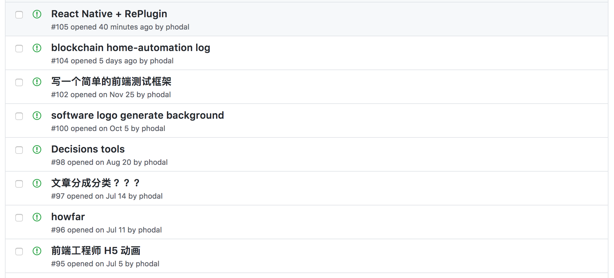
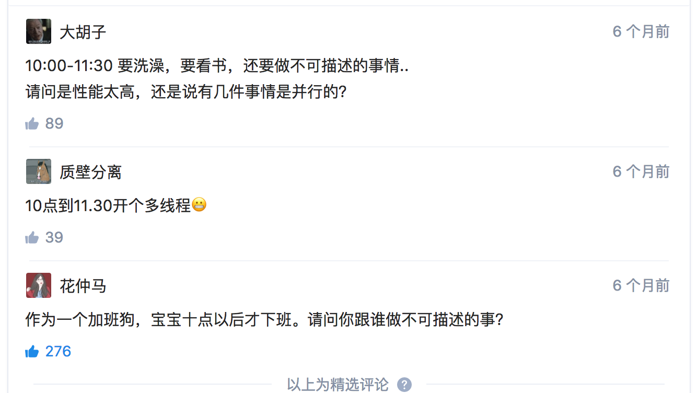

2017 总结：T 型成长，持续学习
===

> 有人经常问我，什么每年能做这么多东西。我的答案一直总是：不加班。

有人经常问我，什么每年能做这么多东西。我的答案一直：不加班。可不加班不一定能有时间做多少事，我每年做这么多东西，都是拜我们家 @花仲马 的加班所赐。

每次写年终总结的时候，总觉得我是在记录我今年做了多少事，又得是比多少人多做了一些东西。可能与去年一比较，总觉得没有特别突出的地方。今年做的很多事情，在去年也都做了；今年翻译了本书，去年也翻译了本书；今年写了本书，去年也写了一本书；今年写了很多软件，去年也是如此。大抵，还是在积累知识期，还没到一个爆发期。

这一年，发生了很多事情，35 岁的程序员在网上成为了一个门槛。早先，我对这个还是蛮担心的，后来想了想吧，这到底不算是一个总是。一来，这个问题类似于，**为什么 90 后没有一个活到 35 岁一样？**二来，35 岁学什么东西都不晚。

慢慢的去思考，不断成长的强烈的思绪，便同泉水一样不断涌现出来。是的，学习，不断地学习，才能走一步是一步。而年轻人，就是应当去学习，要不就会被 AI 淘汰了。上一辈、上上一辈，不识字的家长们，还学会了用微信抢红包呢。

编程
---

程序员嘛，代码就是日常生活的一部分。在一年里，编程上得益于对项目技术的技术栈升级——将 Cordova 嵌入到 React Native，做了一些超越前端的事件。如，使用 Java、Objective-C 编写 Cordova，随后又重写成了 React Native 插件。年底，又工作在原生 Android 的项目上，成为了一名 **XML 程序员**。想来，作为这个 “全栈工程师”，我还是蛮称职的嘛。然而，这个 “悲伤” 的故事告诉了我们一个真理，如果一个前端程序员，会 Java、会 PHP，可能会有不一样的人生。

一来二去的，在 T 型的路上，跑得越来越远。业余写的代码，还是用 JavaScript、TypeScript。值得一提的是，今年我写了很多 TypeScript 代码，用起来真心比 ES6 爽。

又想方设法地推掉一些活，倒是迎来了两三个月的 “舒适期” —— 有时间做自己想做的事情，而不是学习、练习项目相关的技术栈。在舒适期里，我不是在挖坑的路上，就是在弃坑的路上。想挖的坑太多，如我的 Ideas 列表上各式各样的想法；又如 Growth，饼画得太大太厚，最近把自己埋在坑里了。一段头脑风暴结束了，总会迎来一段收敛期。

好在异想天开的轮子也越来越少，注意力渐渐地移向**日常实用工具的开发**。如 ADR、md 就是一个很好的例子，1~2 周内完成工具的开发。每次我都会使用 md 进行排版，当我使用新项目的时候，我就会使用 ADR 来做架构决策记录。除了工具，Dore 软件又指明了一个很好的方向——总结日常的开发结晶。

等等，话说回来，那一天我还想着做一个 Blockchain Markdown Editor 呢。

写作
---

写作上，这一年倒是达到了想要的几个指标。从社交上来说，微信公号上有 22k 的粉，相比 2016 番了一番，又到了我想要的数量——可以不再以涨粉而目的的写作；相似的，知乎上则有 28k 左右的粉，与 2016 相比，大概翻了一番；GitHub 也有 10k+ 了，仍然我不知道说这个有啥意思。

今年买了很多 Kindle 电子书，大概在 150 本左右，还有一些技术类的纸质书。至于这个数量嘛，我还是不说了，毕竟大部分的书我只看了目录，外加自己觉得重要的一两个章节吧。所以，请相信我，我只看了几十本书而已。看了很多书，却没有留下笔记，可明明我是有很多思考的。下一年，有空的时候，应该多写一点书评。

上半年，在写作上来看，表现倒是相当不错。一部分内容放在豆瓣上的《我的职业是前端工程师》，在上面也有 70k+ 的阅读。拿 Microsoft Word 数了一数字数，差不多有 5 万字，差不多等于一书内容的一半。原本想顺着势头，打算在知乎上出一本前端的电子书吧。可是呢，在知乎上受《全栈应用开发》一书的影响，倒是不想写了，写书累吧，收益又少，还得挨那么多与书内容无关的人生攻击。

作为一个计划在 English 世界写 Markdown 的程序员，今年，我仍继续和 Packt 出版社合作，审阅了英语原版书 《Building Modern Web Applications Using Angular》 和《Expert Angular》。和同学翻译的《Arduino  编程:实现梦想的工具和技术》，也终究是出版了。

除了上面提到的电子书，上半年还为 CSDN 写了 《基于 JavaScript 语言的快速物联网系统开发》、《物联网浪潮之下，前端工程师如何迎刃而上》。

年初，完结的 《全栈应用开发：精益实践》也在五月份出版了。虽然这本书带来的效果远不及我预期的，但是在我心目中，它相当的优秀。从定义上来说，它蛮像《代码大全》的，只是面向的是初中级 Web 开发人员，带来了一些额外的尴尬地步。

下半年嘛，就把精力放在积累知识上了——为 2018 年写 Markdown 作准备。唯一能说得上几句的，便只有《Serverless 架构应用开发指南》一本指南了。

这样一总结，想来我还是相当能写的。

可是掐指一算，今年两本书带来的稿费，加上翻译书的稿费，还不到 20000。对，我花了半年多的业余时间，收益就这么些。我还是再去多接几个广告吧，你们有啥推荐的吗？

设计
---

显然，在这一年里，我的拍照技术是有所提升的。

而除了拍照，没做出什么设计相关的东西。UI 上做的东西，如 Growth、玩点什么，可是吧，总结出来的 UI 相关的内容又不多。这一点，倒是值得我好好去反思。

这就是我不对了，明明有那么的作品，却很难让人一眼认出这就是 Phodal 的作品。先前为了解决这个问题，我在各个地方都写上 Phodal 几个大字。这种用户体验，简直 LOW 到爆了。

于是吧，在这一两周里，我想了想，是时候做出一些 UI 上的 Refresh 了。我的博客，每天都大概 500 次访问，还有玩点什么的访问量也是相关可观的。在 GitHub 上，我用 10 个手指头数了数，大概有大概 10 个每天访问量在两位数的电子书。我还有一堆项目的 README，使用了 GitHub Pages 来吸引流量。

UI Refresh 就是在告诉用户，呀，我们改版了，不信，您再看看。这个地方由 12px 变成了 14px，这里黑色的帽子，已经变成了绿色了。

比如说，创建自己的 GitHub 主题，设计一个自己的 UI 系统，一点点的颜色，每 1px 的按钮，还有各式各样的组件，还要有吊炸天的动画。不仅仅要支持 Web，适配 Desktop，适配移动端，未来还要适配 VR、AR，blablablablablabla。对，还有微信上专用的 markdown 编辑器。

可是一算访问量来说，我倒是觉得蛮划算的。看上去是工作量浩大的工作，可是我已经想好了，我要使用 fork 大法。

对我还需要想个名字，是要叫 mdUI 呢，还有 phodalUI，又或者 mdx，取个名字真难。我先去想个名字。

……过了一个小时，我已经想到名字了，继续回来写文章。

已经有了 dore 框架，do re mi fa sol si do。按两个音阶一个单词来的话，就有了 mifa、solla、sido。每个都没有人用，那我就先占坑了。

生活
---

年中，搬到小区里合租以后，每天都在见证 “中年男女人” 的生活。大多数人生活的写照，早上开车送孩子上学，晚上回家做饭。只能有意地减少写代码的时间，再尝试去提升写代码的速度。可是要再去提高，哪怕 1% 的速率，都不是一件容易的事。

 - 好的精神状态，早睡一会儿，中午眯一会儿，难免也会提高一些效率
 - 更快的 Google、StackOverflow 访问速度，我想你一定懂的
 - 编程时选择更高效的 IDE，写 Markdown 时使用 Sublime 获得更快的速度
 - 人体工程学鼠标和键盘，少痛一会儿，就能多写一会儿
 - 间歇性休息，使用手环提醒自己休息一会儿（魅族手环，50 分钟），以继续下一个时间段的冲刺。
 - 保持运动
 - 更好的耳机，**说实话没啥关系**，我就是想听会歌。

这一些日子里，我也做了一些饭。到底是蛮烧时间的事情，六点多到家，洗米煮饭，再去超市买个菜，洗菜切菜烧菜，再吃个饭，怕是都八点多了。

遗憾的是，@花仲马 的加班时间越来越长，以致于：

进入末夏之后，我将走路的回家方式，改成了上下班 20 分钟左右 的自行车。每天早上，难免会流点汗，但是因为吸入了很多氧气，精力上倒算是不错。最近换了新项目，骑自行车的时间多了十几分钟，但是有点运动的感觉了。

在年底的时候，总算是可以为自己和 @花仲马 存钱了。三年多了，帮家里还钱不容易呢~。

对比 2016 && hello, 2018
---

去年写的 2016 总结里，但是简单地在文章里写了几个计划。

 [x] 花了相当多的时间在 Social Network上。可以适当地减少在这方面的支出了
 [x] 公众号缺乏一个合理的定位。最初只是帮我们家 @花仲马 引流，那么下一步呢？
 [x] 缺乏一个合适的开源软件方向，这似乎是一个很大的问题，2333~~
 [x] 下一年里，我应该就会变成一个『Senior Consultant』， 是不是可以靠着这个 Title 出去刷刷脸？No

问题一，目前的投入已经差不多了，应该继续关注于主要业务。

问题二，应该写一些高质量的、引发思考的文章了

问题三，基本上是日常用的工具

问题四，在这一年里，我成为了一个高级咨询师（Senior Consultant）。 Title 上带来的变化，意味着有更多的可能性。因此，这个问题在下一年可能会变成 YES。

末了，我又在文中提了几个简单的计划，就等着明年底打脸。
