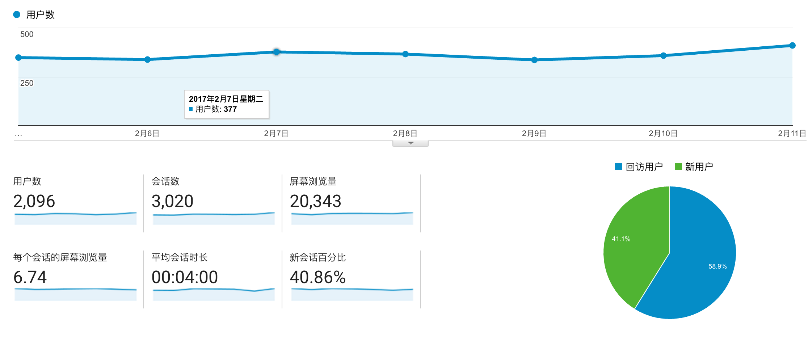
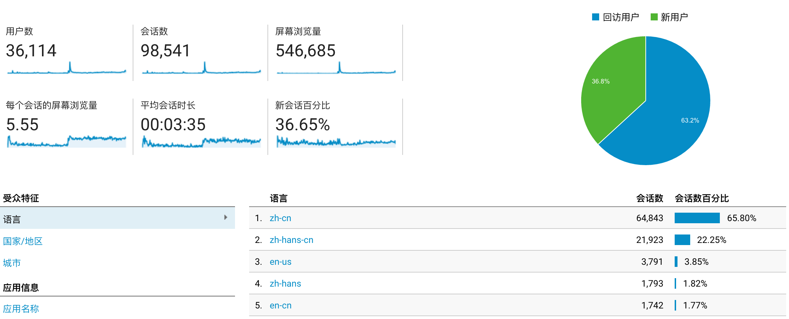
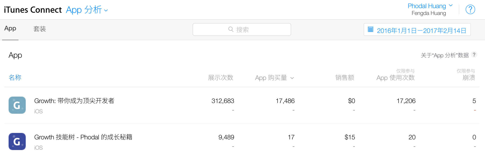
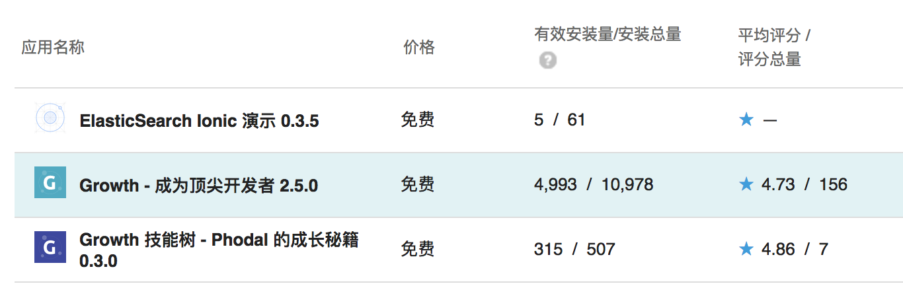
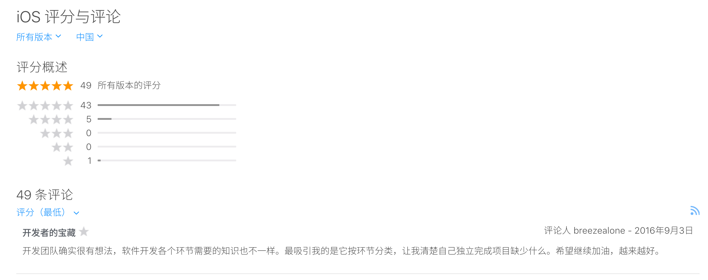
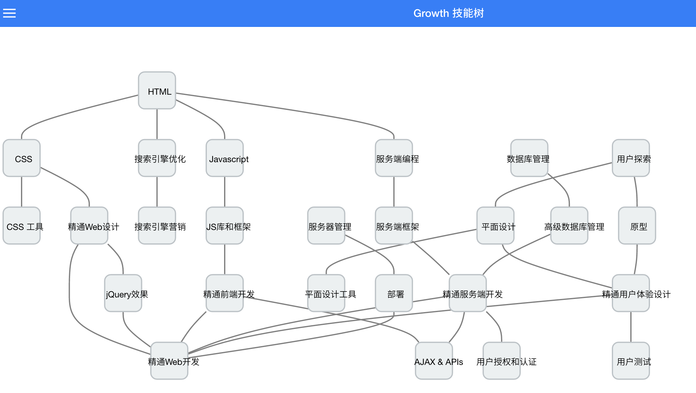

编程学习应用 Growth 2.5 发布: 让我们点亮全栈工程师的技能树
===

> 2015年底，我创建 Growth 了应用，它向初学者们提供了一个学习路线。两年来，已经有超过 3 万个用户使用过。本周里，我们发布了 2.5.0 版本，现在你可以点亮技能树了~~。

在我创建 Growth 的时候，我没有意识到它会如此地受欢迎~~（PS：我就是喜欢自夸）。

Overview
---

在 Growth 1.0 里，我们向 APP 中添加了 Google Analytics，它可以分析出用户的使用情况。如下图所示：

在上一周里，平均每天有三百多个用户，这一周 2096 个用户使用了 Growth。同时，浏览量表明 Growth 2.x 比 1.x 更受大家喜欢，但是还是远远不够。

从开始使用 GA 的时间里，累计有 36114 个用户使用了 Growth，并且主要都是中国人——说了都于没说。

其中，有大约 17,486 个 iOS 用户：

而 Google Play 也统计到了 10,978 个用户：

这个数据表明，程序员中的大部分人都是使用  Google Play 的。尽管 Play 的 Android 用户比 iOS 少了 70%，但是我们收到了156 个评分，远远高于 APP Store 的两倍：

到底是 Play 用户的素质高，还是 iOS 的用户比较懒？

Growth 2.5.0
---

在 Growth 2.5.0 里，我们做了一些事情：

1. 出于安全及 App Strore 限制，我们使用 HTTPS 来替换全部的 API——这个运维工作量很大（由 Phodal 完成）
2. Ionic 2 在上个月推出了正式版，所以我们修改了大量的 beta.5 代码来适配这个版本（由 Phodal 完成）
3. 添加了技能树功能。未来用户，将可以从技能树获取到更多的知识（由 Phodal 完成）。

去年 8 月份的时候，我们使用了 Angular 2 Beta 和 Ionic 2 Beta 编写了 Growth 2。无奈的是，Angular beta.5 的坑太多了，在 Growth 2.5 的时候，近乎重写了整个应用。这就是为什么，Growth 在很长一段时间都没有更新的原因。

关于 Growth 技能树
---

最初我推出 **Growth 技能树**的收费版本目的是，**为了众筹点钱来支付 Apple Developer**的 688 元开发者账号。

我们花费了大量的时间，来维护这个开源应用。我们已经在 GitHub 上拥有 2043 次提交，这意味着每周期我们要提交 20 次代码。我们将花费了大量的时间，将这个应用从 Angular 1.x 迁移到了 Angular 2.x，从 Ionic 1.x 迁移到了 Angular 2.x。当然，这些都是应该的。

除此，我还需要支付 Growth 论坛 [http://forum.growth.ren/](http://forum.growth.ren/) 的服务器费用。

因此，我们推出了 Motree 项目，大致如下图所示：

每个 Android 用户都可以获取到 Motree 的免费版，而 iOS 用户则是经**更多优化**的收费版——为了 Apple Developer。

由于 Motree 本身是免费的，所以这个功能也迁移到了 Growth 2.5.0 中。

**我们也将在未来几个月里，提供更专业的 Motree 付费版，同时也会上架 Play 收费~~。**

嗯，就这样，让我们和上万个用户一起更新 Growth 2.5 吧~~。

