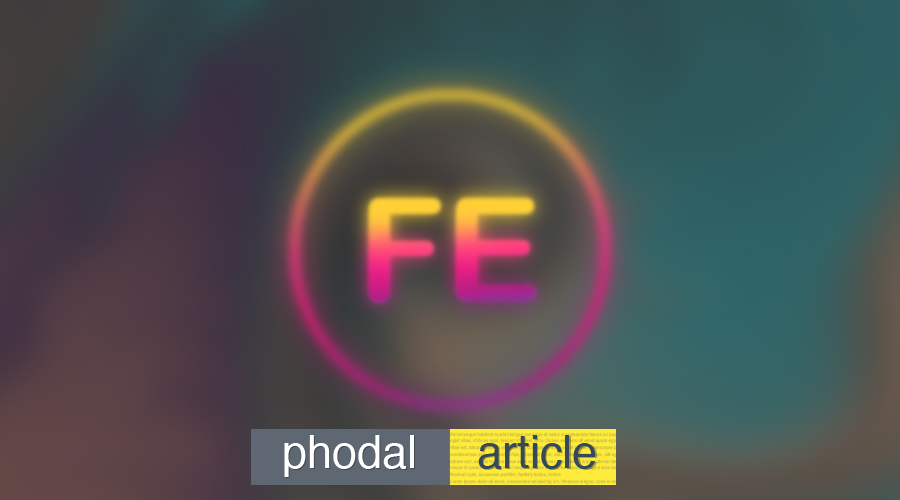
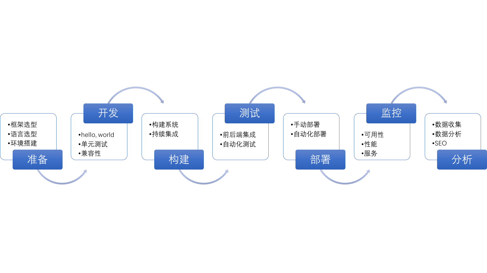

读书日限免 | 这本前端修炼之道今天免费领取啦
===

> 原价 19.9 元的电子书，今天免费领取啦，这是这么任性。

作为 GitHub 知名的 md 程序员，我很高兴宣布，已经在 GitHub 上 Release 第七本电子书。

在我来深圳之前的项目里，我们是一个全功能团队，我从实习生开始了职业生涯。在这一个团队里，每个人都是一个全栈工程师，即要编写前端的 JavaScript 代码，又要会后台使用 Java 或者 Scala 来对 API 进行编程。

而最近在深圳的一年工作里，我是一个前端+ 移动应用开发（混合应用方向）工程师 。2017 年年初的时候，看完村上的《我的职业是小说家》，便有了这个系列的文章，并整理成了电子书《我的职业是前端工程师》。

这本书电子书的免费版，一共有十四章，累计 46286 个字符，差不多半本书的内容，PDF 版排版完有 99 页。内容主要集中于前端应用 **通用的知识**，保持与《全栈应用开发：精益实践》的基本思路是一样的，也因此理论上是不会有纸质版的。但是，未来会出现更完整的收费版——可惜公众号没有付费功能。

你也可以将本书当为其扩展资料。

书籍信息一览
---

相应大部分的公众号读者，已经读过这本电子书的大部分内容了：

*   我要成为一个前端设计师
*   入门不是应该很简单吗？
*   如何选择合适的前端语言
*   如何选择合适的前端框架
*   必会的六个调试技能
*   如何以正确的姿势练习
*   前后端分离，你应该知道的八件事
*   SEO 优化技巧
*   单页面应用的核心知识
*   客户端存储与模型的艺术
*   如何优化前端应用性能
*   移动应用选型指南
*   如何处理好前后端分离的 API 问题
*   如何从头开发一个前端应用

### 作者介绍

黄峰达（Phodal Huang）是一个创客、工程师、咨询师和作家。他毕业于西安文理学院电子信息工程专业，现作为一个咨询师就职于 ThoughtWorks 深圳。长期活跃于开源软件社区 GitHub，目前专注于物联网和前端领域。

作为一个开源软件作者，著有 Growth、Stepping、Lan、Echoesworks 等软件。其中开源学习应用 Growth，广受读者和用户好评，可在 APP Store 及各大 Android 应用商店下载。

作为一个技术作者，著有《自己动手设计物联网》（电子工业出版社）、《全栈应用开发：精益实践》（电子工业出版社，正在出版）。并在 GitHub 上开源有《Growth: 全栈增长工程师指南》、《GitHub 漫游指南》等七本电子书。

作为技术专家，他为英国 Packt 出版社审阅有物联网书籍《Learning IoT》、《Smart IoT》，前端书籍《Angular 2 Serices》、《Getting started with Angular》等技术书籍。

他热爱编程、写作、设计、旅行、hacking，你可以从他的个人网站：[https://www.phodal.com/](https://www.phodal.com/) 了解到更多的内容。

为什么不应该写一本前端书籍？
---

2016 年的时候，我作为一个技术审阅，参与了三本英语版的 Angular 2 书籍的编写。

年初的时候，我已经陆续收到了《Angular Service》 以及 《Getting started with Angular - 2nd Edition》 两本书，但是还有一本书还没有出版，这是一个**发人深省**的故事。

2015 年底，Angular 团队发布了 Angualr 2 的 Beta 版。在经历了半年的稳定更新后，大部分的开发者以为 Angular 已经接近稳定了。有一些（如我）便开发了相应的 Angular  2 应用，同时，有一些技术作者撰写相应的书籍。即，上面说到的那本书的作者，便是其中的一员。作者在写作时，预计了一下进度，估计出版的时间是 2016 年底。

后来，Angular 2 Beta RC 5 更新了大量的 API，导致开发者几乎要重写应用。也因此需要结合 Angular 2 的正式版，来更新相应的代码，便需要做大量的工作来更新内容。

出版时间，因此改到了 2017 年四月份。可是到了 2017 年四月份的时候，Angular 4 已经推出正式版了。后来，这本书的出版旪便推到了今年的七月份。

谁知道到了 2017 年的七月份又会怎样？？

三个月后的前端，又会怎样呢？

End
-----

在线阅读地址：[http://ued.party/](http://ued.party/)

下载地址：[https://github.com/phodal/fe](https://github.com/phodal/fe)

欢迎入小密圈参与讨论~，专为 iOS 用户准备。

有钱的打个赏，没钱的分个享。
