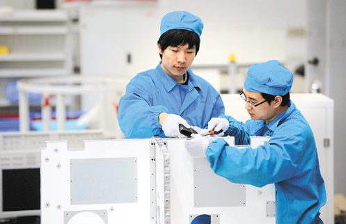
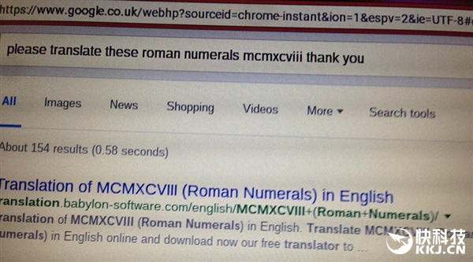
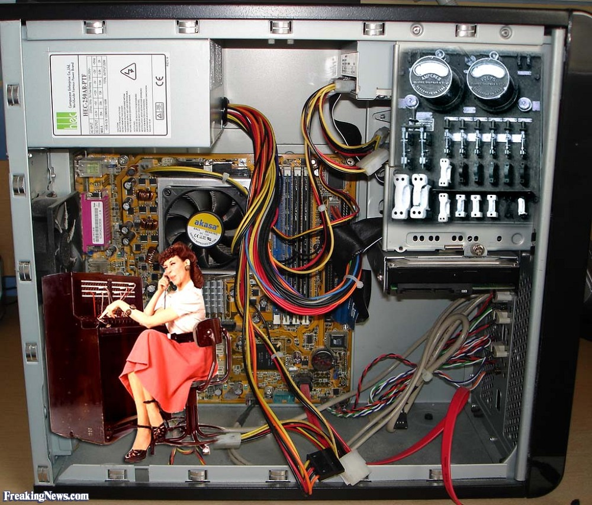
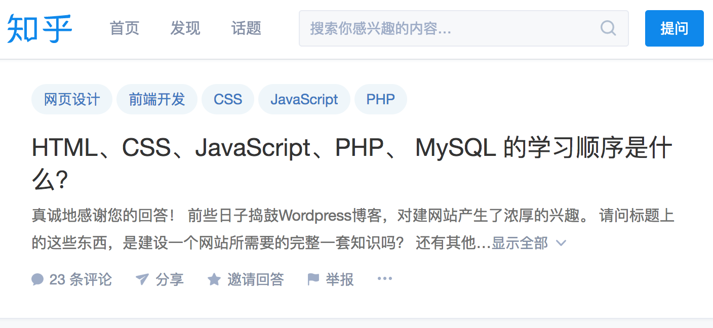
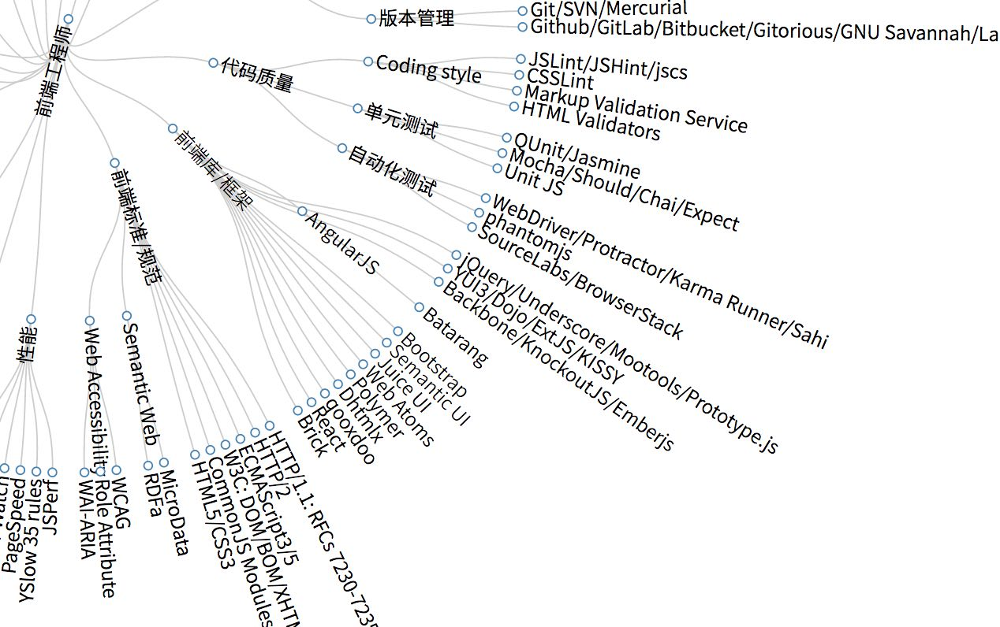
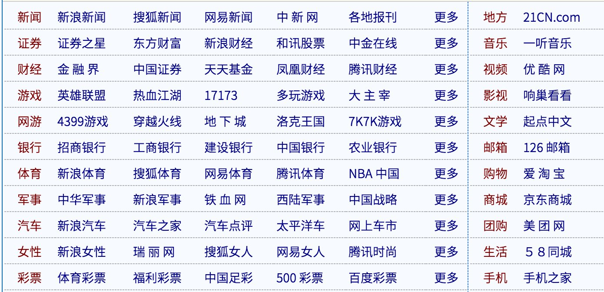
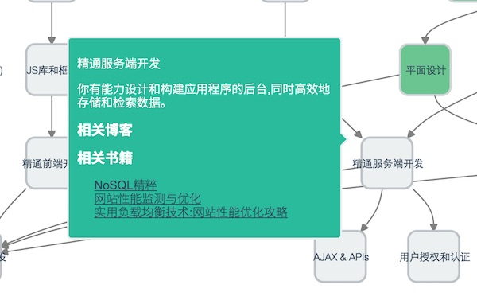
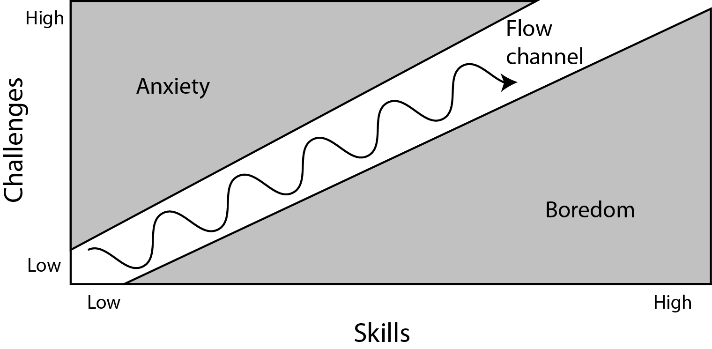

2017 年，你应该这样学习 Web 编程开 —— 内置索引 + 外置搜索引擎
===

>  如果你不会使用 Google 去搜索，那么你是一个新手。而如果你只学会如何使用 Google，但是不知道搜索什么，那么你也仍是一个新手。

最初我对这个问题的思考，来自于一年前的一篇相关的文章《程序员的内置索引与外置的Google》。当时，文章的主要对比点是，门户网站与 Google。两者有一些明显的区别：

 - 门户网站更适合那些什么都不知道，从头开始探索互联网的人。
 - 搜索引擎更适合你知道相似的东西，但是忘记具体的细节。

也因此，学习**应用型技术**变成了一项相当简单的事。你只需要知道它**有什么**（索引），然后去了解**怎么用**（搜索）即可。

从怎么学到学什么
---

开始之前，先让我介绍一下，我的学习框架、语言的方式：

  - 买本中文书或者找个教程、官方的 Guide，花个十几分钟了解一下目录。
  - 直接找个官方的示例，运行一下 Demo。
  - 上手写写应用。
  - 查看官方文档，看看自己是不是漏掉了什么重要的东西。

首先，你有了一份入门资料了，并且也已经有官方的文档了。然后你只需要一步步去做就可以了，不会的地方你就可以搜索到。难怪，程序员被喻为**新蓝领工人**。

你拿上一份框架的说明书、一份需求文档、一个搜索引擎，就可以很容易地制造出一个产品。唯一的门槛是，你需要会读懂这些内容。这有点像新的知识阶级，只是门槛不再是识字与否，而在于是否能懂编程的知识。

将学习编程与门户网站、搜索引擎相比，就是：

 - 当你是一个新手程序员的时候，你需要一本书、一份指南、一个教程来作为索引，并学习上面的一个个内容。
 - 当你是一个有经验的程序员时，你只需要一个搜索引擎，因为你的脑子里已经有了整个世界。

当你不会使用 Google 时，你可能会这样去搜索资料（参见：英国老人坚持用敬语谷歌搜索 成网红被怒赞）：please translate these roman numerals mcmxcviii, thank you。

这种感觉就好像是，你在使用机器人“娇娇”，背后有一个人一样：

可惜，机器人都是晚期直男癌，喜欢单刀直入。

当你只会使用 Google 时，你只能去知乎、SegmentFault 或者 StackOverflow 提个问题：

过去，我花了相当长的时间，在探索学习什么的问题。毕竟学习是相当简单的一件事，你只需要抽点时间、找个空间、研究个点就可以了。在这其中，最难的地方是研究一个点。因为你根本不知道，需要学习什么？并非所有的人，都能找到合适的路线。

### 索引与图谱

当你在某个领域拥有多年的经验时，你就可以将它整理为各式各样的图谱、技能树等等。如：

这样的图谱，就像门房网站一样，在上面列好了一个个的知识点。

它按照不同的类别，一一的归类。稍有区别的是，这些类别都会相应的内容与之对应。而你在技能汇总上是看不到的，这也就是为什么像技能树这样的工具，也会相当的受欢迎。

人们需要的，不仅仅是一张简单的地图，还需要导航功能。技能图谱、技能汇总等等类似的图谱，它们都只是一些简单的工具。你还需要辅助相应的内容，如文章，视频、教程等等的资料。

在这个时候，或者你需要的是一个 Awesome-xx 的项目，上面不仅仅有目录，还有各式各样的资料。点击到相应的链接，你可以看到代码、应用。

初学的时候，你只需要找到一份合适的索引。学到一定程度的时候，你就可以和我一样创造相应的索引，还有各种资料，如 Growth（[https://github.com/phodal/growth](https://github.com/phodal/growth)）。随后，你就可以对比不同的索引，来完善自己的知识休系。

不断的更新索引
---

小学的时候，你学会了基本的数学知识，如加法，除法，乘法。你开始在初中的时候，开始解决各种复杂的二次、三次方程、图形计算等等的问题。

从哇哇坠地在医院，到初高中毕业，学习的大部分知识都是别人觉得重要的。学习的时候，教育者们出于某种目的，已经为你规划好了一个个的路线。

工作的时候，领导们仍然会出于某种目的，为你规划好一个学习路线。你并不需要知道自己需要去什么，你像游戏中的国王一样，按别人的规划一步步地往前走。

如果别人为你规则学习的路线是合理的，那么学习起来就会很轻松。反之，你就会很痛苦，开始质疑合理性。

知识本身具有**连贯性**——这就是《技术发展的本质》一书所阐述的。你把一个现代的智能手机，交给 20 年前的用户，他都不知道怎么用。

如果你是经历过手机 20 年的更新换代，那么你就很容易地就可以上手各种手机。与些同时，你并需要从 20 年前的大哥大开始用起。这也是大部分开发者的学习过程，但是并意味着你需要从头学起。你仍然可以忽略过很多东西，然后学习最新技术。

令人遗憾的是，知识本身不是静止的，而是一个不断发展的过程。就连吃饭，你都要学习使用不同的工具，如西餐。只有基础本身是静止（相对）的，一旦涉及到应用都是变化的——你学习的 A 技术，经过一段时间，都会被市场淘汰。

这时，你需要像爬虫一样，不断地去抓取新的网页，新的知识点。

