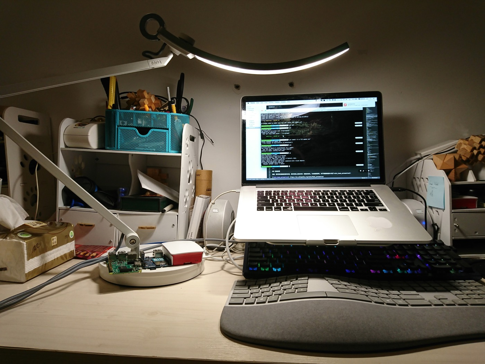
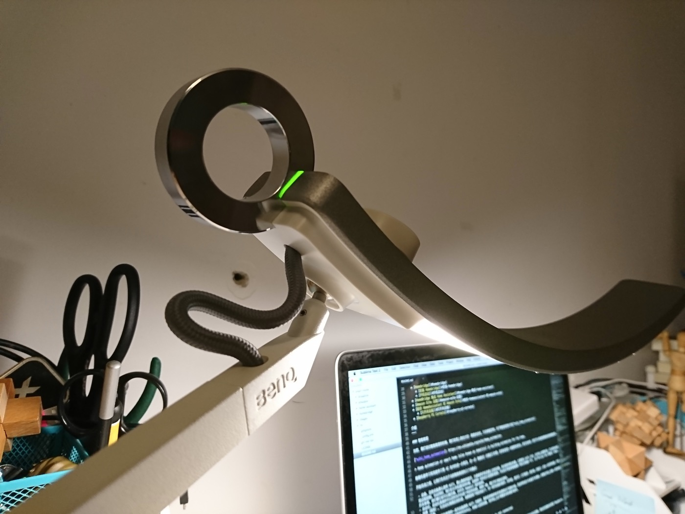
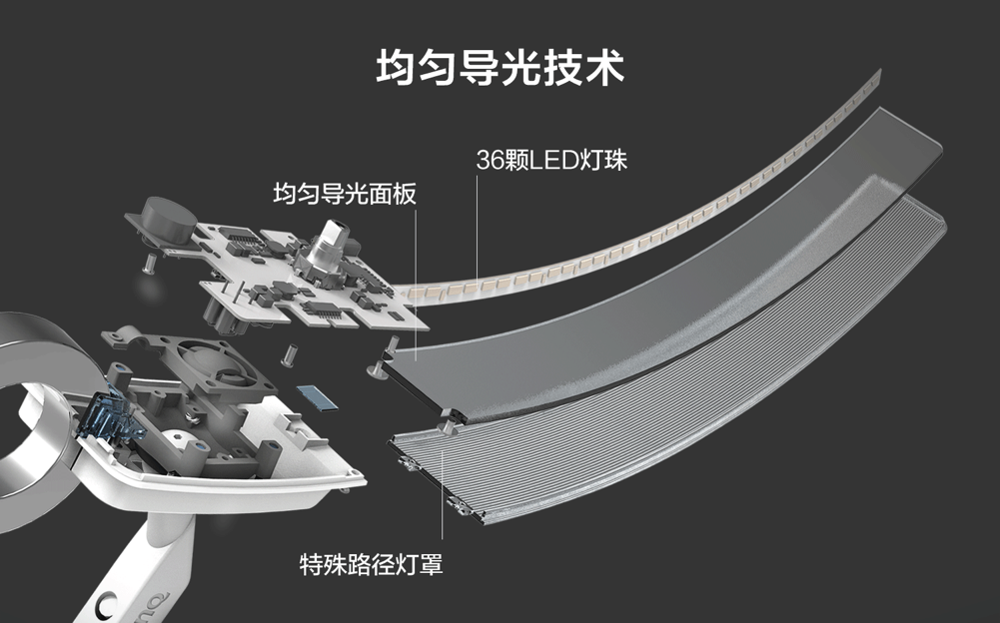
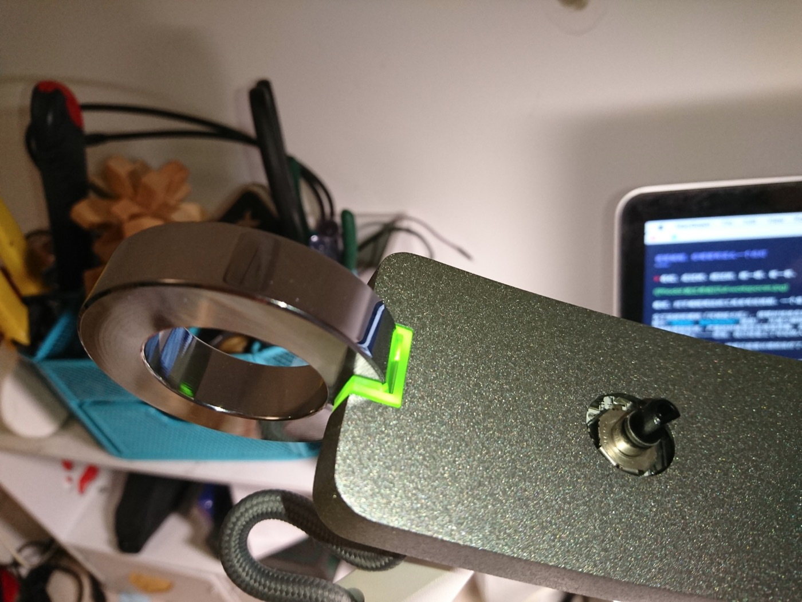
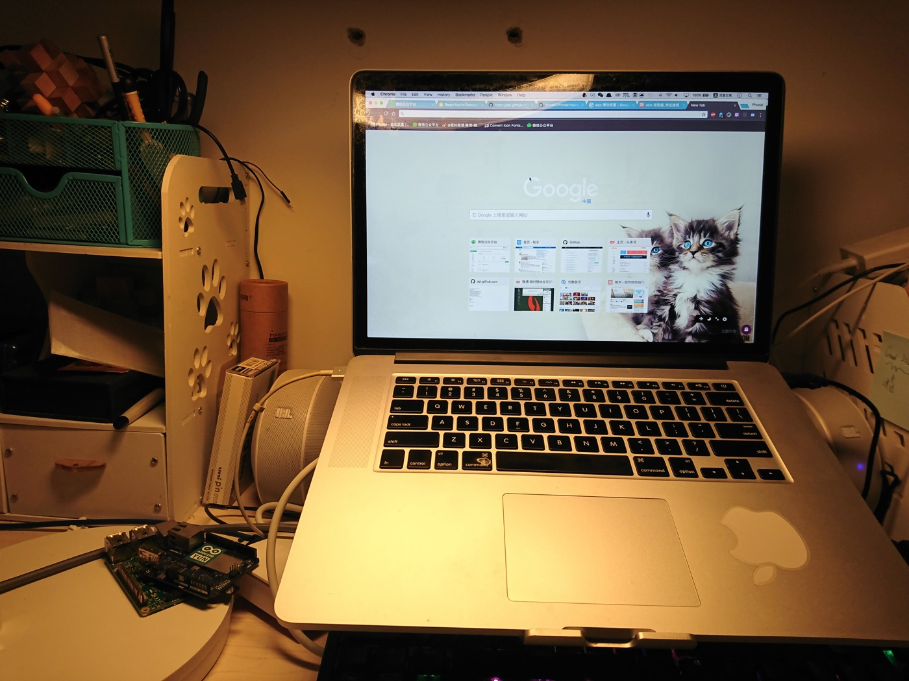
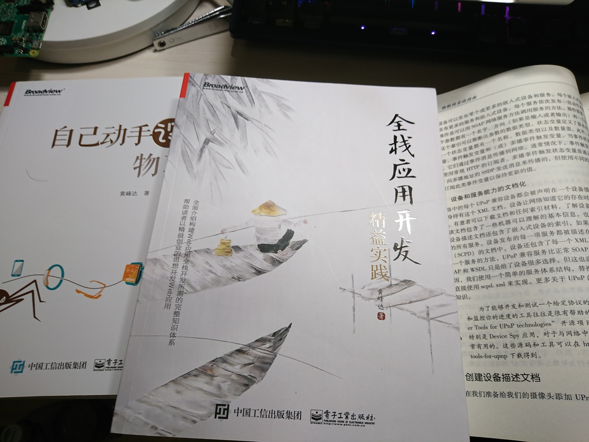

夜里编程，你需要有这么一个台灯
===

> 各位，走过的、路过的，瞧一瞧、看一看。

最近，对于编程周边的工具多有些挑剔。一个是受到职业病的威胁，还有便是想防止发生新的事故。

为了治好所谓的『尺神经卡压』，便暂时性地在家里使用微软的 Surface 人体工程学键盘（PS：就是题图中的那个**奇怪的、看似变形的**键盘），并减少编程时间。由于过去，长期把那手放在笔记本上，导致手腕底部的神经受到压迫，严重的时候便会在夜里疼醒。去找医生看了看，建议我多按摩手部，还有便是来了一疗程的『万通筋骨片』——想来，我已经是上了年纪的人了。

而对于这种职业病来说，怕是只能靠长期的治疗了。而对于一个程序员的日常来说，我们需要关注这么几个设备：

 - 鼠标。作为一个程序员，应该尽量使用快捷键来代替鼠标。如果使用鼠标的手部、肩部感觉疼痛，那么请选用一个**符合人体工程学**的鼠标，诸如买笔记本送的小鼠标，则尽量少用。
 - 屏幕。如我在之前的文章中所说，尽可能地将你的电脑与视线保持水平，并在可能的时间使用 MBP 等更好的屏幕。
 - 键盘。机械键盘手感好~~，可是我还想先试试人体工程学键盘。说不定，我就不需要『万通筋骨片』了。
 - 台灯。这就是本文的内容了。

之前找不到合适的明亮灯光，照亮我的电路，我便买了个 LED 台灯：

时间一长，发现眼晴容易累，并且会导致失眠——一查是**蓝光**。除了 LED 灯外，还常见于手机、电脑、Pad 等屏幕，所以如果你失眠的话，那么看看是不是有这样的问题~。

后来，我找到了一款没有蓝光的台灯，它通过欧盟IEC/EN 62471无蓝光危害的认证（这是目前国际上唯一能够检测蓝光指数是否安全的标准）：明基的WiT 台灯

它不仅没有蓝光，同时还**无眩光和频闪**，一般频闪的光线就是拿手机在灯光下面照相会出现删格和抖动。当你拿手机去拍普通的显示器，就会看到有频闪的问题。

看它那 90 度弯下的腰，它的两个灯臂与灯管都可以自由地调节。对，这个就是传说中的 @vczh 推荐过的台灯。这是距今为止，我用过最好用的台灯~。

只需要通过触摸这个大圆环，就可以唤醒这个台灯：

它是由 18 颗冷色调 LED + 18 颗暖色调 LED 来配合控制的——间隔出现的。

因此 WiT的色温支持从2700k-5700k，并实现由明到暗、由冷到暖。其借由一个日本 ALPS 公司生产的变阻器，来控制的，按下则可以切换色调与亮度模式——一键式切换明亮度调节及色温调节功能。作为一个电子信息工程出身的程序员，我从来没想到变阻器还可以这么玩，2333。

下图则是暖色调下的屏幕：

不要问我是怎么知道的（我拆了）。同时，这还是一个相当重的台灯，它的灯头和灯臂是用的航空级别的铝合金。关节则是用锌合金压铸、内嵌扭力弹簧，保证刚好的扭力和摩擦力。考虑到这个灯的重量，我拿到我们家 @花仲马 的新体脂秤上秤了一下，足足有 5 KG。

除了正常的调节功能，它还有**智能调光模式**，长触金属环大约两秒钟，指示灯便会亮起——即上上图中的绿色灯光模式。

除了正常的编程模式，它还特别适合看书。它可以提供的照明范围宽达100 公分，完全可以满足你看好四五本我写的书，可惜我还只写了两本：

言而总之，它的外型和实用性相当的不错，并且能满足我们不同的使用需求。要是它能配合 APP 调节不同的模式，那么就更加的不错了。

