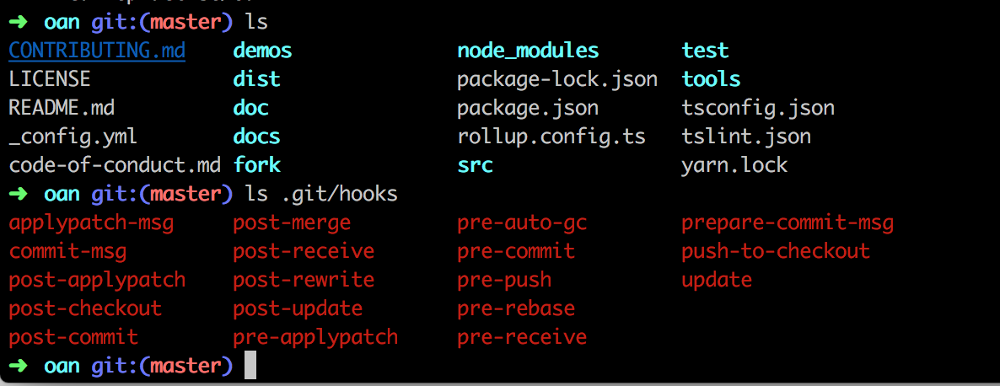

如何提升 Web 应用的代码质量
===

> “我只是修改了一个 if 条件，没有想到它导致持续集成失败，部署也因此失败，还影响了 QA 测试其它功能。”

Web 应用的质量提升，是一个非常有意思的话题。我们明知道有一系列的手段可以提升代码质量，但是限于多种原因，我们并不会去做。在我工作的第一个项目里，由于大家都是年轻人（Junior Consultant），我们实施了一系列的基础措施，来提升应用质量，诸如写测试、追求测试覆盖率、运行预提交脚本等等。

在最近的这个项目里，我们面临着类似的问题——需要提升项目的代码质量。于是，便想写一篇文章介绍一个相关的内容。这篇文章大致可以分为这几个部分：

 - Web 应用的质量问题
 - 使用测试提升质量
 - 使用 Lint 和 Git Hooks 检测代码
 - 如何防范危险提交

那么，让我们继续回到老生常谈的 “Web 应用的质量问题”。

Web 应用的质量问题
---

Web 应用通常面临着上线和质量之间的博弈——只要不影响用户体验，小的 Bug 往往对于项目来说可以 “容忍” 的。这样一来说可以早些上线，实现用户价值。除此还有其开发的影响：一个是敏捷方式的开发周期，一个则是可以多次上线。

故而，Web 开发与一些特殊领域及行业的软件开发不同，在这些特殊的行业里，一个开发成本上亿的软件，可能只会运行、部署一次，不会有第二次机会，如原子弹的控制系统。还有一些类型的案例，就是智能汽车上的自动驾驶系统，稍有不慎就是车损人忙。相当于 Web 应用虽然更新困难，可它们还是能远程更新的。但是在这些系统上，它们就更追求系统的质量，而不是开发速度。Web 应用部署失败可以回滚，虽然会带来一定的钱力损失，但是极少带来生命危险。

因此在**质量**和**速度**方面，在 Web 开发上因此保持着一个微妙的平衡。

可软件开发不仅仅只有质量和速度的问题，还有一个产品问题——即，能做出符合用户需求的产品。于是，就变成了**质量-速度-需求**，一个更复杂的平衡。为了交付出更符合用户需求的产品，就不得不经常做一些需求变更。而取决于这些变更的时间，它往往会影响到代码质量和开发速度——实现一个需求的时间越短，那么其测试的时间越短，Bug 出现的可能性就更高。过去我遇到过，今晚上线，下午临时改需求。可想而知，测试人员是没有时间测试的。

在这个时候，持续集成只能显式地告诉我们，我们的测试挂了，我们的某些功能 broken 了，我们不应该部署这个新版本。然而并不是持续集成出问题了，我们就不能部署，我们仍然还是能部署的。

Blabla，那么问题来了，最有效的方式呢？

使用测试提高质量
---

用于保证这个项目的质量，在代码提交之后，会经过一系列的测试：

 - 单元测试
 - 自动化 UI 测试
 - 开发人员手动进行集成测试
 - 测试人员进行 3~4 轮的测试

如果只是宏观来看一个项目的测试的话，那么在一个敏捷项目里，测试可以分为这么几个阶段：

 - Dev （开发）环境的 Desk Check，主要用于演示功能是否和需求一致。
 - QA （测试）环境的测试，用于进行一些常规的测试。
- ST （System Test）环境的测试，常用于与第三方系统联调。当出现第三方系统的时候，就需要该环境来集成。
- UAT（User Acceptance Test，用户接受测试）环境的测试，通常用由业务方的代码来验收产品是否符合需求。

如果一个 Web 应用能经过这么一系列的测试，那么它的质量在一定程度上是得到保障的。所以，开发人员如果不想活得太久，就可以 “不负责任” 地直接把功能扔给测试人员。笑~

可是，在有一些公司时吧，Bug 率可是会影响绩效的，又或者是有这么多 Bug 看上去不那么专业，等等 blabla。

言而总之，总而言之，开发人员自己写测试会更友好一些。按照测试金字塔理论来说，我们需要三种类型的测试：

 - 单元测试，用于保证我们的基础函数是正常、正确工作的。
 - 服务测试，不仅仅自身的服务，也会测试第三方依赖服务。
 - UI 测试，模仿用户操作行为的测试。

对于一个前端项目来说，我们通常只需要两种：``单元测试`` 和 ``E2E 测试``。实际上，理论上应该还有 ``UI 组件的测试``，但是一般而言，我们在选用 UI 组件的时候，会考虑到组件的稳定性。

可是在多数国内公司里，写测试往往是不可能的。退而求次，我们就需要一种更简单而友好的方式，来做这样的事情。

使用 Lint 和 Git Hooks 检测代码
---

在代码提交之前，我们还可以进行一些常见的操作：

 - 静态代码分析（lint），用于进行静态代码分析，常见的如 Lint4j、TSLint、ESLint。
 - 运行测试，为了不影响持续集成，我们需要在代码提交之前进行测试。

现代的编辑器（使用相应插件）、IDE 可以提高很好的技术手段，在开发的过程中静态代码分析，并随时提高建议。如 Intellij IDEA 和 WebStorm 就会根据 TSLint，来提醒开发者 TypeScript 代码的一些规范问题。

这些分析工具主要进行一些代码上的分析，如《全栈应用开发：精益实践》一书所说，一般会进行如下一系列的风格检测：

 - 规范函数名及变量
 - 代码格式规范
 - 限制语言特性
 - 函数行数限制
 - 多重嵌套限制
 - 未使用代码
 - 等等

而这些规范，如果没有强制，那就是个游戏。于是，我们通常会依赖于 Git Hooks 来做这样的事。对于一个使用 Git 来管理源码的项目来说，Git Hooks 可以做这么一些事情，可以在 ``.git/hooks`` 目录下查看：



一般而言，我们只会在两个阶段做相应的事情：

 - ``pre-commit``，预本地提交。通常会在该提交之前，进行一些语法和 lint 的检测。
 - ``pre-push``，预远程提交。通常会在该提交之前，运行一些测试。

于是，在我们的这个前端项目里，我们就又写了这两个 ``scripts``。对应的实现如下：

```
{
    "precommit": "lint-staged",
    "prepush": "ng test && ng build --prod"
}
```

在 ``precommit`` 时，我们配合 ``lint-staged`` 和 ``prettier`` 来进行代码格式化：

```
  "lint-staged": {
    "src/app/*.{css,scss}": [
      "stylelint --syntax=scss",
      "prettier --parser --write",
      "git add"
    ],
    "{src,test}/**/*.ts": [
      "prettier --write --single-quote",
      "git add"
    ]
  }
```

事实上，使用 ``ng lint --fix`` 也是一个不错的方式。

随后，我们在 push 代码之前，即 ``prepush``，进行了测试及 Angular 的构建 production 的脚本。由于单元测试运行得相当的快，它可以在几分钟内完成，快速对问题做出响应。而不是等到持续集成出问题时，再去修复。

但是 Git 提高了这一种的种选项，也提供了一个 ``--no-verify`` 的参数。它可以让开发者不需要进行上面的验证，就能提交代码。
 
我们往往无法阻止别人做这样的事情，特别是当出现多个团队协作的时候。

难以防范的危险提交
---

原本，我想将标题取为 “有风险的提交”，但是我觉得危险的提交更为可靠。

常见的有要去吃饭了、要下班了、要开会了等等，临走前提交了一下代码。功能可能本身没有问题，但是它 block 后续的一系列行为。

当然了出现不可坑的因素，如地震、火灾等的时候，就不需要考虑这些事情了。

只是有了这些规范和实践，可以帮助我们开发出更稳定的 Web 应用。

结论
---

开发速度和质量，是一个难以平衡的天平。在不同的时间里，我们应该做不同的技术决策。


