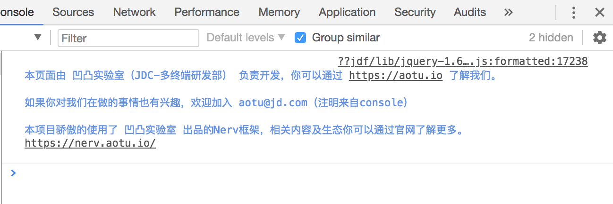
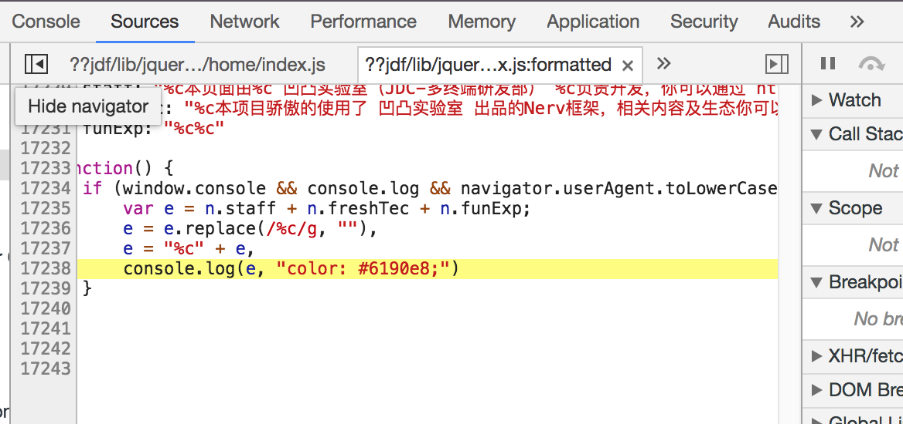
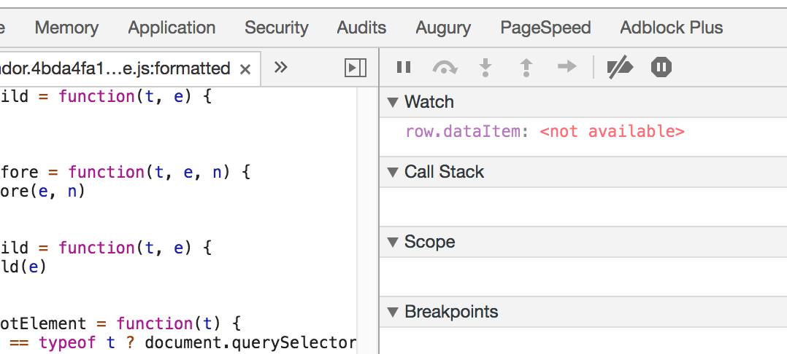
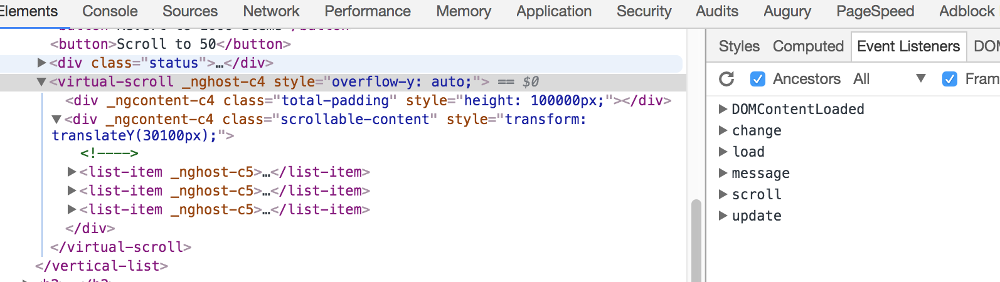
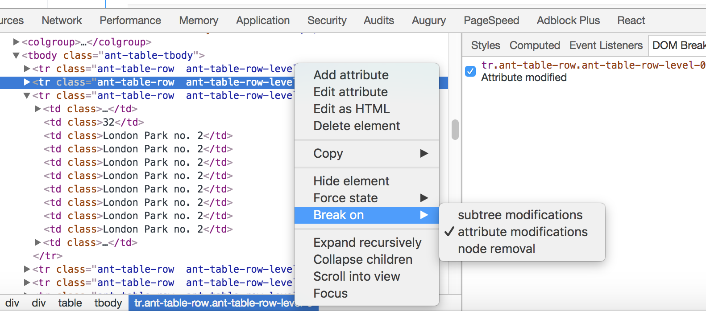
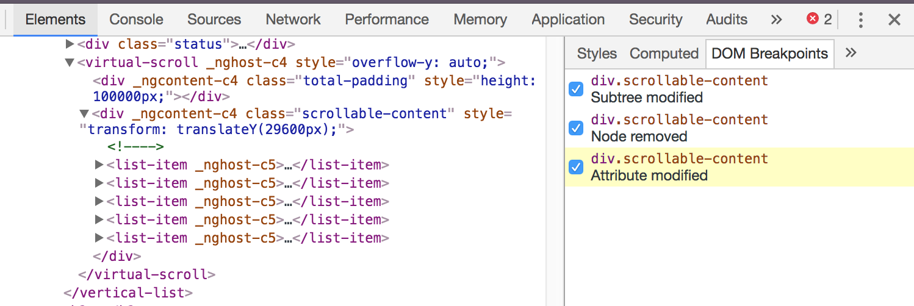
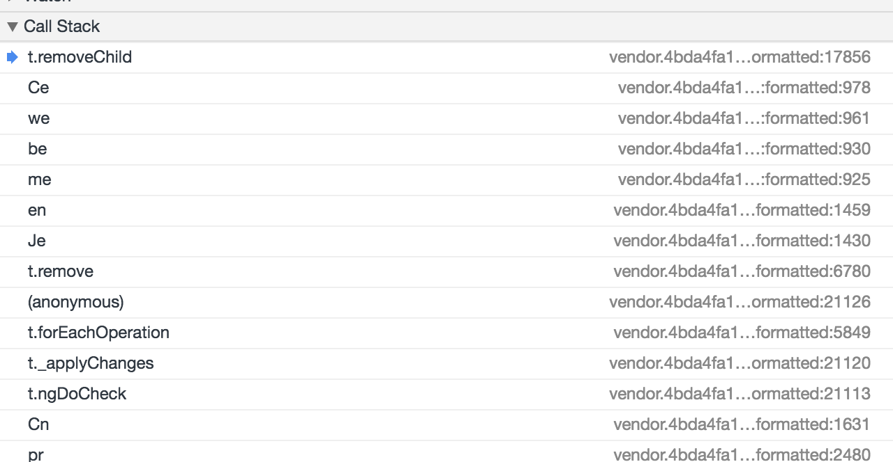

Chrome 调试第三方 UI 库技巧
===

上周，我的主要工作内容是：为一个第三方 UI 库添加新的功能。由于要新功能的源码的代码行数在 10k+ 左右，并且没有一个与之对应的文档。

> “逐行读代码是不可能的，这辈子都不可能的”。


对于一个这种数量级的源码，完全不可能花这么多时间去阅读，同时我们也没有必要去一行行的读。于是，只能调试。在调试的过程中，发现了一些不错的调试技巧。整个过程下来，大概有这么一些心得：

 - 使用 ``debugger`` 或者 ``console.log`` 找到代码
 - 反向：通过注释，在 Chrome 中找到源码
 - 通过 Watch 实时 Debug 值的变化
 - 全局事件：Event Listeners，寻找对应的事件监听
 - 监测 DOM 修改：Dom Breakpoint
 - 结合 Call Stack 寻找调用链

起源
---

假设我们项目的客户购买的 UI 库叫 ClientUI，我们封装的 UI 库是叫 PackgeUI，那么这的依赖关注可能就是这样的

 - Project
   - PackageUI
     - ClientUI

显然，这种依赖关系，明显地增加了调试的难度。调试相当的不容易，首先要在对应的 ClientUI 中编译 UI 库，然后把代码拷贝到项目的 ``node_moduless`` 目录下替换。当然也可以：

1. 在项目的 ``node_modules`` 下的 JavaScript 源码中修改
2. 完成后再回到 ClientUI 目录下，使用 TypeScript 修改
3. 修改完后，再拷贝到项目中测试
4. 打 tag，发布新的 ClientUI 版本

而这并不是重点，重点是你要习惯非主流的代码规范，要从看一个个代码上万行的文件。还好，可以通过 IDE 来在代码中跳转。并且，这些代码中也存在一个个的 Bug，直接读代码还不如调试来得方便。

使用 debugger 或者 console.log 找到代码
---

对于 Chrome 浏览器来说，对于第三方引用的库，它不会显式地在 Sources 中显示文件。这个时候，要么我们通过在第三库中引入 ``console.log``，要么在第三方库中写上一行 ``debugger``。我一般是采用 ``console.log`` 的方式，我可以有选择地进去，然后打上断点。而不是 ``debugger`` 中的自动断点。``console.log`` 还有一个好处是，我可以一直保留着它。

随后，我们就可以找到相应的行数。因为源码是 TypeScript，所以翻译完的行数和原先的必须是不一致的：



如这里的 jquery-1.6….js:formatte:d，中的 17238 即是代码的行数。点击它，就能找到对应的源码：



这就是最常见的找代码 debug 方式。而，随后我还面临的一个挑战是，在这一个 10k+ 的工程里，找到某个函数对应的行数。

反向：通过注释，在 Chrome 中找到源码
---

而，反过来就再加有意思了——即根据代码，从源码中找到对应的行数。

ClientUI 库使用的源码是 TypeScript，编译完后，行数与原来的不一致，要找到对应的行数。就需要一些不变的行待，比如说上文截图中的：``本项目骄傲的使用了``，或者一些特别的字符。

而对于那些工程实践做得比较好的项目来说，是不存在这样的东西。那么，只能通过在编译过程中不删注释，再根据注释来找到对应的代码了。

这一点在我调试的过程中，倒也是相当的实用。

通过 Watch 实时 Debug 值的变化
---

这一点，怕是大家也都知道了，这里就大概说一下：



即在 Sources 右侧的 Watch 窗口里，我们可以添加对应的变量，来实时查看它的值。这一部分主要是用在一些循环语句中，毕竟要一个个看循环中的变量不是那么容易的。

全局事件：Event Listeners，寻找对应的事件监听
---

在我所要实现的功能里，有一个 click outside 的需求，即点击到目标元素以外的元素时，阻止事件的冒泡。

正常情况下，我们认为 ``click`` 事件是点击事件，但是有的时候它是 ``mousedown``。因为从速度上来说：``mousedown`` -> ``click`` -> ``mouseup``。

开始的时候，我忘记了这一事。于是，我便尝试查找元素的对应监听事件。如下图所示：



我只需要点击相应的元素，就可以在右侧查看对应的事件监听列表。

于是我的 click outside 变成了：

```
@HostListener('mousedown', ['$event'])
onMouseDown(event) {
  let nativeElement = this.elRef.nativeElement;

  if (nativeElement.contains(event.target)) {
    event.preventDefault();
  }
}
```


监测 DOM 修改：Dom Breakpoint 监测修改 DOM 的代码
---

而当我们对于代码不知所措的时候，还可以通过直接对 DOM 元素打断点，来找到相应的修改函数。这一点，对于我调试第三方库来说，相当的给力。毕竟，对于一个几十万行的库，可没有那么多的时间一一去了解。

我们所要做的事情也很简单，右键对应 DOM 节点 -> Break on，再按照需要选择类型：



当相应的节点发现修改时 Chrome 会显示地高度对应的修改：



然后进入 Debug 模式，再结合 Call Stack，就能找到调用链。

结合 Call Stack 寻找调用链
---

对于一般的函数来说，并不需要这么复杂。我们写的代码嘛，都能知道在哪有问题。而对于不是自己写的代码，就没有那么方便了。并且，当我们要调试的方法复杂时，我们就需要它了。

以下是一个 Minify 以后的调用栈：



（PS：请原谅我不能用自己的源码来展示）

通过这样的方式，我们就能找到对应的 ``removeChild`` 的调用关系。

结论
---

Chrome 中还有各种神器，你还知道什么功能呢？