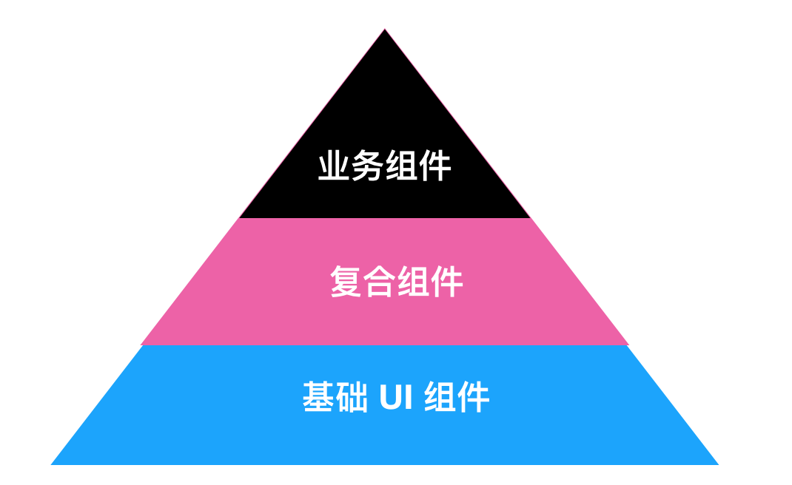
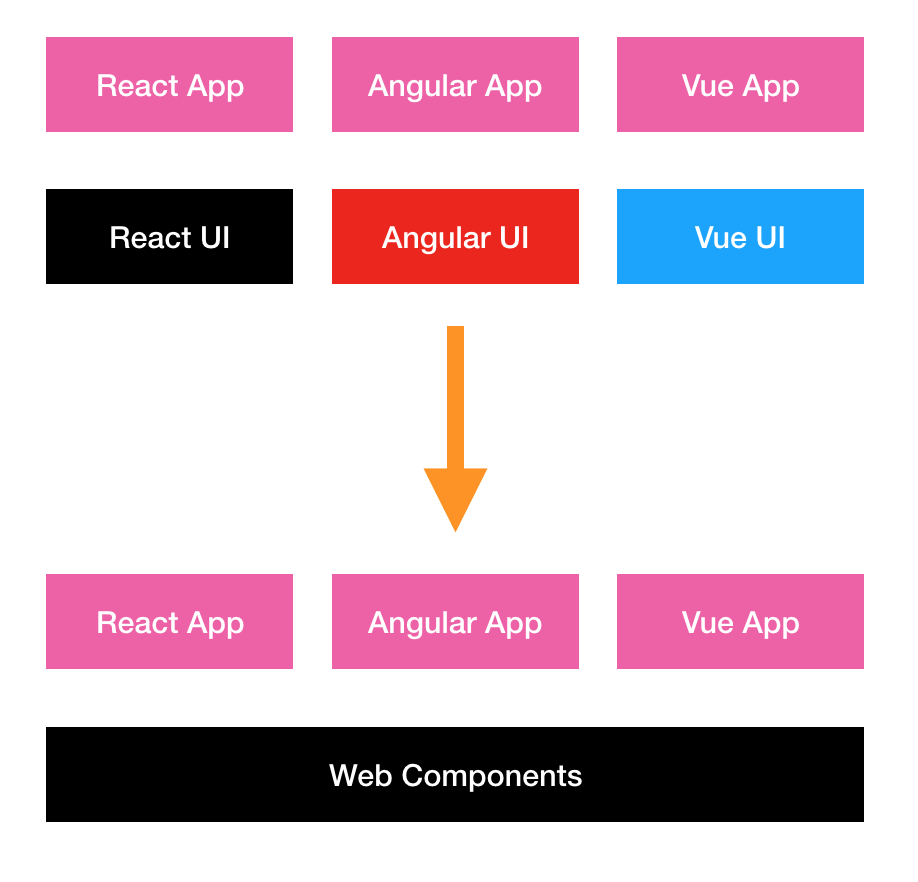

# 前端下半场：构建跨框架的 UI 库

> 如果用一个 UI 库不能解决问题，那就用两个 UI 库；如果用一个 UI 框架不能解决问题，那就用两个框架。

**跨框架的 UI 库**，即前端 UI 库可以不经任何修改，直接能运行在 React、Angular、Vue 等框架上。

在开源电子书《[微前端的那些事儿](https://microfrontend.cn/)》 中，我们讨论到了 Web Components  技术，一种新的 Web 前端容器化技术。在电子书里，我们主要介绍的是：如何使用 Web Components 来构建微服务。而在这篇文章里，我们讨论的是 Web 组件的下半场：**跨框架的 UI 库**。

## 背景

最近的一段时间里，我花费大量地时间在练习微前端技术。在我的新 Markdown 编辑器 [Phodit](https://github.com/phodal/phodit) 中，我有意无意地去拆分出一个个的小组件，每个小的组件使用不同的技术构建，React、Angular、Stencil.js、原生 JavaScript 等等。如：

 - Stencil.js + Web Components 来放置 Terminal 的关闭窗口
 - React.js 制作了左侧的树形文件树
 - Angular 6 完成了重命名文件的交互
 - sweetalert 用来做 Dialog 提醒
 - ……

编辑器仍然在开发中，这并不是最后的所有技术。引入这么多框架的 “hello, world”，然后构建一个个简单的组件，大概、可能、也许是为了 <del>炫技</del> 练习。虽是这么说，事实是 SimpleMDE 已经封装了 CodeMirror 的一系列 API，为了能快速用上自己的编辑器，我决定地接基于SimpleMDE 来修改。而 SimpleMDE 并不能直接用在 Angular 等前端框架上，这也意味着，因为这个 Editor 的存在，我不得不将页面**撕裂**成几部分：左侧菜单、Terminal 窗口栏、辅助栏、状态栏等等的几部分。

换句话来说，就是这是一个**组件化架构**最好的应用场景。

过去我们谈论前端的组件化架构时，通常指的是**框架限制的组件化架构**。而当我们拥有基础的 UI 组件库时，我们的架构则是**基于 UI 组件库的组件化架构**，两者间的不同在于共性的第一次提取。而当我们在业务组件的基础上，进行对一些通用业务组件的封装时，我们的架构则基于**基于 UI 组件库和业务组件的组件化架构**。



可不论是哪种方式，最后我们都限定于**框架限制**——我们将系统绑定在框架上。而对于团队的技术决策者来说，绑定上框架的实现是一种冒险的作法。未来，这些都是风险，那么有没有可能将底层的 UI 组件库、 复合组件和业务组件库通用呢？

## 铺垫：React 中引入 Angular 组件

为了在我的编辑器中使用 Angular，我用 Angular 编写了一个重命名功能。而为了使用它，我得再次使用一次 ``customEvent``，而在这个微前端架构的系统中，其事件通讯机制已经相当的复杂。在这部分的代码进一步恶化之前，我得尝试有没有别的方式。于是，我想到了之前在其它组件中使用的 Web Components 技术，而 Angular 6 正好可以支持。

### HTML 中引入 Web Components

我所需要做的事情也相当的简单，只需要将我的组件注册为一个 customElements，稍微改一下 ``app.module.ts`` 文件。在这种情况之下，我们就可以构建出独立于框架的组件。

如下是原始的 module 文件：

```javascript
@NgModule({
  declarations: [AppComponent],
  imports: [BrowserModule],
  bootstrap: [AppComponent]
})
export class AppModule { }
```

如下则是新的 module 文件：

```javascript
@NgModule({
  declarations: [InteractBar],
  imports: [BrowserModule],
  entryComponents: [InteractBar]
})
export class AppModule {
  constructor(private injector: Injector) {
    const interactBar = createCustomElement(InteractBar, {injector});
    customElements.define('interact-bar', interactBar);
  }
}
```

然后，只需要就可以在 HTML 中传递参数： ``<interact-bar filename="phodal.md"></interact-bar>``，或者监听对应的 ``@Output`` 事件：

```javascript
const bar = document.querySelector('interact-bar');
bar.addEventListener('action', (event: any) => {
  ...
})
```

事实证明，使用 Angular 构建的 Web Components 组件是可以用的。于是，我便想，不如在 React 中引入 Angular 组件吧。

### React 中引入 Angular 组件

于是，便使用 ``create-react-app`` 创建了一个 DEMO，然后引入组件：

```
<div className="App">
  <header className="App-header">
    
    <h1 className="App-title">Welcome to React</h1>
  </header>
  <p className="App-intro">
    To get started, edit <code>src/App.js</code> and save to reload.
      <interact-bar filename="phodal.com" onAction={this.action}></interact-bar>
  </p>
</div>
```

嗯，it works。至少 ``filename`` 参数可以成功地传递到 Angular 代码中，而 action 在当前似乎还不行。但是毫无疑问，它在未来是可用的。

Demo 见：[https://phodal.github.io/wc-angular-demo/](https://phodal.github.io/wc-angular-demo/)

Repo 见：[https://github.com/phodal/wc-angular-demo](https://github.com/phodal/wc-angular-demo)

这个时候，我遇到了一个问题，我使用 Angular 构建的这个组件，大概是有 257kb。这个大小的组件，但是有点恐怖。

### Web Components 框架构建组件

在那些微前端相关的文章中，我们指出类似于 [Stencil](https://github.com/ionic-team/stencil) 的形式，将组件直接构建成 Web Components 形式的组件，随后在对应的诸如，如 React 或者 Angular 中直接引用。

如下是一个使用 Stencil 写的 Web Components 的例子：

```javascript
@Component({
  tag: 'phodit-header',
  styleUrl: 'phodit-header.css'
})
export class PhoditHeader {
  @State() showCloseHeader = false;

  componentDidLoad() {...}
  handleClick() {...}

  render() {
    if (this.showCloseHeader) {...}
    return (<div></div>);
  }
}
```

使用它构建出来的组件，大概可以在 30kb 左右的大小。

不论是不是一个经量级的方案，但是它至少证明了组件复用的可行性。

## 跨平台 UI 库

在有了上面的技术基础之后，我们可以发现：我们可以构建跨 UI 框架的组件库。那么，它就可以解决我们在构建内部 UI 库时，面对不同技术框架，需要编写不同业务逻辑的问题。这个时候我们的 UI 架构，就会发生一系列的变化。原先我们需要为 React、Angular 和 Vue 等几个不同框架写几个不同的 UI 组件库，但是现在，我们只需要写一套 UI 组件库即可：



自此，我们的 UI 库架构变得更加简单、轻量。

那么问题来了，为什么还没有这样的 UI 库？原因主要有两个：

**技术不够成熟**。主要原因是，现有的前端框架对于 Web Components 的支持并不是那么好，诸如我尝试使用 React 来使用时，遇到一些问题。与此同时，前端框架都能支持构建出这样的组件，那么也需要浏览器对于  Web Components 的支持。我们需要诸如 ``custom-elements-es5-adapter.js`` 等的支持，而像 Polymer 这样的 Web Components 框架也需要 	IE 11+ 的支持。

**Web Components 技术重写组件**。是的，我们需要将之前使用 TypeScript 或者 JSX 或者 .vue 编写的组件，使用更轻量级框架来构建。UI 框架中的很多要素，是我们在编写组件的时候不需要的——我们只在需要的时候，引入我们所需要的组件即可。

而现在，正是构建这种跨平台 UI 库的最好时机。

