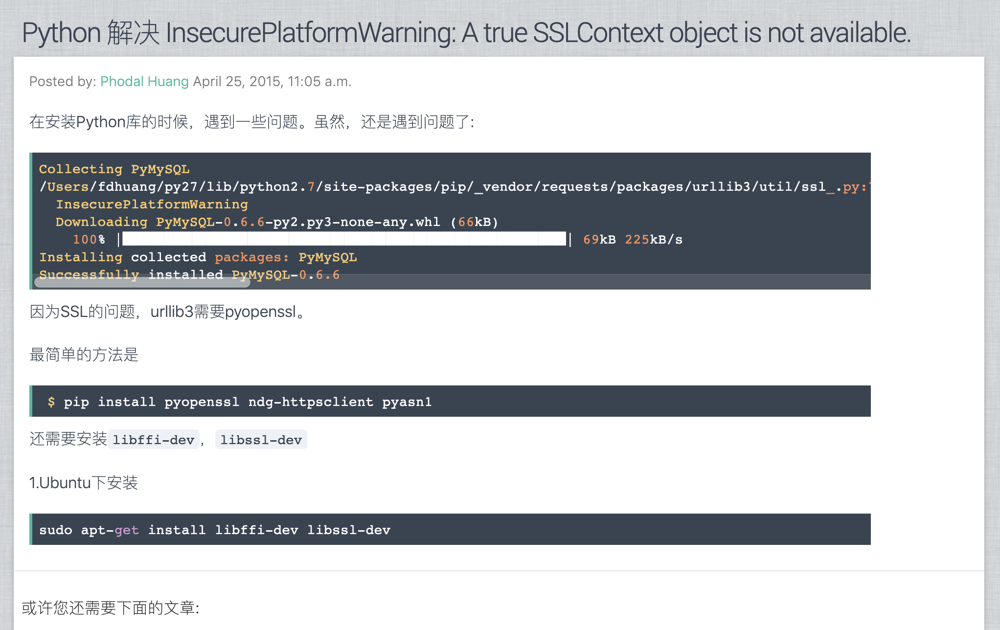

# 构建技术影响力

PS：在我毕业的那一年里，我做了一个影响力相关的 session。自那以后，几乎每一年，我都会写一篇相关的文章——主题，几乎是每年一样的。只是随着时代的变迁，加入了一些新的话题，加入了一些新的元素，然后文章变得更长了。（TL：DR）这次也不例外，它变得比以往更长了。对于我来说，**写一篇短的文章，变成了一种挑战**。

**说说影响力**

技术影响力分为两种，利用技术打造的个人影响力，和个人的技术影响力。两者所有不同的是，前者是以技术之名，成就个人的影响力——简称网红。他/好们可能不写技术文章，只是会辅助一些个人的观点和看法。后者，则是通过技术去影响他/她人，让他/她们去实践这些技术。两者没有对与错，只有各自的追求，与各自的利益诉求。

技术影响力这个东西，每个人都有自己的想法，有的人觉得是个好事，有的人觉得会浪费时间；每个人都有自己的目的，有的想赚一些业余的钱，有想提供一些 KPI，这些都无可厚非。在最开始的时候，我只是想着成为一个作家，于是写博客、写文章成了一个自然而然的习惯。当我文章写多了之后，发现影响力来了，发现它有助于帮助我实现个人目标：自由职业。我的自律的水平，倒是颇为适合于这一点。毕竟，以我这能力和人脉，怕是当不了大老板。以我这 90 后固有的职场态度，也混不进大公司的职场。

又扯远了，自我发现了：技术影响力有助于成为一个独立的个人开发者、作家，以及设计师之后——我的斜杆太多了。自媒体时代来了，我发现它还可以赚钱——哎呦，我感觉离自由职业更近了。要不是我的技术能力，还达不到**我想要**的程度，投入软技能的时间也有缺失，我早就投入这星尘大海，成为一个光荣的炮灰了。

这个就扯得更远了，原因就说到这儿了，回到正题：构建技术影响力。

按照我以往的思路，我把步骤分为这么一些部分：

0. **定位**。你是谁，你代表了什么，你擅长什么，你能做什么。
1. **搭建个人博客**。在国内，你需要一个可以畅所欲言的网站。
2. **小步快跑**。前期快速尝试不同的内容，寻找自己合适的方向。
3. **尝试高质量输出，树立口碑**。高质量的内容，很难，但是非非非常常常有价值。
4. **传播文章**。酒香不怕巷子深的时代，我想是不存在的——只当酒洒在地上才行。知乎、公号、微博，寻找你想要的平台。
5. **扩大媒介**。技术影响力有多种形式，代码、文章、演讲、Slide、培训等等。
6. **学习新技术，快速提升影响力**。你很难挑战传统的巨头，只有新的领域、技术，你才有机会超过他/好们。
7. **持续输出与内容策略**。适当地内容输出策略，可以帮助你持续性地编写内容。
8. **适当的激励**。做短期没有回报的事情，需要定下一个个里程碑，以让自己不放弃。
9. **著书立说**。自己写的书，绝对是一个十足的装逼利器。自己出的理论，那就顶天立地了。
10. **专注你自己**。先写别人需要的，以后专注于自己的需求。

所以，这篇文章真的不是一般的长，我建议你先收藏一下——哪天缺钱的时候，或者面临 KPI 压力，或者面临 Annual Review 压力的时候。拿出来看看，然后为明年做一个计划。没有别的意思，影响力是一个长期的行为，遵循**马太效应**——强者愈强、弱者愈弱。

若是你看懂了上面的大纲，就可以理解下面要说的内容，那就建议你多分享一下这篇文章，哈哈哈。

## 0. 定位

对自己的技术影响力进行定位，便像是打造自己的品牌一样。你是谁，你现在在哪里，你又要去往何处。所以，开始之前想清楚一下，你内心需要的是什么。

比如，你是一个立志为技术大牛的女程序员，那么你就可以借用女性程序员的优势，来获得更大的影响力。又或者是，你是从一个普通的二本院校毕业的程序员，立志于使用某项技术带来新的变化，那么这也是你给自己的定位。**你是谁，你来自哪里，你将去何方**，它相当于是你的人设，也相当于是你的定位。

这种定位可以放在各个网站的 Slogan 上，如微博、公众号、知乎、GitHub，它说明了你是谁，你要做什么。所以，你可以想一下你的 Slogan，但是呢，它应该是有助于提升你的影响力。所以，我要举个反面的例子，我的 Slogan『待我代码编成，娶你为妻可好』好像就这么浪费了——因为我秀恩爱的次数不多。

最后，让我再扯一下 ID 的事情，无论在哪里，你都需要一个 Brading。我们为人所知的就是我们的名字，要在网上混，我们还需要一个个人的网名。这个网名，即是我们的 ID，我们的 ID 表明了我们是谁，它还能表明我们做什么。如我们在公众号上看到的各种名字，它们都代表了身后的一个人。

举个例子，作为一个有志（机缘巧合）于打造全球视野的程序员，我选择了 Phodal 作为我的 ID——它相当的难记，以致于经常有人打错了，哪怕是非常熟悉的人。从某种程度上来说，它影响了**早期扩散**，但是时间一长，这个 ID 就被记住了。这就是选择一个英文 ID 的成本，不过，它成了我走出国门的一小步——反正，现在已经有接近 10 本的英文书上，印着 Reviewer: Phodal HUANG。

想象一下，现在有一本你翻译的书，译者有你，审阅者也有你——是的，我说的是《物联网实战指南》，这个逼我可以吹给我孙子听。再想象一下，未来有一本书，作者是你，译者也是你，哈哈哈。

## 1. 个人博客

个人博客对于个人是大有易处的，无论从技术上来说，还是从持续提升影响上来看。

### 博客类型

如果我们有精力，就自己去开发一个自己的博客，如我的博客是基于 Mezzanine + Python + Django（开放在 GitHub 上）之上开发的。它除了让我有了一个博客之外，还定期地输出一些文章，如：

 - 怎么部署博客？
 - 怎么更新 Python？
 - 怎么编译 Nginx 以支持缓存？
 - ……

不过，与之相比，直接使用 WordPress 是一个更容易的方式——你仍然需要租用一个服务器，并购买一个域名。但是，时间的成长低了，还拥有大量的相当基础设施，如手机客户端，桌面客户端等等。

如果没有精力的话，直接使用 GitHub Pages 会是一个更好的选择——虽然它访问受限。但是，与国内的 Gitxx Pages 相比，你不会遇到删文章的困扰。

### 技术需求

一个个人技术博客，应该是面向 SEO （搜索引擎优化）的，至少是应当具备服务端渲染的能力。搜索引擎是免费的流量，一旦你写了一篇独一无二的文章，那么 Google 的第一个结果就是你的——毕竟，程序员很少用百度。

一个个人技术博客，应该是自由的，可以让你说你想说的话——大部分写作平台实现不了。我的意思，并不是鼓励你去说一些政治不正确的东西。我的意思是，做好这方面的准备。

与此同时，从技术上来说，作为一个普通的程序员，并不是我们想到的新技术，都可以直接应用上。在这个时候，我们的博客就成为了一个非常好的平台，可以尝试各种新技术——千万不要删库。当 Google 推出一些 SEO 相关的新技术，比如 AMP（Accelerated Mobile Pages）、结构化数据（JSON-LD）等等，我都大胆地采用了。它即让我在技术上领先了，又让我有新的博客可以写。

## 2. 小步快跑

现开始写作的时候，会出现一个问题：**我不知道写些什么好？**。应对这个方式，有一些比较普遍的做法：**先写一些日常工作相关的内容**。诸如于：

 - 今天遇到了什么难题，应该怎么解决。
 - 解决问题的一些方案与思路。
 - 今天学到了一个什么新东西。

这些文章的话题都比较小，可以让我们快速写一些相关的内容，并让我们**慢慢进入技术写作**领域。让自己先跑出来，然后才是怎么跑好，怎么跑才是有质量的。

如果你看过我的一些文章，会发现我的文章，大部分都是在这些日常内容的一些总结。而这些日常的工作流水，我往往会放在我的博客（[phodal.com](https://www.phodal.com)）上。一来，这些文章并不是每个人都需要的；二来，它是需要**适合引流的内容**。我解决了某个 blabla 的问题，诸如于：``InsecurePlatformWarning: A true SSLContext object is not available``，已经为我的博客来了：**23,986** 次访问。

而这篇文章不到 100 个字，只花了我 5 分钟左右的时间：

由于，我在搜索的时候，没有相关的中文内容，所以我记录了一下。

但是，不管怎样，先让自己跑起来，先让博客转起来——养成一种习惯。

## 3. 尝试高质量输出，树立口碑

好了，现在你应该对于自己老是写流水文章，开始产生了一些困惑以及不满。那么，接下来，你就可以做出一些更大的改变——写一些高质量的内容。当我们在说高质量的内容的时候，我们说的是：**总结**。而令人遗憾的是，总结往往是以长度挂勾的——我的意思不是说，越长质量越好。而是要面面俱到的讲述一个内容，那么内容自然而然的就长了。

好在写这一类文章的时候，往往有两种写作模式：

 - 《金字塔原理》（一本书），适合于**一个特定主题相关的总结**。即通过结论先行、上层概况下层、同层独立穷尽、纵向疑问问答、横向四大顺序（结构、时间、总分、演绎）、序言情景冲突的模式，来写相关的文章——建议去看一下这本书。
 - 『黄金圈法则』，适合于**引入一个新技术的总结**。即 Why-How-What，用 Why 来介绍引入这个技术的目的和相关的理念，用 How 来讲述怎么去做，最后再去讲 What。

两种模式，各自有各自的特点。大部分的技术文章，都可以用这种模式业写。不过呢，《金字塔原理》并只不是一个模式，而是一系列模式的结合。它更适合于写出『使用 Flutter 收获的六点经验』blabla 类型的文章。而『黄金圈法则』，则类似于我在前几天引入的《无代码编程》，适合于介绍新技术——新技术能解决现有的痛点。

## 4. 让文章传播

**高质量的内容，才适合传播**。普通的流水式的日志文章，一旦在微信群里、社交网站上，并没有多大用处，反而会招来反感。所以，在你计划分享到一些相关的内容时，请再三看一下：你的内容**是否有分享的价值？**。没有价值的内容，只会让情况变得更糟糕。诸如于，Python Pip 这种小问题，是不会有人打开看的。

相应的也有一些分享策略：

 - 早期，多平台输出。因为个人的影响力还不够，所以需要建立多个渠道，再找适合的发现。现有的渠道有：知乎、CSDN、掘金、Segmentfault、公众号等，以及一些头条分享，诸如开发者头条、掘金、Segmentfault 头条等等。值得注意的是，前期要选择开放性平台，如知乎，而非公众号式的封闭生态、微博这样的半封闭平台——当然了，如果有大 V 帮你引流也是相当不错的。
 - 中期，少平台输出。每个平台都有各种的特色，所以有的平台会有阅读量，有的阅读少。随后，就可以更关注于有阅读量的平台，以节省自己的时间，专注于提供自己。
 - 后期，一平台输出。当你是一个大佬的时候，你的文章就会有人帮你分享出去了，你也不需要花费去扩散了。诸如 Martin Folwer，写一篇文章，就有大量地人帮扩散。

最后，你可以构建你的社群（微信群），即让你的读者们可以和你一起沟通中，探讨一些相关的技术。

越是质量高、有启发性的文章，越容易被传播开来。

## 5. 扩大媒介

文章，只是我们获取影响力的一种媒介——我擅长的媒介，相似的形式还有：

 - 代码。在 GitHub 上传播自己写的优秀项目。
 - 演讲。到各种技术大会上传播自己的优秀思想。就是太累了，我一般懒得参加。
 - 培训。可以尝试，带领更多的人成长。
 - 视频。录一些技术技巧相关的小视频啊，帮助其他/她开发人员成长。
 - 直播。你长得漂亮，或者你穿写代码，就会有人气，哈哈。
 - ……

总之，越新的媒介，就可能意味着更多的机会。如早期，我们都是通过个人博客作为媒介的，现在平台换成了微信公从号，又或者是知乎。越是这些平台的早期用户，就越能获取**早期的平台红利**，也就越有影响力。

## 6. 学习新技术，快速提升影响力

对于现有技术而言，一定存在比我们更深入的人，自然而然他/她是相关领域的权威。哪怕是换个角度来写相关的内容，也没有那么获得影响力。因为权威的地方已经那里了，我们很难去撼动。就像是现有的互联网企业，也都不敢去正面杠传统公司。而是在线上成熟之后，降维打击传统公司。

作为一个程序员，不仅要通过总结来归纳自己的知识体系，还需要不断接触一些新的概念、使用新技术。这是是一个非常有效的投机取巧的方式——但是，它相当的有效，让人百试不爽。毕竟只有领先于其它人，才算是市场先驱。

所以，当市场上出现了一个**特别有潜力**的新技术，请毫不犹豫地拥抱它们——虽然你可能押错宝，但是会提升你的学习能力和速度。

若是你觉得这种风险太大，那么可以从一些主流的技术趋势，如 ThoughtWorks 技术雷达上，寻找新的元素。与上一种方式相比，它更加可靠一些。

## 7. 持续输出与内容策略

保持持续输出，并不是一件容易的事。过去，我可能一周写上三四篇文章；现在，我只能一周写一二篇文章。除了，越来越少的写作时间之外，我们还需要寻找合适的写作素材。为此，我们需要为自己制定一个内容策略。

于是，我的第一本内容策略出现了：**系统性地写一领域相关的知识**。比如，我之前的《我的职业是前端工程师》，我换了一个轻松的角度来写前端开发 相关的内容。即可以让我在一段时间内，有相关的主题，还可以帮助我深入这个领域的方方面面——因为我以输出的方式来促进输入，即**写作驱动学习**。对于个人来说，是一种相当大的提升。

我的另外一个内容策略比较简单：**先无脑地输入，再总结、思考输出，最后系统性整理**，具体的实践过程就是：

 - 实践一些新的技术和概念（要比其它人快半步）
 - 抽取这些技术和概念，造建一个新的轮子
 - 把造轮子、实践的过程写成文章
 - 系统性的把这些文章整理成电子书
 - 时机合适，也出版成书。

这种方式对于我是适用的，对于你来说可能也有一定的参考价值。

## 8.适当的激励

在我写博客的时候，每到了 100 篇，200 篇，300 篇，直到 700 篇的时候，我都会再写一篇文章来『吹捧』一下我自己。

在我日刷 GitHub 的时候，在 100 天、200 天、300 天、365 天，我都会写一篇文章来激励自己。

而随后，我又可能会买一些自己喜欢的小东西，比如键盘，笑~。如当我出版了一本书的时候，我会给自己买上一个**黑魔导女孩**的手办，哈哈。

当我们有了一定的影响力的时候，就会有一些相应的公司、组织，希望我们帮它们做一些宣传。我们可以获取一些收入，而它们也可以获得更低成功的广告。**没有什么比这种激励更加有效了**，哈哈哈。

赚钱，也不是不可以。只是这个时候，要注意的是，**适当和适量**。不当地广告，会影响你的个人形象；不合适地广告，会让你背上黑锅。当你立志于提升技术影响力时，需要考虑这个因素。如我只会接一些技术相关的广告，而它们又有一些大厂背书，我才会考虑。诸如金融、民生之类的，都不会考虑。

## 9.著书立说

> 写技术书不赚钱，那些程序员太扣了。

技术书要赚钱太难了，如我的两本书加起来，销量可能在一万左右，而版税是 8%，定价大概在 50 左右。所以，两本书的所以，大概是 10000 * 50 * 0.08 * (1 - 0.2) （大概的个税） = 32000，而我们只会收到卖出去那部分的钱。所以，你花上个一年半载写的书， 往往就只有这么一点收入。

不过呢，从提升影响力的角度来说，写书是非常有必要的——我可以拿着它，和我们的子子孙孙说，我年轻的时候有多 NB。额，举例错了，它可以让人一提起相应的领域，就想起了你。也因此呢，写书也有一个红利是，你是最早写这个领域的作者。不过，可不要为了红利而写书，它是个好机会。

除此，当我们开拓一个新的领域时，如我们发明了一个新的名词，诸如 FrontendLess 或者 Codeless，并做了大量的研究和开发。我们就成了这个领域的绝对专家，是不是很棒——就是离得有点远。

造一些新的名词，然后持续发力，有一天它火了，你就更火了。

## 10.专注你自己

> 当你有了多少粉之后，你就有了与之成比例的黑。

技术领域也是如此，有人喜欢 Vim，就有人讨厌 Vim，我们无法让每个人满意。我们只是一个技术人员，写技术文章只是业余的兴趣和爱好。

写作的时候，我们往往可能在一个字眼上，犯下了错误。但是看的人，可能会纠住这个字眼不放。比如说：

 - 我们写作的时候，第三人称写的是『他』。但因为女权运动的缘故，我改成了他/她——这样还会有人有意见。
 - 我们写了一句：如果你书看得多，那么你看书可以只看目录。会有人断章取义成，『看书可以只看目录』。
 - 夸奖自己的时候，用『我又可以装逼了』，就不会有人说你装逼——笑。
 - ……

从我过去的经验来说，面对键盘侠的做法是，无视他/她们，或者以更猛烈地方式抨击他/她们——不要对小人太君子了。

总之，以提升自己为前提，专注于自己在做事上。

## 结论

好了，你可以放弃治疗了。

