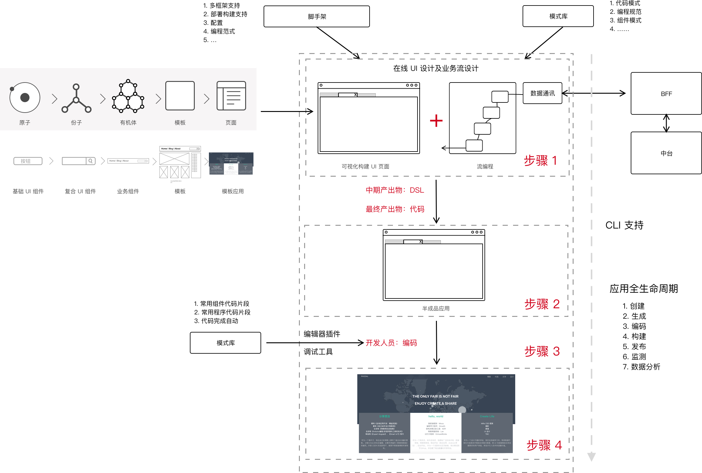

# 下一代：无代码编程

> 中台之后，便是无代码编程。

规模化的组织，经常要面临这样的挑战：每个应用的基础设施是相同的，部分的代码也是相同的，甚至于它们可能只是数据模型不同而已。结果却导致了，他/她们要一次又一次地重新编写一个应用。

对于一个新的应用而言，它需要对接大量的三方（非自己团队）服务。服务之间的不断变化 ，导致了对应的使用方也需要发生变化。不断变化的业务，导致了前台的设计不断变化。为了应对快速谈的的前台服务，后台便诞生了中台，以提供快速的响应能力。而随着中台进一步沉淀，从某种形式上趋于稳定，而前台仍然需要快速地响应能力。

于是乎，作为一个前端开发人员，我们不断提炼和复用代码，想着的模式在上一篇文章 [减少代码量的 7~8 种方式](https://www.phodal.com/blog/code-reuse/) 中提到了：

 - 脚手架
 - 组件库
 - 模式库
 - 模板和模板应用

对应的，我们还创建了一系列的 CLI、工具集、编程器插件以及设计系统，以完成整个系统的快速开发。然而，我们还缺少一套有效的工具，来统一化的管理这些工具。

换句话来说，就是：我们需要一个**前端的中台**，它便是无代码/低代码编程。

## 什么是无代码编程？

无代码/低代码是一种创建应用的方法，它可以让开发人员使用最少的编码知识，来快速开发应用程序。它可以在图形界面中，使用可视化建模的方式，来组装和配置应用程序。开发人员可以直接跳过所有的基础架构，只关注于使用代码来实现业务逻辑。

当然，从开发人员的角度来看，降低代码量，可能是：

 1. 框架本身处理了复杂性。毕竟 **“复杂度同力一样不会消失，也不会凭空产生，它总是从一个物体转移到另一个物体或一种形式转为另一种形式。”**
 2. 代码生成减少了工作量。大量的复制、粘贴需要更多的时间。

### 流程 

只是凭借这个概念，我们是无法理解无代码编程的。于是，我画了一张图来展示相应的架构和流程：



依照我的观点来看，我将无代码编程分为了两部分：

  - 用于构建 UI 的编辑器——一种在线的拖拽式 UI 设计和页面构建工具
  - 用于编写业务逻辑的流编辑器——通过流编程的方式来编写业务代码（多数是对于数据的处理）

**UI 编程器**。为了设计出我们的 UI 构建器，我们需要准备好一系列的基础设施：

 - **UI 编程器**。用于拖拽式设计 UI。
 - 空白脚手架。一个带有完整的应用生命周期的项目，但是它是一个空白的项目——用于我们在构建 UI 的过程中，随时随地的添加组件和代码。
 - 设计系统。我们需要一个完整的组件库，大量的页面模板，以及一定数量的模板应用，减少相应的开发工具量。
 - 代码片段集。它将设计系统中的组件库进一步实例化成代码段，在完成编辑后通过 CLI 来动态编辑代码。
 - DSL（领域特定语言，可选）。中间生成物，用于隔离框架与设计。

**流编程器**。随后，为了在

 - **流编程器**。用于拖拽式、输入编写业务代码。
 - 后端服务。如果不能提供现成的后端服务，则需要拥有一个标准的 API 规范，以及相应的 mock server。
 - 模式库。包含相应的业务处理代码，如通用的登录、数据获取、UI 交互等。
 - DSL（领域特定语言，可选）。同上

当然了，我们还需要能**实时预览**构建出来的应用。随后，我们执行了构建，而后构建出了一个半成品应用。开发人员只需要在它的基础上开发应用即可。而在开发人员开发的过程中，我们可以设计一系列的工具，来帮助开发人员更快速地构建应用。

 - 编辑器插件。包含设计系统、模式库等的自动完成代码，以及组织内部常用的代码库。
 - 调试工具。对于混合类型的应用而言，我们还需要一个开发工具来快速构建应用。

从上述的流程上来看，无代码编程还具有以下的特点：

 - 拖放式界面。又或者是可视化模型——基于节点和箭头
 - 基于视觉的设计。
 - 可扩展的设计。如对于插件、插件商店，社区等一系列的支持。
 - 跨平台功能。支持 PC Web 应用开发，支持移动应用构架等。
 - 强大的部署后。即平台包含着整个应用的生命周期。
 - 拥有丰富的集成支持。可以随意的找到需要的组件，以及对应的后台服务。
 - 配置化。它也意味着大量的自定义配置。
 - 自制的领域特定语言（可选）。用于构建时优化。

### 优缺点

相应的，它具有以下的一些特点：

 1. 高效。不用多说，节省时间和开发成本。
 2. 有限的 Bug，安全性。
 3. 低成本。其所需的预算非常有限。
 5. 易用（取决于设计）。
 6. 开发速度更快。
 7. 开发过程中的 AI 。
 8. 维护成本低。

对应的相应的缺点有：

 1. 仍然需要编程技能。
 2. 受限的自定义能力。
 3. 可扩展性成了新的问题。
 4. 集成受限。

就当前而言，低代码开发平台通常分为两大类：

 - 对于外部：制作简单的产品，如网络移动应用程序
 - 对于内部：为您的团队或企业创建业务应用程序

诸如只使用 CRUD、表单、验证、简单聚合、分页等简易的服务。最常见的例子就是表单构建了，诸如金数据这样的应用，便是可以直接通过拖拽元素来生成，相应的开源实现有 jQuery Form Builder。对于开发人员来说，我们只需要定义好数据模型，再通过拖拽来决定元素的位置即可。从这种角度来看，只要能使用 Serverless 构建的应用和服务，都可以直接使用低代码开发模式。

###  开发流程对比

从我们的理解来看，传统应用的开发流程是：

 1. 分析、设计、确认、规划需求
 2. 设计系统架构
 3. 搭建前后端项目。选择技术栈、从零开始搭建或者从脚手架中创建。
 4. 搭建持续集成。
 5. 创建线框图和高保真原型。
 6. 设计数据模型，定义前后端契约，即 API URI、方法、字段等。
 7.  前后端实现业务逻辑。
 8.  前端实现 UI 页面。
 9.  集成第三方后端服务。
 10.  功能需求测试（DEV、QA、ST、UAT）
 11.  跨功能需求测试（安全性、性能等）
 12.  部署到生产环境。

而，低代码开发流程：

 1. 分析、设计、确认、规划需求
 2. 选择需要的第三方 API
 3. 在可视 IDE 中绘制应用程序的工作流程、数据模型和用户界面。
 4. 连接 API——通常使用服务、函数发现。
 5. 编写业务逻辑（可选）。手动代码添加到前端或者自定义自动生成的 SQL 查询。
 6. 用户验收测试。
 7. 部署到生产环境。

从步骤上来看，无代码编程少了几个步骤。这些步骤都因为大量丰富的内部系统集成，而变得非常简单。

### 适用场景

就当前而言，无代码编程实际上是一种高度的场景预设的模式。因此，它存在一定的适用场景：

 - **模型驱动开发**。
 - **快速 UI 构建**。
 - **极简的业务功能**。使用这样的工具，也意味着，我们对于交互和可
 - **IT 资源受限**。在资源受限的情况下，能快速开发出符合业务需求的应用最重要。

而从流程上来看，对于一部分的应用来说，我们并不能实现无代码编程——存在一些业务上的不同之处。因此，**多数场景之下，只是实现了低代码编程**。

若是想真实的无代码编程，则需要一些更特定的场景：

 - 设计表格（输入数据）
 - 创建报告（组织数据）
 - 常规调度和自动化过程（操纵数据）

更多的场景正在探索中。

## 无代码编程的挑战

无代码编程，除了需要准备好上述的一系列基础设施，还不可避免地会遇到一系列挑战。

  - 谁来写这部分代码？
  - 客户端的基础设施准备。
  - 服务端的服务平台搭建。
  - 统一用户体验设计。设计出一系列能便利组合的组件，及对应的模板页面。与此同时，它们还能适应于不同的风格，即有多样性的主题支持。
  - DevOps 流水线设计。低代码编程，依赖于一系列的自动化工具，以实现构建、调试、部署以及维护，同时还包含应用的测试。
  - 领域语言设计。
  - 自动化测试。如果我们的前端代码是自动生成的，那么我们还需要对它们进行测试吗？这是一个好问题，而如果代码是自动生成的，那么测试也应该是自动生成的。毕竟要在平台上，编写大量的自动化测试，以保证平台的质量。

其中，有一些部分略微复杂一些，我们大概可以探索一下。

### 谁来写这部分代码？

在我们创建这样一个平台和工具时，我们要考虑的第一个问题是，我们这个工具是为谁写的？

 - 没有编程经验的人。如业务人员，他/她们对于业务系统有着非常丰富的经验。这也意味着，我们
 - 有编程知识，但是没有经验的人。
 - 有一定经验的开发人员。
 - 有丰富经验的开发人员。对于专业的人来说，自动化就意味着缺少灵活度。甚至与自己编写相比，他/她们要花费更多的时间来修复生成的代码。

显然，对于相当有经验的开发人员而言，这个工具并不一定是他/她们所需要的。

### 客户端基础设施

从我的理解来看，它适合于 **快速的 MVP 构建**，并且生成的代码还应该方便修改，而不是诸如早期的 DreamWeaver 或者 FrontPage 这样的工具。

而与此同时，由于面向的开发人员水平不同，我们所需要做的工具也不同：

 1. 支持云构建和调试。
 2. GUI 编程应用。
 3. 代码生成。
 4. 设计系统体系构建。组件库搭建，模板应用创建等。
 5. …

更难的是，容易让开发人员能接受代码生成。

### 服务端

对于一个低代码平台而言，它对应的后端应该：

 1. 大量可用地现有服务。身份验证、安全性、推送能力、地图等等
 2. 快速构建出后端服务。若是有内部 Serverless 或者 FaaS 方案，可以说是再好不过了。
 3. 方便与第三方服务集成。
 4. 灵活性。支持多语言等。

统一的后端服务 API，对于后端服务来说，我们需要一个通用的范式。所有的 API 应该按照这样的范式来设计。不过，作为一个 API 的消费方，我们可能没有这么大的权力，但是我们可以采用**装饰器模式**，即封装第三方 API 成统一的方式。为此，我们采用的方式，仍然是：

 - 契约。诸如 Swagger UI，它可以直接创建一个简易可用的服务。
 - BFF。即我们一一去按我们的需要，去封装这些第三方应用。
 - 查询语言。与自己编写 BFF 相比，更简单的方式是采用：**GraphQL** 这样的后端查询语言，便捷性更高、模式更加灵活。

在开发前的设计期里，我们需要首先设计出对应的领域模型。

### 领域语言设计

低代码环境使用（图形）**建模语言**来指定整个系统、产品的行为。它意味着：

 1. 将数据结构、领域模式应用到程序的各个层级中。
 2. 将业务规则、决策融入到应用中（层级）。

这也就意味着，我们需要设计一个模型语言。而它对于我们而言，实际上是领域特定语言（DSL）。如下是一个简单的 DSL 示例，用于描述使用到的组件：

```json
  {
    'style': '',
    'id': 2,
    'blocks': [
      {
        'content': {
          'content': 'content',
          'title': 'hello'
        },
        'type': 'card'
      }
    ]
  }
```

除此，我们还需要设计对应的布局 DSL，诸如于：

```
H:[circle1(circle1.height)] // set aspect-ratio for circle1
HV:[circle2..5(circle1)]    // use same width/height for other circles
H:|[circle1]-[circle2]-[circle3]-[circle4]-[circle5]|
V:|~[circle1..5]~|          // center all circles vertically
```

最后，我们还需要将流代码，转换为真实的项目代码。三种类型的 DSL 结合下来，都不是一个轻松的工具。

## 原型设计

写好现有的组件，通用型接口。如常见的登录接口，。对于使用登录接口的业务来说，它们只关心三部分的内容：

 1. 成功登录。
 2. 取消登录。
 3. 登录失败。对于客户端而言，可以视为取消登录。对于服务端来说，则可能是密码错误、用户名不存在、账号被锁定等。

对应于以上情景，又有一些通用的逻辑处理：

 1. 登录成功。保存 Token，并返回历史页面。
 2. 登录失败。弹出一个自定义内容的提示框。

这些代码是相似的。

### 前端原型

在一些简单的前端应用里：

 - 模板。只是在使用这些模板，再为这些模板设置相应的属性，绑定对应的值。
 - 数据。其过程都只是在各种保存变量的值，并 CRUD 这些变量的路上。为此，我们需要一个数据处理的管道架构设计，用于处理这些值。
 - 函数。事实上，我们的所有函数都只是一些管理函数，只用于处理这些对应的逻辑。

这些常见的功能都可以做成一些组件，它们对于某些应用来说，代码相应的重复。

 - 无限加载页面。只需要绑定上 API，再控制一下元素的显示与隐藏即可。
 - 表单。定义好字段即类型，对应的前后台逻辑都有了。除此，我们还需要为它们自定义好常见的规则，如正则表达式。而一旦表单之间有联动，那么这个组件的设计就更加麻烦了。
 - 卡片式元素。
 - 表单和表格展示。
 - 常见图表。事实上，已经有一系列的图表工具了，我们只是在它们在基础上，进行了二次封装而已——使得它们可以变成领域语言的形式。
 - 高级的响应式布局。与每个应用独立开发布局不同的是，低代码平台需要提供一套强大的自定义、响应式布局设计——即要满足移动端的通用模式，还要满足桌面版的通用模式。如对于大量数据来说，桌面端使用的是 Pagination，移动端使用的是无限滚动。

### 后端原型

事实上，对于后端来说，低成本平台意味着，代码生成及服务生成。而服务本身是有限的，既然是业务上发生了一些变化，后端服务也可能并不会发生变化。

它也意味着：

 - 微服务化。每个后端服务要尽可能的小。
 - API 规范化。即采用统一的 API 格式，接受统一的权限管理
 - 大量的 API 服务。
 - 快速集成第三方服务方案。集成第三方服务是开发应用不可避免的情况。为了应对这个问题，我们需要做准备好对应的创建服务逻辑，传入第三方服务所需要的参数，便可以直接生成我们的转发服务。

那么，问题来了，既然如此，我们是否能提供一个定制的工具呢？让每个人可以创建自己的组件流？

答案，显然是可以的。

### 概念证明

于是乎，在我最近设计的 PoC （概念证明）里，采用的是 Anguar 框架。相应的基本思想如下：

 1. 使用 Material Design 作为组件库，使用 CDK 的 Drag 来实现拖拽功能。每个拖拽的组件，称为 element（元素），由 ElementDispatcher 由根据数据生成对应的组件。可拖拽的部分由两部分组成：**布局** + **元素**。
 2. UI 构建完后，生成对应的 DSL，目前采用的是 JSON。毕竟数据结构是最简单的领域特定语言。
 3. 借由 Angular Schematics 解析这部分的 DSL，来生成相应的项目代码。

## 其它

相关开源项目：

 - 拖拽式 Web 建造工具：https://grapesjs.com/
 - 基于 Flow 的编程工具：https://noflojs.org/
 - DSL 布局生成器：https://github.com/ijzerenhein/autolayout.js/
 - 可视化数据流编辑器：https://github.com/Gregwar/blocks.js
 - 基于 React 的内容生成器：https://github.com/vigetlabs/colonel-kurtz

参考资料：

1. [https://www.process.st/low-code/](https://www.process.st/low-code/)
2. [https://medium.com/@stefan.dreverman/decisions-to-take-for-your-low-code-architecture-c0768b606f](https://medium.com/@stefan.dreverman/decisions-to-take-for-your-low-code-architecture-c0768b606f)
3. [https://medium.com/@stefan.dreverman/analyzing-coinmarketcap-data-with-neo4j-4930ba0068e1](https://medium.com/@stefan.dreverman/analyzing-coinmarketcap-data-with-neo4j-4930ba0068e1)
4. [https://www.outsystems.com/blog/what-is-low-code.html](https://www.outsystems.com/blog/what-is-low-code.html)
5. [https://medium.com/@stefan.dreverman/starting-a-low-code-application-architecture-13170fcd6fc7](https://medium.com/@stefan.dreverman/starting-a-low-code-application-architecture-13170fcd6fc7)
6. [https://www.quora.com/What-is-low-code](https://www.quora.com/What-is-low-code)