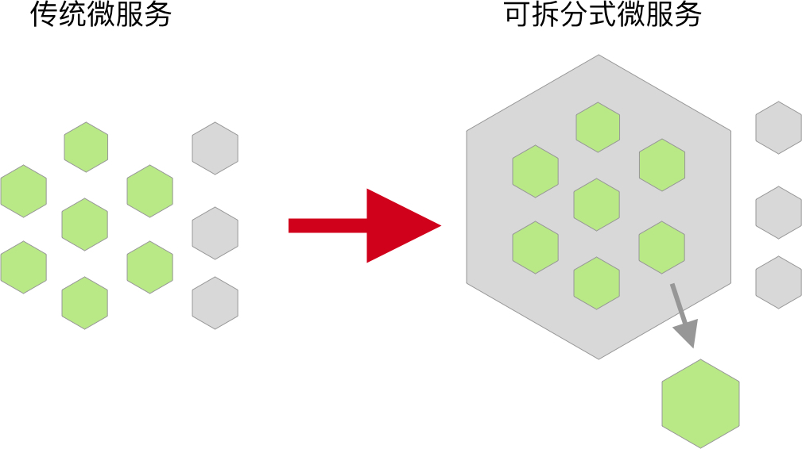

# "微" 害架构

> “微” 害架构，即微架构以不合理的方式运行着，其表现形式不适当地采用 “微架构”（微服务、APP 插件化、微前端等）技术拆分臃肿的单体应用，导致软件架构进一步复杂化、难以维护，使得原本具有优势的微架构**微微**出现一些问题。

为什么一个设计良好的架构，会变成一个人人嫌弃的架构？我们可以轻轻松松地列举出这么一些理由：

 - 架构的设计不符合演进的需求。
 - 开始设计时，架构就不合理。
 - 架构本身是合理的，后继的开发者能力不足。
 - 架构本身是合理的，然而开发的过程中走歪了。

关于能力不足导致的架构问题，就不进一步展开讨论。我们主要讨论的是 “走歪了的流程”，它才是导致 "微" 害架构的元凶。在开发能力完备的情况下，架构走向微微不合理的地方，有一个原因是：KPI。KPI 导向的系统架构设计，必然会出现一定的不合理性。

 - “我们的竞争对手采用了微服务架构，你看看我们有没有办法也用这个架构？”
 - “隔壁开发小组的团队使用了微前端架构，我们也上这个架构吧？”
 - “小李啊，听说最近微服务很火啊，你看能不能看到我们的项目上？”
 - ……

如果只是吐槽 KPI，那么这篇文章对于读者来说一定是没有价值的，因为 KPI 是一定要有的。架构是不是最好的不重要啊，重要的是大家都满意——领导满意了，可以多涨工资；团队采用了，可以向外宣传，吸引新成员。

那么到底是怎么样产生的 "微" 害架构？从定义上我们可以知道，架构本身应该是合理的，只是出现了点问题。问题的原因有多种多样，如没有因地置宜地实施架构—— A 项目有 50 个后端开发，后端由 20 个微服务组成；B 项目有 10 个后端，也由 20 个微服务组成。每次上线的时候，不得不出动所有的人，上线到半夜才算完成。然后，发了个凌晨 4 点的朋友圈。

而在走歪之前，让我们先了解、回顾一下再有系统的架构形成。

## 架构的演进

回过头来看，大型项目的架构演进，无非就是：

1. 我有了一个 Idea，快速地设计出了原型 1.0 版本，并推向了市场，效果还不错，赚到一些钱了。
2. 市面上的竞争对手越来越多，为了赢得这场战争，我们在 2.0 版本系统里添加了越来越多的功能，一个臃肿的单体应用。
3. 随着时间的推移，我们添加新功能的难度越来越大，于是我们设计出了 3.0 版本的系统——在今天这个节点里，就是微服务架构。

这就是《Linux/Unix 设计思想》一书中所提到的三个系统，毫无维和感：

1. 在背水一战的情况下，人类设计出了第一个系统。
2. 专家们在第一个系统的基础上，做出了伟大而臃肿的第二个系统。
3. 受累于第二个系统的人，设计出了第三个系统。

可故事并不能因此而结束。随着时间的推移，**受益于第三个系统的人们，又有一部分组织会回到第二个系统**。

大部分的组织，会意识到三个系统的存在。于是，在根据 Idea 设计一个新系统的时候，采用了第三个系统的架构，然后出错了——因为他们缺少专家。这里的专家并单纯指技术方面的专家，而是技术专家 + 业务专家，他/她可以是一个懂业务的技术专家，或者一个懂技术的业务专家。架构在底层是由技术实现的，而在顶层则是业务代码实现的。

**业务层的耦合直接影响了技术上的耦合**。这个困境导致了，技术架构在不断变化。

## 组织及架构变更

从我毕业到现在，大公司、大组织的软件架构不断地在发生变革。Mobile First、One APP 、中台战略各种口号不断提出、不断修改。线下业务线上化发展的过程中，业务不断发展，导致组织的软件部门本身的膨胀，进一步地便映射到了软件架构上。

再次的，让我们联系到了 “康威定律”：设计系统的组织，其产生的设计和架构等价于组织间的沟通结构。可它并不是在反应康威定律。而是相似的推论：系统的组织不断变化的同时，其设计和架构也相应的在不断地调整。

面对组织结构变化的同时，架构也随着产生了一系列的变化，毕竟：**天下大势，分久必合，合久必分**。同数据库分库分表一样，既然一个组织的部门已经过于庞大，那就进一步细化。同理之下，软件的不同部分又被拆分到不同的部门之下。而随着不同部门的业务发展，技术栈也因此而越来越难以统一，出现了多样化。而在走向多样化的一段时间之后，用户越来越讨厌一家公司的应用（Web、移动 Web、APP）分散在多个不同的应用上，于是应用又开始进一步走向聚合。

于是在过去的两三年里，我参与了一系列的 “微架构” 相关的系统的开发。参与的是互联网领域的应用开发，所以主要有：

**后端拆分**。其典型的形式便是微服务，而以微服务的实现来说，不同部门的服务也往往通常是独立存在的，在架构上后台本身也是互不干扰的。只要保证接口 API 是正常的，那么我们并不需要关心其它项目背后的技术栈。将其与 APP 和前端一对比，就会发现其实后端微服务是特别容易实现的。然而，

**APP 拆分**。APP 由于存在多种容器，便有插件化、组件化、小程序等不同的方案。整个 APP 所承载的代码量，有可能不逊色于操作系统的代码量。跨团队共同在一个代码库开发，并不是一件容易的事，因此只能提供一个 APP 平台，让不同部分的业务可以在上面运行。

**前端拆分**。大规模前端应用的开发历史，要比 APP 要短得多，但是也出现了一系列的拆分方案：[前端微服务化](https://github.com/phodal/microfrontends)、[微应用化](https://www.phodal.com/blog/architecutre-in-word-design-micro-application-frontend-architecture/)。前端走向微前端架构的原因，除了庞大的单体应用，还有一部分是要聚合旧的遗留应用。

其中或多或少走过的坑，让我意识到了微架构对于人员素质的要求。对于有些组织来说，其不合理地采用微架构带来的问题，可能比带来的问题还多。

## 微架构带来的问题

> “微” 害架构，即微架构以不合理的方式运行着，其表现形式不适当地采用 “微架构”（微服务、APP 插件化、微前端等）技术拆分臃肿的单体应用，导致软件架构进一步复杂化、难以维护，使得原本具有优势的微架构**微微**出现一些问题。

在不同的微架构领域里，他们有着不同的原因。在考察是否使用某项技术的时候，我们就会考虑这些因素。而在个时候，我们的第一答案是：“直接使用这种架构，具体遇到什么问题再解决”。是的，现在让我们来戳破这些问题，来看看有没有对应的解决方式？

（**以下的内容以个人经验、理解为主，可能与项目的情况不同。**）

### 后端：微服务到应用

实施过后端微服务的开发人员，想必对微服务也有一系列的看法。在不正确的实施之后，不少的人会对微服务有不满。尽管如此，他/她们都会承认微服务在隔离服务之间的价值。但是当带来的问题远大于收益时，它就变得不值得采用了——要么是问题不好解决，要么是问题解决不了。早在 2014 年，我翻译了一篇微服务代价的相关文章《[微服务架构——不是免费的午餐](https://www.phodal.com/blog/microservices-is-not-a-free-lunch/)》，其中提到的多数都是技术问题。

在项目上实施的时候，我发现有一些额外的问题：

 - 代码架构。在不同的组织之间，采用微服务架构，对于相互之间都是好处的。但是在一个小型的内部组织里，掌握**代码独立**的微服务数量就值得考虑了——既然不需要和别人沟通，为什么需要在十多个 repo 间切换？？
 - 部署流程。微服务讲究的是独立开发、独立部署，而如果一个微服务如果不能独立部署，有些固定的上线周期，那么部署变成一件痛苦的事。如果在一次 release 计划里，我们需要同时上线十几个服务，就变得……。

那么，在这种情况下，这些开发者就在考虑：**是否值得采用微服务架构**？而实际上这个问题的本质可能是，是否有**独立拆分微服务**的必要？

或者采取集成构建的方式，在开发和构建时来独立两个应用，而部署只需要部署一个应用？

### 客户端：插件化、组件化

（PS：笔者仅有 Android 插件化相关的经验）

APP 的拆分可以分为：插件化、组件化两种方式。插件化是集成构建完后的 APK 包，而组件化（Module）则是集成构建后的模块（lib）。Web 前端的拆分则可以是：微前端、微应用和跨框架组件化几种形式。

不论采用的是哪种方式，每一个微小的部分，最后可以在同一框架内运行。不同的实现方式，稍有有一些区别。有些架构在实施起来很轻松，但是在维护后却变得相当麻烦。而实际上往往有很多的架构在实施的时候就很麻烦，更不用说在后期维护更加麻烦。

业务的价值往往以大前端的形式呈现，因此移动应用在代码的拆分上，往往比后端容易。不论采用的是动态加载、UI跳转、路由或者其它的形式，都 得考虑如何来拆分代码。于是我们就遇到问题了：

 - 一个简单的业务，是否有必要成为一个简单的服务？

这个时候，当我们有一系列简单的功能，那么它们真的要得独立运行。它们是否有必要成为多个简单的组件？他们不能是一个组件来接受多个参数吗？

面对这些问题，我们可以采取合适的代码拆分策略，以方便在未来合适的时候拆分。而限制我们这么做的主要原因是，后期拆分的时候巨大的挑战。

## 解决方式？可拆分式微架构？

要合并多个后端服务，那么就需要统一它们的技术栈，但是他们的技术栈会是一样的吗？在多数组织里，技术异构是存在的——只存在于少数据服务中。在大多数情况下，他们都是使用同一种技术构建的。同一个语言、一个框架，可以降低学习成本。在一些不易实现特性，如机器学习、深度学习，则使用 Python 等拥有丰富 AI 生态的技术栈来构建。

此时，我们只需要保证可以成功构建即可，如 [微应用化](https://www.phodal.com/blog/architecutre-in-word-design-micro-application-frontend-architecture/) 但是一种构建时集成的方式。当然了，我可能又一次的回到锤子定律的坑里了。

而这种方式并不违反微服务的一系列原则，服务自治、专注的服务等等。在需要的时候，诸如我们主要修改的代码在某一个特定的服务里，那么我们只需要拆分出来独立部署。

同理于，APP 插件化和前端微应用化。只是如果没有规范化开发流程，架构之间可能会出现进一步的耦合。
