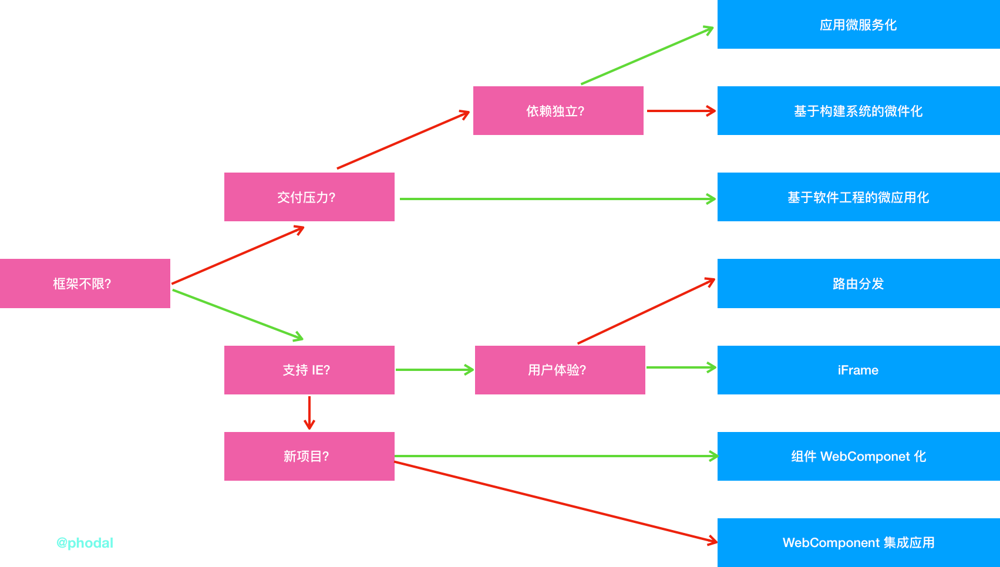

微前端架构选型指南
===

在之前那篇《实施前端微服务化的六七种方式》中，介绍了在实施微前端的过程中，我们采用的一些不同方案的架构方案。在这篇文章中，我将总结如何依据不同的情况来选择合适的方案。

快速选型指南图
---

我还是直接先给结论：

关键点的相关解释如下：

**框架限制**。在后台微服务系统里，人们使用其它语言的库来开发新的服务，如用于人工智能的 Python。但是在前端，几乎不存在这种可能性。所以当我们的前端框架只有一个时，我们在采用微前端的技术时，可选范围就更大了。而遗憾的是，多数组织需要兼容遗留系统。

**IE 问题**。不论是在几年前，还是在今年，我们实施微前端最先考虑的就是对于 IE 的支持。在我遇到的项目上，基本上都需要支持 IE，因此在技术选型上就受限一定的限制。而在我们那些不需要支持 IE 的项目上，他们就可以使用 WebComponents 技术来构建微前端应用。

**依赖独立**。即各个微前端应用的依赖是要统一管理，还是要在各个应该中自己管理。统一管理可以解决重复加载依赖的问题，独立管理会带来额外的流量开销和等待时间。

微前端方案的对比：简要对比
---

如果你对上述的几个方面，仍然不是很熟悉的话，请阅读《实施前端微服务化的六七种方式》。

方式       | 开发成本 | 维护成本 | 可行性  | 同一框架要求 |  实现难度 | 潜在风险    
---------|---------|--------|-------|----------|-------|-------
路由分发   | 低 | 低 | 高 |  否  |  ★ | 这个方案太普通了 
iFrame    | 低 | 低 | 高  |  否  | ★ | 这个方案太普通了 
应用微服务化 | 高 | 低 | 中 |  否  | ★★★★ | 针对每个框架做定制及 Hook 
微件化   | 高 | 中 | 低 |  是  | ★★★★★ | 针对构建系统，如 webpack 进行 hack
微应用化   | 中 | 中 | 高 |  是  | ★★★ | 统一不同应用的构建规范
纯 Web Components | 高 | 低 | 高 |  否  | ★★ | 新技术，浏览器的兼容问题
结合 Web Components |高 | 低 | 高 |  否  | ★★ | 新技术，浏览器的兼容问题

同样的，一些复杂概念的解释如下：

**应用微服务化**，即每个前端应用一个独立的服务化前端应用，并配套一套统一的应用管理和启动机制，诸如微前端框架 Single-SPA 或者 [mooa](https://github.com/phodal/mooa) 。

**微件化**，即通过对构建系统的 hack，使不同的前端应用可以使用同一套依赖。它在**应用微服务化**的基本上，改进了重复加载依赖文件的问题。

**微应用化**，又可以称之为**组合式集成**，即通过软件工程的方式，在开发环境对单体应用进行拆分，在构建环境将应用组合在一起构建成一个应用。详细的细节，可以期待后面的文章《一个单体前端应用的拆解与微服务化》

微前端方案的对比：复杂方式
---

之前看到一篇微服务相关的 [文章](https://www.softwarearchitekt.at/post/2017/12/28/a-software-architect-s-approach-towards-using-angular-and-spas-in-general-for-microservices-aka-microfrontends.aspx)，介绍了不同微服务的区别，其采用了一种比较有意思的对比方式特别详细，这里就使用同样的方式来展示：

架构目标           | 描述
------------------|---------------
a. 独立开发        | 独立开发，而不受影响
b. 独立部署        | 能作为一个服务来单独部署
c. 支持不同框架     | 可以同时使用不同的框架，如 Angular、Vue、React
d. 摇树优化        | 能消除未使用的代码
e. 环境隔离        | 应用间的上下文不受干扰
f. 多个应用同时运行 | 不同应用可以同时运行
g. 共用依赖        | 不同应用是否共用底层依赖库
h. 依赖冲突        | 依赖的不同版本是否导致冲突
i. 集成编译        | 应用最后被编译成一个整体，而不是分开构建

那么，对于下表而言，表中的 a~j 分别表示上面的几种不同的架构考虑因素。

（PS：考虑到  Web Components 几个单词的长度，暂时将它简称为 WC~~)

方式        | a | b | c | d | e | f | g | h | i
-----------|---|---|---|---|---|---|---|---|---
路由分发    | O | O | O | O | O | O |   |   |   
iFrame     | O | O | O | O | O | O |   |   |   
应用微服务化 | O | O | O |   |   | O |   |   |
微件化      | O | O |   |   | - | - | O | - |   
微应用化    | O | O |   | O | - | - | O | - | O 
纯 WC      | O | O |   | O | O | O | - | - | O 
结合 WC    | O | O | O | O | O | O |   |   | O 

图中的 O 表示支持，空白表示不支持，- 表示不受影响。

再结合之前的选型指南：

（PS：本图采用 Keynote 绘制）

你是否找到你想到的架构了？

