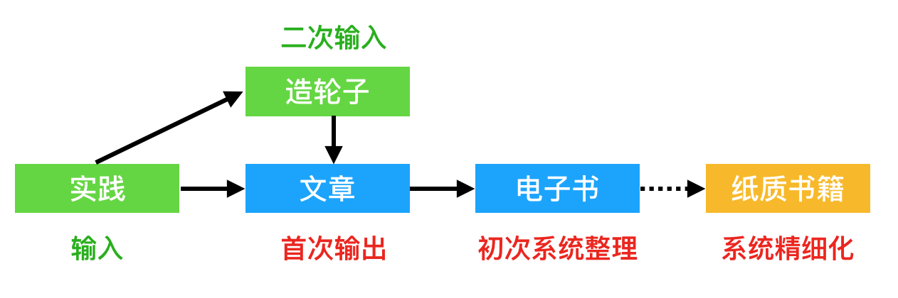
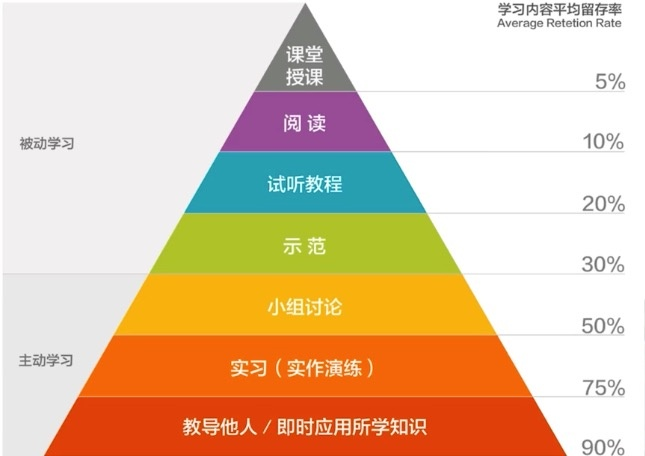

# 如何学习、练习一项技能？

随着工作年限的增长，经验的不断丰富，我开始寻找下一阶段的个人发展目标。作为一个学习者，在过去的几年里，成果大抵是卓有成效的。可无论是学习还是应用新的技术，都需要一个短暂的学习与练习，才能获得相应的经验。这就造成了一个冲突，**日益增长的技能需求，同不足的时间之间的矛盾**。

练习不练习？练习的话，又得练习多少？怎么练习？

在时间限制的情况下，我们要怎么去解决这些问题？

## 练习式学习

我的模式比较固定，一般是就是这么几步：

 - 实践一些新的技术和概念（要比其它人快半步）
 - 抽取这些技术和概念，造建一个新的轮子
 - 把造轮子、实践的过程写成文章
 - 系统性的把这些文章整理成电子书

这个模式从我毕业一直玩到现在，不敢说对所有人都适用，但是对我的效果倒是相当的不错。所以，大可以称之为 Phodal 学习模式。

如我最近半年研究的 Serverless 和微前端都是采用同样的模式，AWS 可以使用 Node.js 来开发 Serverless 应用。

Serverless。我先实践用 AWS 玩 Serverless 的一系列玩法，在我的 GitHub 上堆了一堆相关的代码，然后输出了一系列的文章：[phodal/serverless](https://github.com/phodal/serverless)，方便后人学习和 **star**（我就是这么鸡贼）。本来我打算自己造个 Serverless 的轮子，但是涉及的知识太广了，一个人短期内造不过来就放弃了。

微前端。仍然的，我也是找到 Single-SPA 这样的框架，进行一些尝试。然后造自己的轮子：[phodal/mooa](https://)，接着输出一系列相关的文章：[phodal/microfrontends](https://github.com/phodal/microfrontends)，方便后人学习和 **star**。于是，我继续在探索微前端的实践，最近在造一个新的轮子。

基本就是：**先无脑地输入，再总结、思考输出，最后系统性整理。**

整个过程下来，会发现它会不断地提高我们的抽象思维能力（或者说总结能力）。我们需要不断的整理现有的知识，然后将它与过去的内容进行对比。一来二去，不但提高了新技能的掌握，还复习了一下旧的知识。

于是，你是否也发现了问题，这种练习方式**特别浪费时间**。

### 练习技巧

在这个过程中，我掌握了三种还算不错的练习技巧：直接造新轮子 + 输出反馈下一个输入

#### 直接造新轮子

实际上，这部分是上面的模式中的一部分。学习，意味着我们掌握再有的轮子。破，即我们在现有的轮子上创新。这并不意味着，我们是在学习新技术之后，再去创造一个新的轮子。即在练习后，再去深入了解相关的知识。

有很多时候，我们可以直接拿要学习的新框架、新技术，它对于我们理解新的技术来说更有帮助。这种方式可以让我们有足够的动力，以让我们深入了解技术本身的一些实现。

 - 在学习 Virtual DOM 的时候，我写了测试代码生成框架 [Luffa](https://github.com/phodal/luffa)。在边实现的过程中，我需要不断地修改 Virtual DOM 的代码。
 - 在学习轻量级架构决策记录的时候，我写了相应的 Node.js 版本的工具 [ADR](https://github.com/phodal/adr)。是的，我也是在学习相关概念的过程中，造了新的轮子。

同样的，这种方式的学习，也会花费大量的练习时间。如果你的时间越来越紧张，那么这种方式可能也不适合你了。

#### 回顾：输出反馈下一个输入

由于，新的技术一般需要有 1~N 个月左右的学习时间，我们才能掌握得差不多。这里的时间对应的是业余时间的学习，即使我在不加班的情况下，我觉得至少还需要这么长的时间。于是，每次练习的时候，如果我们不能高效的学习，花费的时间就更多。一年下来，我们所能掌握的新技能也是有限的。

于是，我们需要类似于敏捷的方式来改善自己的学习方法，即回顾。每次练习完，回顾一下这个周期里做得如何。然而，我通常是进入下次练习的时候，才会总结上一次的练习经验。思考这些经验，将其用于设计计划上。

### 休息开启仪式感 

在一个正常人的眼里，工作和生活是分开的。在这之间需要有一个界限的，尽管随着 Title 的升高，这种界限可能会变得模糊。但是，在未来的一二年里，对于我来说是不会发生这种事情的。所以，在生活与工作之间便是有一个明显的界限。尽管偶尔会有一二个技术问题困扰我，让我回家也在思考工作，但是总得来说时间不多。

晚上六七点回到家里，基本上就是非工作状态了，我可以吃个饭，看会美剧，然后休息会眼睛，接着在八点左右开始业余技术的生活了。在这段休息时间里基本分开了两段时间。

一个仪式性的休息就这么愉快地切换过来了。

## 翻译改善学习

在一年前，我尝试过一种新的方式，翻译技术文章来学习新的知识。而翻译的时间，则集中在工作时候的午休时间里，大家都在休息、游戏、睡觉，稍微减短一下休息时间。我就获得了翻译一篇文章的时间，于是我用这些时间来翻译一些物联网相关的文章。累计到今年的三月初，最后大概翻译了 180 篇文章左右，差不多是半年的跨度。

在这段时间里，我快速、低成本的获得了大量物联网、智能音箱、智能家居领域相关的知识，构建了整个生态的相关索引。并且用这些内容构建了一个网站：[玩点什么](https://www.wandianshenme.com/)，我便拥有了一个丰富的知识储备图库，也掌握了丰富的知识。

唯一的问题是：**没有成就感**。是的，翻译别人的文章是没有成就感的一件事。尽管在翻译文章的过程中，我们在不断以作者的角度来看待问题，但是归根到最后我们不是作者。我们成了一个为了布道而翻译的布道者，而不是在写文章的同时，顺便成为了一个布道者。

## 写作驱动学习

为了提高学习知识的效率，我曾经采用 “写作驱动学习” 的套路，即以输出为向导的输入——以追求学习金字塔的高效留存率

它是将实践作为学习的辅助，而不是以实践为基础的输出。但是这种方式对我的体验不好，我是在为结果而练习，而不能享受整个过程。但是模式本身是一种好的模式，只是不适合自己罢了。

如我之前的文章所说，以写作驱动思考的学习模式，有这么一些优点：

 - 对于我们所要学习的东西，可以掌握得更深入——因为我们需要向别人解释清楚。
 - 除去收获所学习的东西，我们还可以有副产品——博客。
 - 我们在以另外一种方式思问题。
 - 我们在不断地对自己知识总结，对自己知识的一个强化。

当然了，它也有一些缺点：

 - 可能会花费更多的时间，在诸如写作这点事情上
 - 有时学习的结果是为了写作
 - 付出不一定有相应的回报

不过，对于只享受结果的童鞋来说，这种方式也是一种不错的方法。

## 未来的学习？

过去我采用的模式，能解决我遇到的新的问题，并带来一些额外的知识。

而在最近几个项目的里，我发现我不得不在没有相关经验的情况下，快速得到一些关于该技术、架构的“应用经验”。为了得到更准确的结论，只能：快速收集各式各样的资料，从中整理得出一个相对准备的结论。而作为一个资深的作者，我深知每篇技术文章在写作的时候，作者的趋向性会影响到文章的内容。与此同时，涉及到两个事物对比的时候，往往对于另外一个事物不是非常深入。

因此，在这种情况下，整理资源就变得相当困难。就好比是公司内的八卦，口口相传导致事情发生了很大的变化——作为最后一个知道的人，你知道的结果是：谁和谁在一起了，可实际上他/她们可能只是一起吃了个饭。

学习是一种通用的技能，如果我们在 A 领域采用了某种学习方式 ，那么有些方式也能扩展到  B 领域。可是，一旦我们 GET 了一个好的方法来掌握这项技能，那大抵是能改善一下性生活的质量的。

### 开启学习开关？

在我刚结束不久的软技能培训里，我发现了一些软技能是很难练习，但是他们可以观察到的。那么，我们是否能通过这种方式来学习？

它依赖于我们能**识别**对方所用的技能，然后才能学习如何去使用。

### 其它方式

你呢？有什么学习方法？
