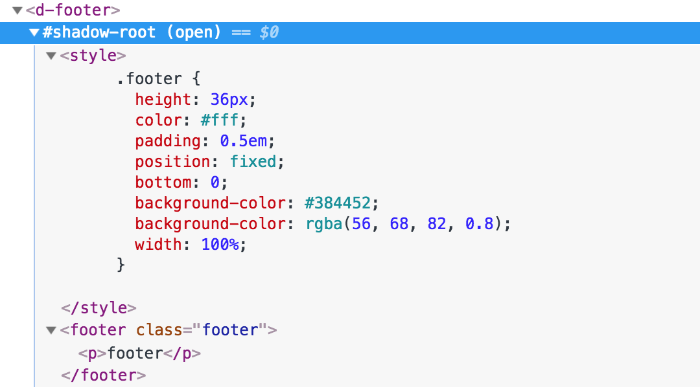

前端的未来？：框架应用组件化
===

### Web Components 示例


1. 首先我们使用 **HTML Imports** 来引入我们自己创建组件，并在 body 中使用这个组件：

```
<link rel="import" href="components/d-footer.html">

<body>
<d-footer></d-footer>
</body>
```

2. 然后在导入的 ``d-footer.html`` 文件中写上模板，以及对应的控制逻辑：

```
<template>
  <footer class="footer">
    <p>footer</p>
  </footer>
</template>

<script>
oan.Component({
  is: "d-footer",
  data: {

  }
});
</script>
```

原始的 Web Components 有些难以适应于微服务架构。

```html
<link rel="import" href="angular-demo/dist/angular-demo/index.html">
<link rel="import" href="react-demo/build/index.html">
```

[Stencil](https://github.com/ionic-team/stencil)




```
<p id="hostElement"></p>
<script>
  // create shadow DOM on the <p> element above
  var shadow = document.querySelector('#hostElement').attachShadow({mode: 'open'});
</script>
```
