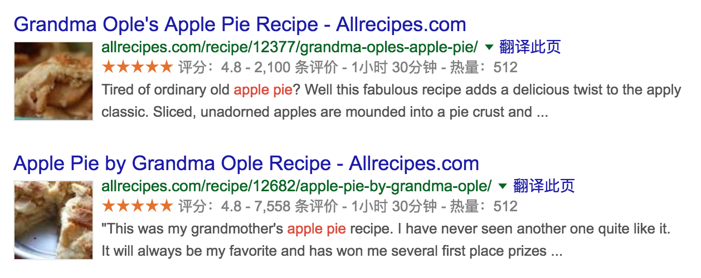
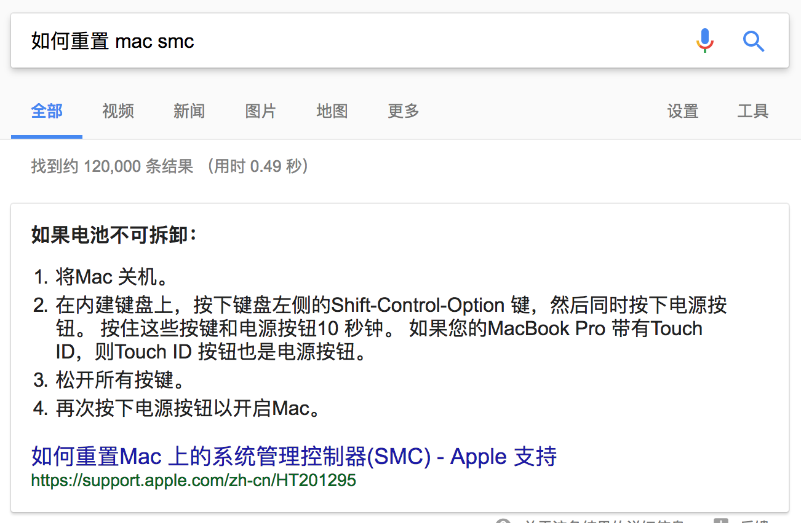
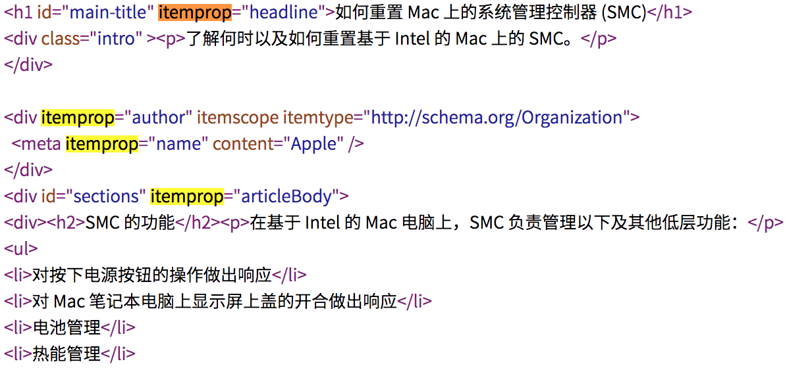
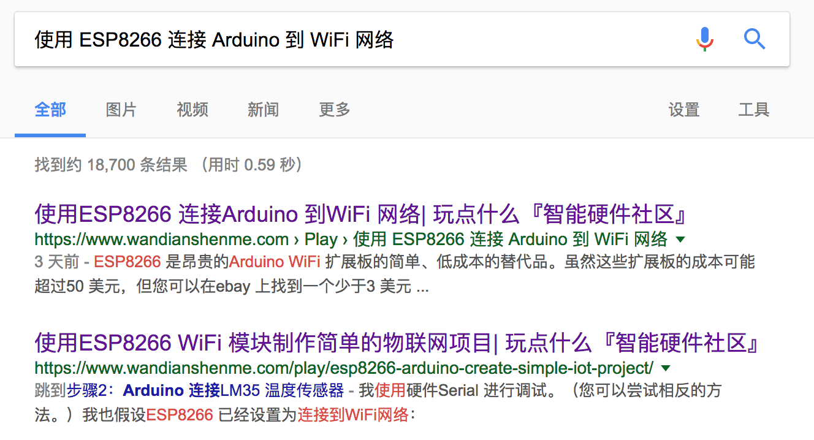
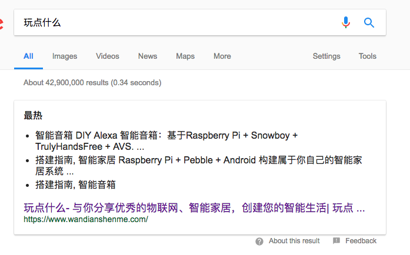
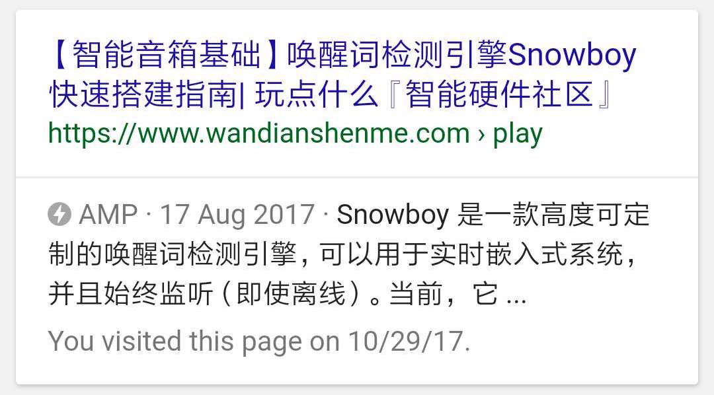
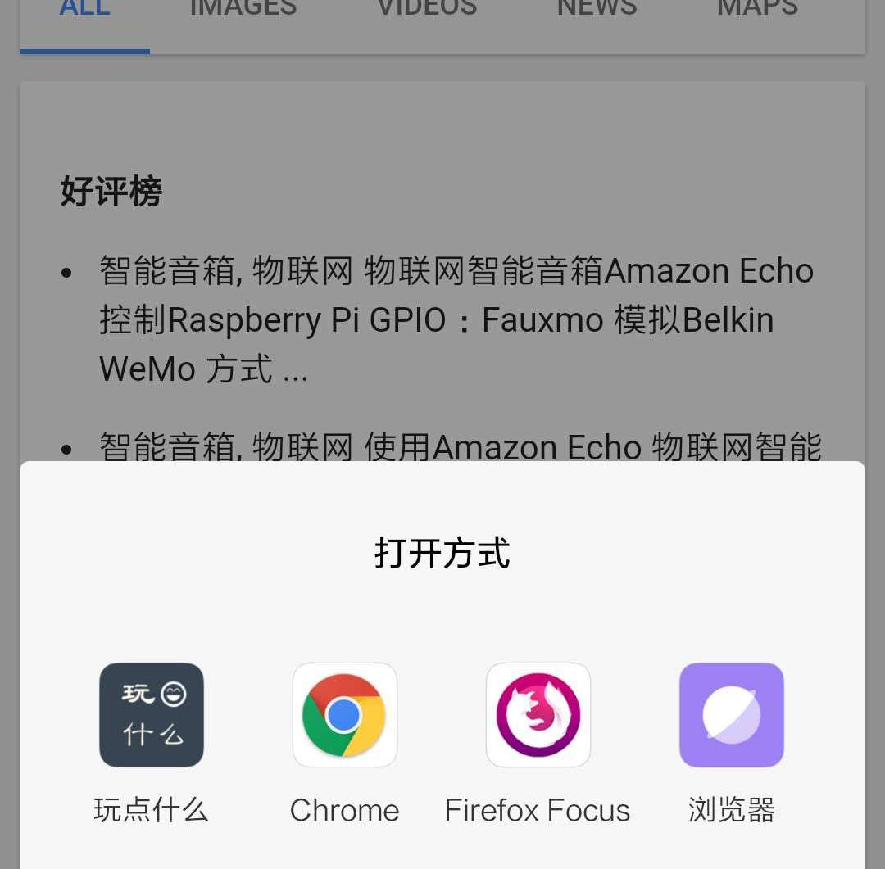

通用使用结构化数据 JSON-LD，我为网站带来了更多的流量
===

最近，我尝试在『玩点什么』网站上，引入了 AMP、APP Indexing，以及结构化数据 JSON-LD。其中 JSON-LD 的效果，最令人惊艳。

结构化数据
---

在我们了解 JSON-LD 之前，让我们先了解什么是结构化数据。

按 Google 官网的解释是，Google Search 很难理解页面的内容。 但是，您可以通过在页面上包含结构化数据，来向 Google 提供有关页面含义的明确线索来帮助我们。结构化数据是用于提供关于页面的信息并分类页面内容的标准化格式； 例如，在食谱页面上，什么是成分，烹饪时间和温度，卡路里等等。

结构化数据，简单的来说，就是我们告诉 Google 里面拥有什么内容。如对于一篇文章来说，它有标题、作者、发布时间、内容，还有可能有封面图等等。这些内容，都可以直接使用 Google 的爬虫可以理解的方式，展示给搜索引擎。

而当你决定向 Google 提供更友好的数据的时候，Google 也会为你的潜在用户提供更友好的体验。如下是一个搜索菜谱的示例：



Google 展示了菜谱相关的详细信息。它不仅仅包含了以前我们在 SEO 领域的，标题、描述等基本的内容，还用图形化展示了评价、图片等等的信息。

对于我们而言，所做的只是在网页上添加几个标签。就能带来更好的用户体验，何乐而不为呢？

Google Search 支持三种形式的微数据：

 - **JSON-LD**（Google 推荐的方式）
 - **Microdata**
 - **RDFa**（没使用过）

不友好的 MicroData
---

在过去的几年里，我在我的博客采用了 MicroData，这是一种相当不友好的开发体验。

如下是在 Google 上搜索 Apple 相关的内容，展示的结果：



其相关的数据展示如下：



MicroData 相关的关键字都嵌在 HTML 中，这会导致 HTML 中会多很多无用的标签，如下面的组织名，即 ``meta`` 标签的内容：

```
<div itemprop="author" itemscope itemtype="http://schema.org/Organization">
  <meta itemprop="name" content="Apple" />
</div>
<div id="sections" itemprop="articleBody">
<div><h2>SMC 的功能</h2><p>在基于 Intel 的 Mac 电脑上，SMC 负责管理以下及其他低层功能：</p>
<ul>
...
```

要使用 MicroData，就意味着需要对 HTML 进行大量的改造。

JSON-LD
---

> JSON-LD （全称:JavaScript Object Notation for Linked Data）是一个轻量级的链接的数据格式。人们读写的很容易。它是基于已经成功的 JSON 格式，提供了一种方法，在网络规模有助于JSON数据互操作。JSON-LD 为编程环境，一个理想的数据格式，其余的Web服务，和非结构化的数据库如 CouchDB 和 MongoDB。

即，它可以用 JSON 的形式来展示相关的内容：

```
{
  "@context": "http://schema.org",
  "@type": "BreadcrumbList",
  "itemListElement": [
    {
    	...
        "position": 1
    },
    {
    	...
        "position": 2
    },
    {
        "@type": "ListItem",
        "position": 3,
        "item": {
          "@id": "https://www.wandianshenme.com/play/amazon-echo-control-rpi-by-wemo-way-with-faxumo",
          "name": "物联网智能音箱 Amazon Echo 控制 Raspberry Pi GPIO ：Fauxmo 模拟 Belkin WeMo 方式",
          "image": "https://www.wandianshenme.com/static/media/uploads/blog/amazon-echo-belkin.jpg"
        }
    }
  ]
}
```

在这个 JSON 中我们指出了这个页面所包含的数据类型，BreadcrumbList，及其所包含的层级。于是，在搜索结果页，我们就可以获得一个更用户的 URL：



而，当我们把我们的文章都标成相应的类型的微数据时，Google 还会展示成这样的：



是的，我们只需要在首页搜索相关的内容。就会展示最新 or 最热 or 最欢迎的文章。

其他：AMP
---

而当，我们为我们的网站添加了 AMP 的功能后，又可以变成这些酷炫的展示效果：



当用户点击这些链接的时候，将**快速**、**快速**、**快速**、**快速**、**快速**看到一个网页。这是一些针对移动端优化的页面。

限于之前已经有相关的文章，这里就不多加介绍了。

其他：APP Indexing
---

对于一个拥有移动版本的网站，如果启用了 APP Indexing。那么当用户在搜索结果页，点击链接的时候，就会：



只需要注册相应的 URL Scheme，就可以打开相应的 APP 的链接——这又是一项工作量巨大的工作。在网页上配置好相关的 URL，然后注册 SCHEME：

```
<data android:scheme="https" android:host="www.wandianshenme.com" />
```

处理打开事件，再针对不同的页面，打开 APP 上的相应 View：

```
  Home: {
    path: '/',
    screen: MainScreenNavigator
  },
  Play: {
    screen: PlayViewContainer,
    path: 'play/'
  },
  PlayDetailView: {
    path: 'play/:slug/',
    screen: PlayDetailViewContainer
  }
```

对，就是这么复杂才能串到一起。

结论
---

提升用户体验不是一件容易的事。

特别是你的多数用户看到的是 404，而不是 Google。
