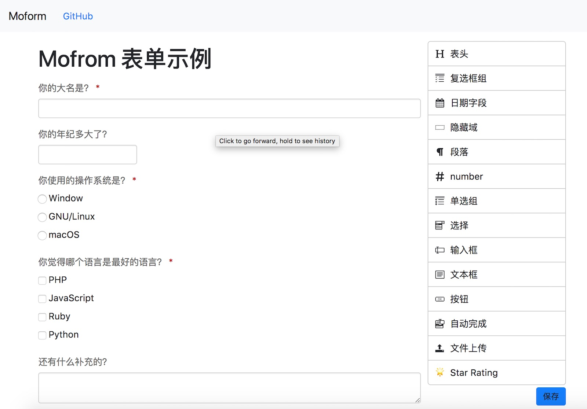
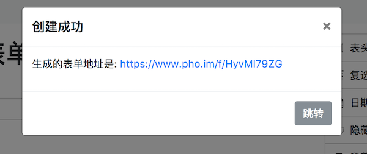
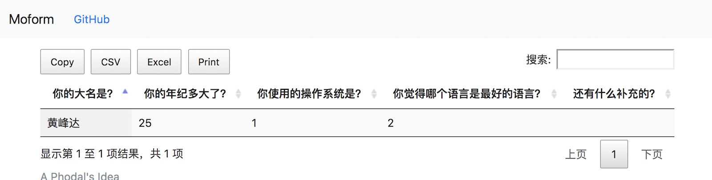
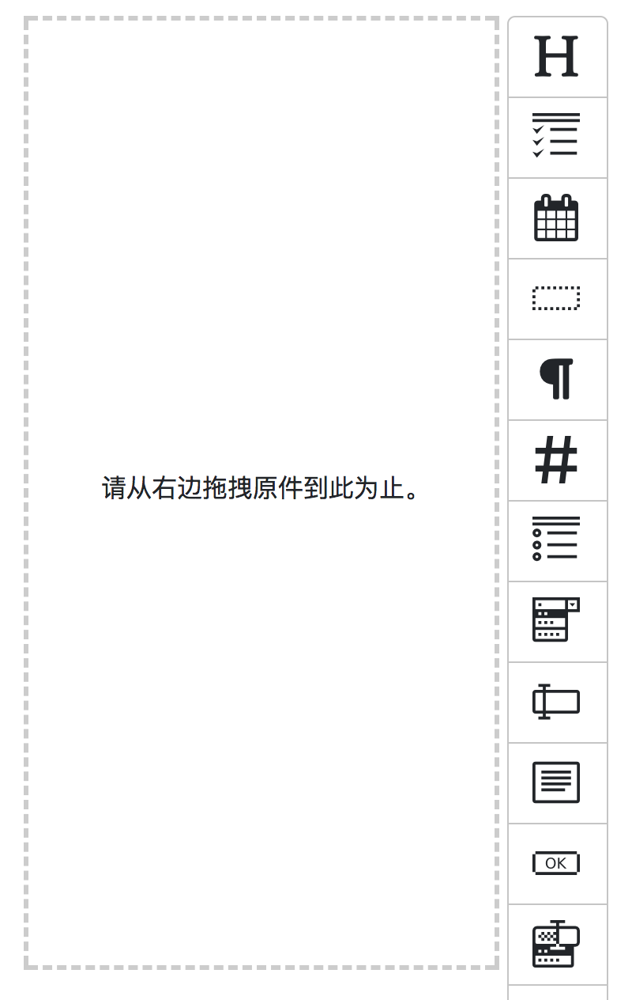

Moform：在 8 小时里开发、上线一个表单系统
===

> 欢迎使用 moform，一个无需注册、基于 Serverless 的开源表单系统。

在使用开发了一个精简版的 Serverless 日志存储系统 molog 之后。我便想开发一个更实用的 Serverless 应用，在一个微信群里，看到了使用金数据已经填满（每月 50 条的限额）的问题，便想表单这是一个非常合适的场景。毕竟表单作为一个数据分析的工具，本身也是事件驱动的。

> 任何能够用 Serverless 架构实现的应用系统，最终都必将用 Serverless 实现。

Showcase
---

基于 Serverless 架构的 moform 的最大特色是**自动扩展**、**无需注册**即可使用。从理论上来说，你不用担心系统的并发问题，FaaS 服务本身就是高可用、自动扩展。

打开 [https://www.pho.im/](https://www.pho.im/)，我们就可以直接创建表单了：



如上，拖拉一些相应的字段，就可以生成表单了。提交完，会生成一个相应的表单 URL，如下：



如在这里，我们的地址是：[https://www.pho.im/f/HyvMI79ZG](https://www.pho.im/f/HyvMI79ZG)。

接着，打开对应的结果页：[https://www.pho.im/f/HyvMI79ZG/results](https://www.pho.im/f/HyvMI79ZG/results)。



除了查看相应的结果，我们还可以搜索内容、下载 CSV、Excel 格式的数据，也可以直接打印数据。

忘说了，无需注册的原因是——到目前为止，比较成熟的在线授权服务只有 Auth0，然而它只支持微博和人人。如果你想接入这个授权，可以看我之前写的文章 [Serverless 架构应用开发：基于 Auth0 授权的 Serverless 应用登录](https://www.phodal.com/blog/serverless-architecture-development-base-auth0-login-example/)

业务
---

好了，接下来，让我们简单的过一下 moform 的基本业务逻辑：

| 用户行为            |  事件(代码)  |  method |  URL         |   逻辑           |
|--------------------|------------|---------|--------------|-----------------|
| 用户打开创建表单页面  |  home      |  GET     |  /          | 返回静态 HTML        |
| 用户创建表单         | formCreate |  POST    | /f          | 保存数据，返回 URL    | 
| 用户打开已创建的表单  | formGet    | GET      | /f/{formID} | 查找对应表单，并返回  |
| 用户提交表单         | formSubmit | POST     | /f/{formID} | 保存用户的数据      |
| 用户查看表单结果     | formResults | GET     | /f/{formID}/results | 返回对应表单的返回结果 |
| 用户可以导出数据     | formResults | GET     | /f/{formID}/results | 导出对应表单的返回结果 |

我相信有了这张表就足够了。

技术及架构
---

所用到的前端技术栈有：

 - formBuilder，用于创建表单和生成表单
 - Bootstrap，你懂的 UI 框架
 - jQuery，对，我还在用 jQuery
 - dataTables，用于展示数据，打印、导出数据（csv，excel）

每次在**大限将至**的时候，我都会选择 jQuery——它不需要复杂的构建，三秒钟就能开箱了，引入网页即可使用。不过最主要的原因是，formBuilder 和 Bootstrap 都依赖于 jQuery。

所使用的 AWS 服务有

 - AWS CloudFront，用于作为静态资源的 CDN
 - AWS S3，用于存储静态资源文件
 - AWS API Gateway，顾名思义 API 网关
 - AWS Lambda，无服务器的函数计算服务
 - AWS Route 53，用于为服务分配域名

底层依然是 Serverless Framework，同时还用到了几个相关的插件：

 - serverless-domain-manager，用于管理、分配域名
 - serverless-finch，用于部署静态资源文件到  S3
 - serverless-plugin-simulate，用于调试，在本地模拟 Serverless 环境。

代码实现
---

理清了这些关系之后，剩下的就简单多了。对应的 serverless.yml 中的函数配置如下所示:

```
functions:
  index:
    handler: backend/index.handler
    events:
      - http:
          path: ''
          method: get

  formCreate:
    handler: backend/form/create.handler
    events:
      - http:
          path: f/
          method: post

  formGet:
    handler: backend/form/get.handler
    events:
      - http:
          path: f/{formId}
          method: get

  formSubmit:
    handler: backend/form/submit.handler
    events:
      - http:
          path: f/{formId}
          method: post

  formResults:
    handler: backend/form/results.handler
    events:
      - http:
          path: f/{formId}/results
          method: get
```

为此，我们需要至少两个 DynamoDB 数据库表资源：

```
provider:
  name: aws
  runtime: nodejs6.10
  timeout: 5
    FORM_DYNAMODB_TABLE: ${self:service}-form-${opt:stage, self:provider.stage}
    FORM_DATA_DYNAMODB_TABLE: ${self:service}-form-data-${opt:stage, self:provider.stage}
    SLS_STAGE: ${self:custom.stage}
  iamRoleStatements:
    - Action:
        - dynamodb:GetItem
        - dynamodb:PutItem
        - dynamodb:Query
        - dynamodb:Scan
      Resource:
        - "arn:aws:dynamodb:${opt:region, self:provider.region}:*:table/${self:provider.environment.FORM_DYNAMODB_TABLE}"
        - "arn:aws:dynamodb:${opt:region, self:provider.region}:*:table/${self:provider.environment.FORM_DATA_DYNAMODB_TABLE}"
      Effect: Allow
```

未来，我们还需要用户的登录信息。

总体的代码与我们之前看到的 [molog](https://github.com/phodal/molog) 的代码差不多。考虑到代码比较简单，我们就看一个获取表单的例子就好了：

```
...

module.exports.handler = (event, context, callback) => {
  const params = {
    TableName: process.env.FORM_DYNAMODB_TABLE,
    Key: {
      id: event.pathParameters.formId,
    },
  };

  dynamoDb.get(params, (error, result) => {
    // handle potential errors
    if (error) {
    	...
    }

    // create a response
    const response = {
      statusCode: 200,
      headers: {'Content-Type': 'text/html'},
      body: generateHtml(result.Item)
    };
    callback(null, response);
  });
};
```

我们从 URL 中获得表单的 ID，然后返回对应的 HTML，就这么简单。获取所有的数据，实际上也和这个差不多。

结论
---

> 任何能够用 Serverless 架构实现的应用系统，最终都必将用 Serverless 实现。

欢迎试用并提出建议，地址是：https://www.pho.im/ 。移动端界面如下所示：



点击**阅读原文**访问。
