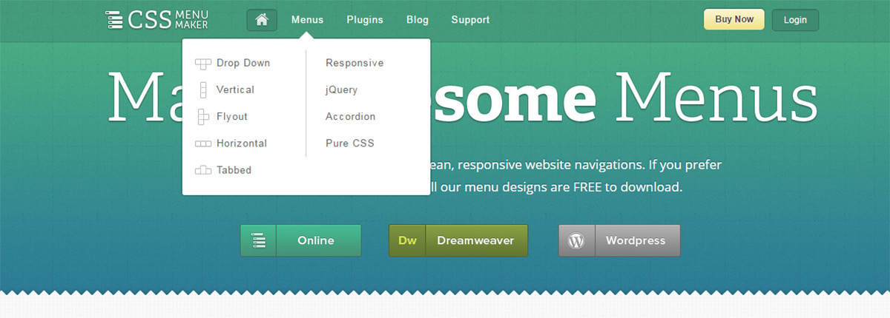
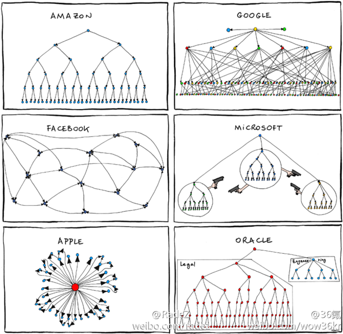
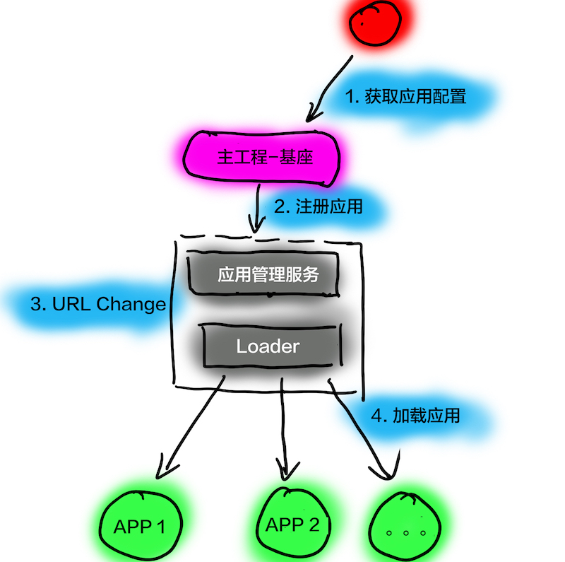
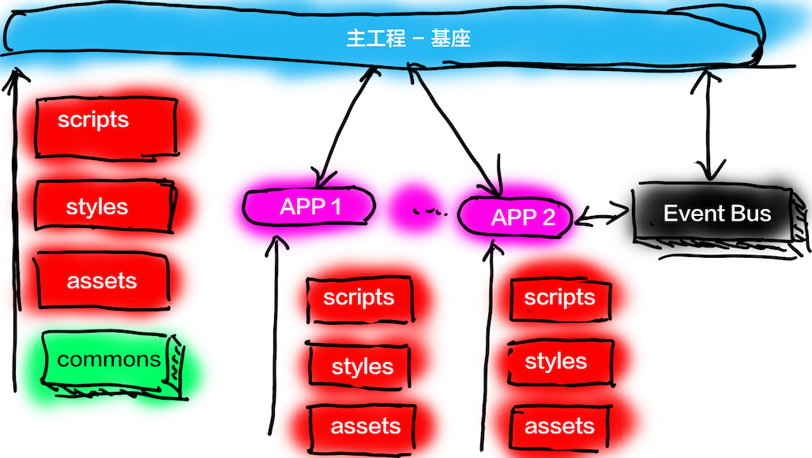

如何解构单体前端应用——前端应用的微服务式拆分
===

> 刷新页面？路由拆分？No，动态加载组件。

本文分为以下四部分：

 - 前端微服务化思想介绍
 - 微前端的设计理念
 - 实战微前端架构设计
 - 基于 Mooa 进行前端微服务化

前端微服化
---

对于前端微服化来说，有这么一些方案：

 - Web Component 显然可以一个很优秀的基础架构。然而，我们并不可能去大量地复写已有的应用。
 - iFrame。你是说真的吗？
 - 另外一个微前端框架 Single-SPA，显然是一个更好的方式。然而，它并非 Production Ready。
 - 通过路由来切分应用，而这个跳转会影响用户体验。
 - 等等。

因此，当我们考虑前端微服务化的时候，我们希望：

 - 独立部署
 - 独立开发
 - 技术无关
 - 不影响用户体验

### 独立开发

在过去的几星期里，我花费了大量的时间在学习 Single-SPA 的代码。但是，我发现它在开发和部署上真的太麻烦了，完全达不到独立部署地标准。按 Single-SPA 的设计，我需要在入口文件中声名我的应用，然后才能去构建：

```
declareChildApplication('inferno', () => import('src/inferno/inferno.app.js'), pathPrefix('/inferno'));
```

同时，在我的应用里，我还需要去指定我的生命周期。这就意味着，当我开发了一个新的应用时，必须更新两份代码：主工程和应用。这时我们还极可能在同一个源码里工作。 

当出现多个团队的时候，在同一份源码里工作，显然变得相当的不可靠——比如说，对方团队使用的是 Tab，而我们使用的是 2 个空格，隔壁的老王用的是 4 个空格。

### 独立部署

一个单体的前端应用最大的问题是，构建出来的 js、css 文件相当的巨大。而微前端则意味着，这个文件被独立地拆分成多个文件，它们便可以独立去部署应用。

### 我们真的需要技术无关吗？

等等，我们是否真的需要**技术无关**？如果我们不需要技术无关的话，微前端问题就很容易解决了。

事实上，对于大部分的公司和团队来说，技术无关只是一个无关痛痒的话术。当一家公司的几个创始人使用了 Java，那么极有可能在未来的选型上继续使用 Java。除非，一些额外的服务来使用 Python 来实现人工智能。因此，在大部分的情况下，仍然是技术栈唯一。

对于前端项目来说，更是如此：一个部门里基本上只会选用一个框架。

于是，我们选择了 Angular。

### 不影响用户体验

使用路由跳转来进行前端微服务化，是一种很简单、高效的切分方式。然而，路由跳转地过程中，会有一个白屏的过程。在这个过程中，跳转前的应用和将要跳转的应用，都失去了对页面的控制权。如果这个应用出了问题，那么用户就会一脸懵逼。

理想的情况下，它应该可以被控制。

微前端的设计理念
---

### 设计理念一：中心化路由

互联网本质是去中心化的吗？不，DNS 决定了它不是。TAB，决定了它不是。

微服务从本质上来说，它应该是去中心化的。但是，它又不能是完全的去中心化。对于一个微服务来说，它需要一个**服务注册中心**：

> 服务提供方要注册通告服务地址，服务的调用方要能发现目标服务。

对于一个前端应用来说，这个东西就是路由。



从页面上来说，只有我们在网页上添加一个菜单链接，用户才能知道某个页面是可以使用的。


而从代码上来说，那就是我们需要有一个地方来管理我们的应用：**发现存在哪些应用，哪个应用使用哪个路由。

**管理好我们的路由，实际上就是管理好我们的应用**。

### 设计理念二：标识化应用

在设计一个微前端框架的时候，为**每个项目取一个名字的**问题纠结了我很久——怎么去规范化这个东西。直到，我再一次想到了康威定律：

> 系统设计(产品结构等同组织形式，每个设计系统的组织，其产生的设计等同于组织之间的沟通结构。



换句人话说，就是同一个组织下，不可能有两个项目的名称是一样的。

所以，这个问题很简单就解决了。

### 设计理念三：生命周期

Single-SPA 设计了一个基本的生命周期（虽然它没有统一管理），它包含了五种状态：

 - load，决定加载哪个应用，并绑定生命周期
 - bootstrap，获取静态资源
 - mount，安装应用，如创建 DOM 节点
 - unload，删除应用的生命周期
 - unmount，卸载应用，如删除 DOM 节点

于是，我在设计上基本上沿用了这个生命周期。显然，诸如 load 之类对于我的设计是多余的。

### 设计理念四：独立部署与配置自动化

从某种意义上来说，整个每系统是围绕着应用配置进行的。如果应用的配置能自动化，那么整个系统就自动化。

当我们只开发一个新的组件，那么我们只需要更新我们的组件，并更新配置即可。而这个配置本身也应该是能自动生成的。

实战微前端架构设计
---

基于以上的前提，系统的工作流程如下所示：



整体的工程流程如下所示：

1. 主工程在运行的时候，会去服务器获取最新的应用配置。
2. 主工程在获取到配置后，将一一创建应用，并为应用绑定生命周期。
3. 当主工程监测到路由变化的时候，将寻找是否有对应的路由匹配到应用。
4. 当匹配对对应应用时，则加载相应的应用。

故而，其对应的架构如下图所示：



### 独立部署与配置自动化

我们做的部署策略如下：我们的应用使用的配置文件叫 ``apps.json``，由主工程去获取这个配置。每次部署的时候，我们只需要将 ``apps.json`` 指向最新的配置文件即可。配置的文件类如下所示：

1. 96a7907e5488b6bb.json
2. 6ff3bfaaa2cd39ea.json
3. dcd074685c97ab9b.json

一个应用的配置如下所示：

```javascript
{
  "name": "help",
  "selector": "help-root",
  "baseScriptUrl": "/assets/help",
  "styles": [
    "styles.bundle.css"
  ],
  "prefix": "help",
  "scripts": [
    "inline.bundle.js",
    "polyfills.bundle.js",
    "main.bundle.js"
  ]
}
```

这里的 ``selector`` 对应于应用所需要的 DOM 节点，prefix 则是用于 URL 路由上。这些都是自动从 ``index.html`` 文件和 ``package.json`` 中获取生成的。

### 应用间路由——事件

由于现在的应用变成了两部分：主工程和应用部分。就会出现一个问题：**只有一个工程能捕获路由变化**。当由主工程去改变应用的二级路由时，就无法有效地传达到子应用。在这时，只能通过事件的方式去通知子应用，子应用也需要监测是否是当前应用的路由。

```javascript
if (event.detail.app.name === appName) {
  let urlPrefix = 'app'
  if (urlPrefix) {
    urlPrefix = `/${window.mooa.option.urlPrefix}/`
  }
  router.navigate([event.detail.url.replace(urlPrefix + appName, '')])
}
```

相似的，当我们需要从应用 A 跳转到应用 B 时，我们也需要这样的一个机制：

```
window.addEventListener('mooa.routing.navigate', function(event: CustomEvent) {
  const opts = event.detail
  if (opts) {
    navigateAppByName(opts)
  }
})
```

剩下的诸如 Loading 动画也是类似的。

使用 Mooa 进行
---

So，我们就有了前端微服务框架 Mooa。它基于 [single-spa](https://github.com/CanopyTax/single-spa) && [single-spa-angular-cli](https://github.com/PlaceMe-SAS/single-spa-angular-cli)，并且符合以上的设计思想。

GayHub 地址：[https://github.com/phodal/mooa](https://github.com/phodal/mooa)

对于主工程而言，只需要以下的几行代码就可以完成上面的功能：

```javascript
http.get<any[]>('/assets/apps.json')
  .subscribe(data => {
    data.map((config) => {
      that.mooa.registerApplication(config.name, config, mooaRouter.matchRoute(config.prefix));
    });
    this.mooa.start();
  });

this.router.events.subscribe((event: any) => {
  if (event instanceof NavigationEnd) {
    that.mooa.reRouter(event);
  }
});
```

并添加一个对应的子应用路由：

```javascript
{
  path: 'app/:appName/:route',
  component: HomeComponent
}
```

则如上所述的四个步骤。

对于子工程而言，则只需要一个对应的 Hook 操作：

```javascript
mooaPlatform.mount('help').then((opts) => {
  platformBrowserDynamic().bootstrapModule(AppModule).then((module) => {
    opts['attachUnmount'](module);
  });
});
```

并设置好对应的 base_href:

```
providers: [
  {provide: APP_BASE_HREF, useValue: mooaPlatform.appBase()},
]
```

嗯，就是这么简单。DEMO 视频如下：

Demo 地址见：[http://mooa.phodal.com/](http://mooa.phodal.com/)

GitHub 示例：[https://github.com/phodal/mooa](https://github.com/phodal/mooa)
