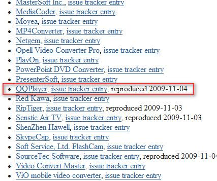
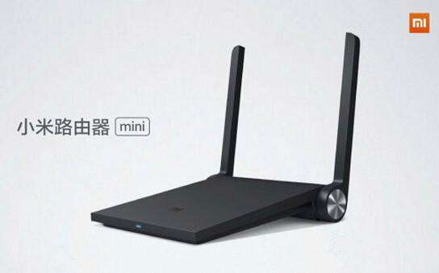
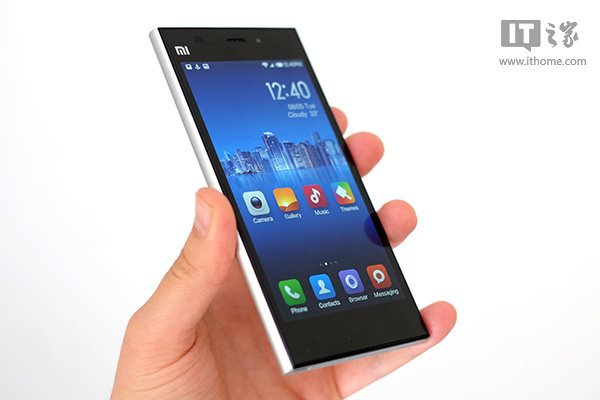
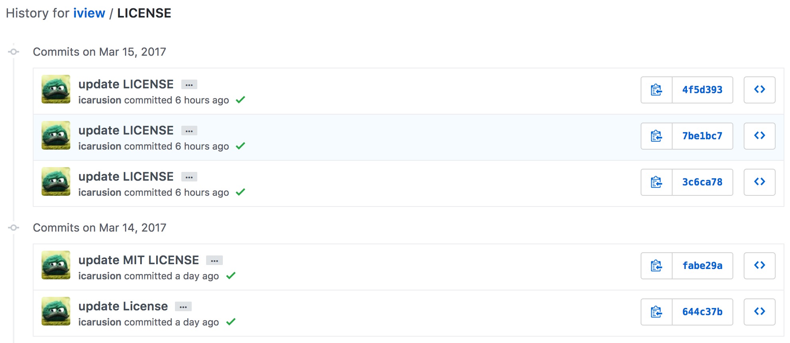
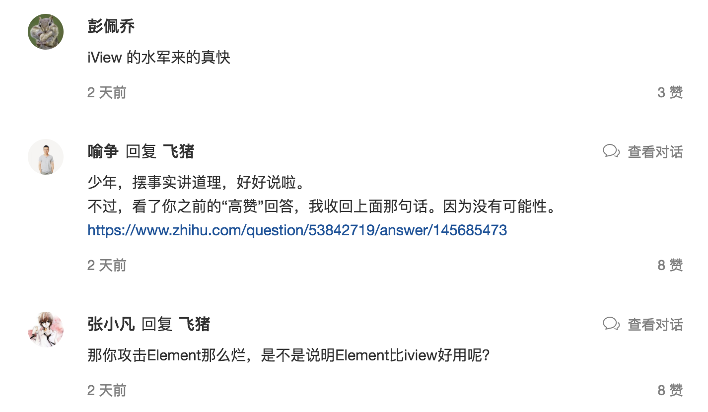

3.15 让我们来看看开源世界的抄袭
===

> 两天前，发生了一件特别有意思的事，	饿了么前端团队在知乎专栏上，撰文《写在 Element 一周年之际》指出指责iview抄袭这件事？那么，问题来了这是不是真的抄袭？

当我看到这篇文章的时候，我的第一反应是：开源项目嘛，不都是借（chao）鉴（xi）过来，借（chao）鉴（xi）过去的嘛。

你借了我的思想，在我的思想上，发展出一套理好的思想。

你借了我的代码，在我的代码上，开发出一套理好的代码。

至于，你要不要在文章、思想、代码里提到我，好像都是可以的。可是，当我在我的 LICENSE 里指明了：

当你用我的软件的时候，你没有在相关的地方写说明。

当你修改我的代码的时候，你也没有在相关的地方开源出代码。

你用了我的代码，还不加上我的 License，这不是抄袭吗？

这些年来，那些抄袭事件
---

自打我的偶像——自由软件之父「Richard Stallman」创建出了 GPL 协议，他就开创了开源软件的大门。而 GPL 像病毒一样，传染了整个世界，Emacs、GCC、Linux 等等。即当你基于 Linux 内核的代码修改时，你应该在软件发布的时候，公开这部分的代码。

当你在开发一个商业软件的时候，你就不会想着这么去做，这样的公司有很多。比较出名的就有腾讯的 QQ 语音、暴风影音，被挂在 FFmpeg 的耻辱名单中：

> FFmpeg，是一个跨平台的视频和音频流方案，属于自由软件，采用LGPL或GPL许可证。

后来，QQ 影音公开了修改的 FFmpeg 源码。但是按照 GPL 协议 ，它应该公开基于 FFmpeg 的 QQ 影音的源码。

除了此，还有著名的粮食公司——小米，使用了基于各种协议修改的软件。这些产品包括了，基于 OpenWRT 操作系统的小米路由器：

修改过 Linux 内核的 MI OS，即各位看官比较熟悉的小米手机：

而聪明的人都会想办法绕过这个协议，如 Android 项目：

如何识别一个开源项目是否抄袭
---

再回到开头的那篇文章里，iView 使用了 Element 的开源代码（基于 MIT 协议），但是并没有在 License 上写上 Element。因此，在这件事上，算 iView 抄袭？

后来，iView 的作者连续五六次提交加上了 License，就不算抄袭了.

而 iView 本身就是开源的，只是它没有遵循协议，在 License 里加上了Element。

而 Element 项目本身也是 MIT 许可的。这就意味着，如果一开始遵循 MIT 协议在 License 里放上了 Element，那么它就不是抄袭。还可以基于此来宣传相关的项目。

所以，请背好上面的表，如果你使用的是 MIT，请尽情的使用。

后来，人们开始撕逼了，我已经搞不清楚这个软件世界了。

有这么多时间，还不如来 GitHub 上看我耍。

小结：我与开源协议
---

作为一个 GitHub Markdown 程序员，我也写了很多的"开源项目"。这其中的主要原因是：

 - **劳动合同里规定了：我们业余做的技术相关的工作的产权，都属于公司的。**
 - **劳动合同里规定了：我们业余做的技术相关的工作的产权，都属于公司的。**
 - **劳动合同里规定了：我们业余做的技术相关的工作的产权，都属于公司的。**

为了方便，我以后使用这些代码，并且没有任何纠纷，这些软件都以开源的形式 Release 了，并且都是 MIT 协议。

而当我在 GitHub 上放置电子书的时候，我都会放上 CC 协议（Creative Commons Attribution-Noncommercial-No Derivative Works 3.0）。毕竟在中国你的文章是很容易被复制的，只要你不拿我的文章出版，啥都好说。这个 CC 协议表明了，你可以到处复制这份电子书，但是你不能用于商业用途和相关的衍生物。

