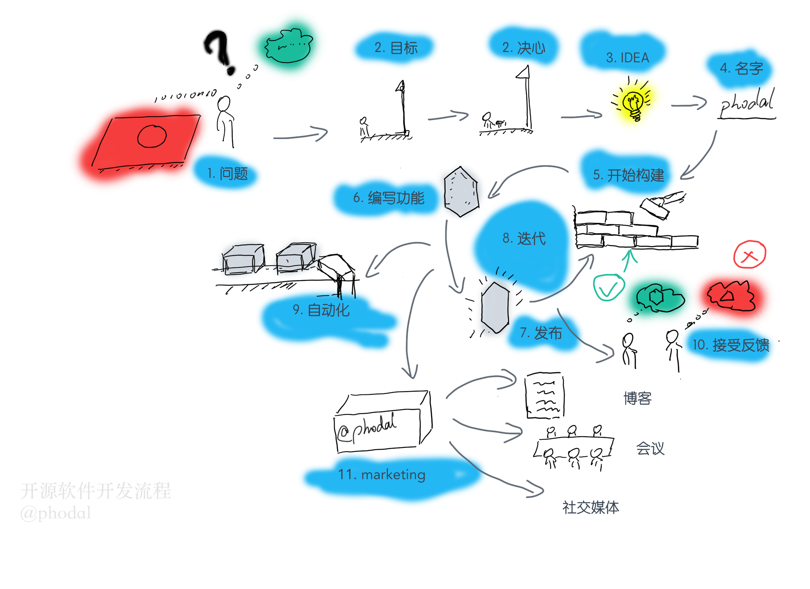
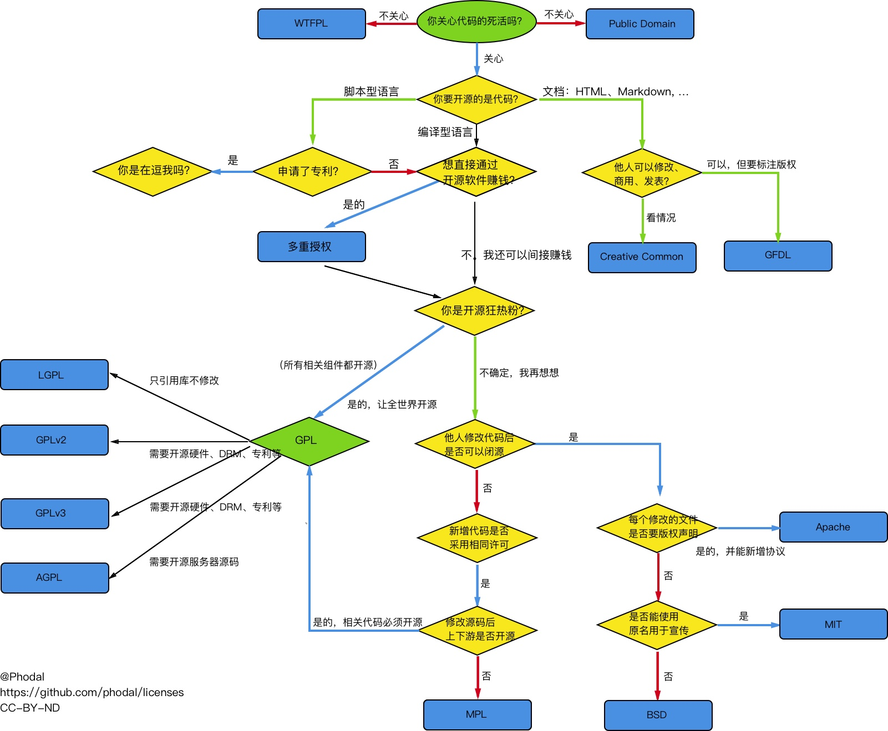
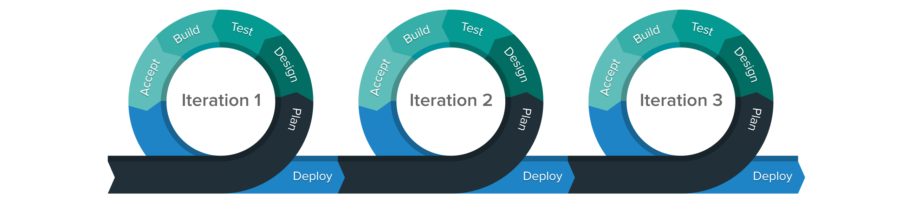
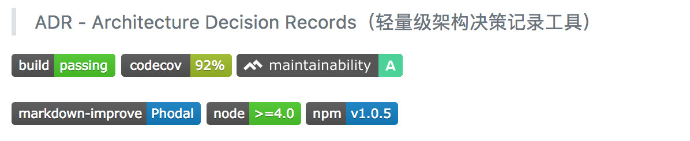

开源的是产品，而不只是代码：开源不是一件简单的事情
===

你是否也想拥有一个可以写在简历上的开源作品？你是否也想创建一个 star 过千的项目？

写了那么多开源的软件，分享了一系列的 star，总得分享一下如何去做这样的事件。

> 授人以鱼不如授人以渔。

开源是一种社区行为
---

开源，英语源自 Open Source，意指开放源码。而依我看来：开源不仅仅只是开放源码，它是一种社区行为，不是靠单一的编码能力、算法优势，又或者谁的代码写得好。开源是一种包含源码的产品，而不仅仅局限于代码，它还包含有软件背后的行为。一个优秀的开源软件，需要由一系列的因素构建，除了代码之后，有易用性、上手速度、文档丰富度、问题响应速度、接受反馈水平的等等。

 - 易用性
 - 上手速度
 - 文档丰富度
 - 问题响应速度
 - 接受反馈水平
 - 社区推广

典型的错误开源方式，在大的厂商里，有阿里为例。过去的阿里，通常就是将一个内部的开源软件开源出来，或者直接开源捐赠给 Apache 基金会。这实则算不上是真正的开源，开源不仅仅意味着开放源代码，还有源码中的思想、代码中的坑、使用方式、文档等等。

我们在这里谈论的开源，**指的不仅仅是开放软件的源码，还有其相应的生态。** 一个有一定用户的软件，就意味着它不仅仅只是一个软件。

常见的开源策略
---

Facebook -> 你用了我的东西，成为了贡献者，我招你。

开源协议的选择
---

MIT, Apache


黑客工坊揭密：原来他们是这样制作开源软件的
====

> 近几年来，市面上流行的开源软件越来越多，有的触目惊心，有的改动了世界，有的震惊了国家。在这些黑客工坊里，人们究竟是怎么制作出来的？

近几年来，市面上流行的开源软件越来越多，有的触目惊心，有的改动了世界，有的震惊了国家。在这些黑客工坊里，人们究竟是怎么制作出来的？

在这些黑客工坊里，有的做出来的软件很好很流行；有的做出来则很一般但是却也很流行；有的则做出来的很好但是不流行。这究竟是为什么呢？

让我们来一探究竟。

在过去的几年里，我开始活跃在开源社区 GitHub，从默默无闻到 GitHub 国内前 10[^github]（粉丝数、star 数及提交次数居在前 10）。这样一小结，我总算是有资格来写一系列文章，以分享一下开源世界的那些事儿。写了那么多开源的软件，分享了一系列的 star，总得分享一下如何去做这样的事件。

> 授人以鱼不如授人以渔。

在这篇文章里，我将揭密开源软件的制作流程，中间会插入丰富的示例。考虑到这个过程的复杂性，同时为了让读者能对这个过程一目了然。笔者花了半天，画了一张通俗易懂地开发流程图：



即下面的 11 个步骤：

0. 问题。
1. 目标。制定出一个 SMART 的目标
2. 想法。确认出需要发布的功能
3. 名字。是的，你需要一个吊炸天的名字
4. 开始构建。寻找模板创建你的 Hello, World
5. 编写功能。
6. 发布。尽早地发现 0.1.0 版本
7. 迭代。有计划的发布功能，直到它完成你想要的功能 -> 1.0.0
8. 自动化。测试，持续集成，持续发布。
9. 接受反馈。评估用户的反馈，决定是否添加为功能
10. marketing。编写文档、文章、博客，在社交媒体进行宣传

等等，真实的情况并没有这么复杂，在这里只是为了方便叙述。

Then，让我们一点点地脱下开源的面纱。

0.问题：为什么这个软件存在着
---

有用的软件都是为了解决某些特定需求、问题而存在的。在开源软件世界里，从小至左填充一个字符串的 ``left-pad``，大到改变世界的 Linux，他们都解决了一些特定的问题。尽管有一些可能是学习而创建的，但是它解决了开发者的学习问题。

总而言之，就是软件存在的意义。

如在先前的文章《[2017 年节点——我写的那些开源软件](https://www.phodal.com/blog/summary-2017-the-opensource-software/)》总结的那样，我们想造一个轮子的来源可以是：

 - 日常工作中遇到的一些问题，提出对应的解决方案。
 - 使用某个开源软件的过程中，发现它不能满足我们的需求
 - 提取出工作上的一些好的技术实践
 - 我想开发一个工具，来帮助其它人
 - 我有一个想法，我要用它来改变世界
 - 无聊，我就是想造个轮子

接下来，让我举几个例子。

### 现在软件不能满足需求

当我在自己的项目上实施**架构决策记录**的时候，我找到了一个相关的库：adr-tools，但是发现这个库有一些小的缺点：

 - 使用 shell 编写，不易读懂、只支持类 Unix；
 - 模板里使用的是英语，不支持中文及其他语言

这种时候，一般是在项目上提个 issue，但是发现这个项目使用 shell 扩展起来不容易。因此，自己来写一个类似的软件是一种更好的选择，于是我使用 TypeScript 写了 Node.js 版的 ADR。

### 日常工作的结晶

在我们的日常、业余的开发工作中，我们往往能实施一些好的技术实践。只是受限于劳动合同的约束，我们不能直接使用这些代码来开源。但是可以独立地重新开始来造一个轮子。在一些有开源文化的公司里，便可以走开源的流程开源出来。

如我创建的 Dore，就是一个总结工作结晶的实践。它总结了我在项目上使用 React Native 实现的 WebView 容器的经验。不过，这依赖于我们对代码的抽象能力。即使，我们在项目上用了好的思想，但是并不一定能提取出来。

### 我需要一个新的工具

上面的两个例子，都需要一定的运行和抽象能力。除了自己乐意造轮子，我们还可以随意地创建一个工具，作为自己制作的工具。

如我最近写的 Solla，就是为了解决我写作的时候找图封面图的问题。

1.下定你的决心
---

我的意思是，你要下定决心去做这一件事情。因为，你很有可能半途而废，比如说我可能在上一步里，习惯了使用英语来写架构决策记录。

这是一件很难的事情，特别是当你和我一样，在 GitHub 上挖了两百多个坑位之后，你可能不会想去做这样的事件。

权衡这方面的利益不是一件容易的事情，所以不妨直接进入下一步。

2.完善关于这个软件的想法、需求
---

当我们决定创建这个开源软件的时候，我们就需要细致地想想它到底需要什么功能。它的核心功能又是什么？

在拥有对比软件的情况下，核心功能与其它软件都是差不多的。以文本编辑器为例，如果你不能提供插入图片的功能，那么有需求的用户可能就跑了。而为了吸引不同的用户，就需要一些额外的吸引人的特性。同样是文本编辑器，如果你能提供 Markdown 支持，那么你就能吸引这些用户。因此，如果是对比其它框架，那么就要完成相同的核心功能，并提供一些额外的功能。

所以，在计划的初期就要思考能提供怎样的特性。

再以架构决策记录框架 ADR 为例，那便是：

 - 采用一种通用的语言环境，如 Node.js，以支持主流的操作系统
 - 多语言支持，我的意思是它至少可以支持 English 和 中文
 - 支持状态日志查询，即我应该可以看到一个决策在生命周期里的变化
 - 一个更好的列表展示，我应该可以查看到某条决策，以及对应的最后状态、修改时间等等
 - 使用 markdown 展示，以便在 GitHub 上显示
 - 拥有一个 ToC 页面，方便用户查看

补充一点，上面有几个功能都是在实现的过程中想的，有一两个是在使用的过程中想到的。这些功能能在设计初期的时候考虑到的话，那么后期架构就不会需要需求的添加而带来开发风险。

3.取一个合适的名字
---

好了，在需求确认得差不多之后，就可以开始动手了。然后，我们就会面临一个很严峻的问题，取一个合适的名字

### 取个名字

取名，对于多数人（包含程序员）来说，是一件痛苦的事。先设想一下，我们写一个 Web 框架，我们可能需要一个能朗朗上口的名字，以 Vue、React、Angular 来看，最好是单音节、双音节、三音节。

并且，它没有被包管理工具注册过的：

 - Ruby 就查看有没有对应的 gem 名可以用。
 - Node.js 则是 npm
 - Python 便是 pip

想想，还是 Java 程序员好，这个依赖的包名是 com.phodal.xxoo，代表了这是 phodal.com 的 xxoo，而不是 hug8217.com 的 xxoo。那么，其对应的域名有可能就是 xxoo.phodal.com。

如果我们想到的名字已经被注册过了，那么这就很尴尬了。在这个时候，可以采取自己的命名规则：

我之前的命名规则：moImages、moLogs、moForms、moLe，都是以 mo 开头加一个对应用途的单词。

比如我最近的系列：dore、mifa、solla、sido，则是以唱名结合来取名字的。

### 选择合适的开源协议

取完名字之后，就需要选择一个合适的开源协议。不同的许可（协议）会赋予用户不同的权利，如 GPL 协议强制要求开源修改过源码的代码，而宽松一点的 MIT 则不会有这种要求。

更细致的协议选型，可以见我之前画的选型图：



按我的习惯，都是以 MIT 协议来发布开源软件，CC-NC 协议来发布电子书。

### 发布 0.0.1

是的，当我们取好名字，选好了协议，我们就要发布 0.0.1 版本了。

我的意思是，我们要先抢下这个名字，即占坑。在占坑前，请深思，你真的会写好这个工具吗？

比如说，我们使用 Node.js 来写一个 MQTT 的包，那么直接用 MQTT 显然更容易被搜索到：Node.js MQTT。

不行的话，只能用 Mosquitto、Mosca 这种名字了。又或者 moMQTT、iMQTT 这种加上前缀的名字，对应于 Java 平台，就可以是 jMQTT。

4.开始构建
---

如我在《全栈应用开发：精益实践》一书中所说，在我们编写软件之前，我们要先做技术选型与搭建开发环境。这里的技术选型就没有那么复杂，就只需要选择一个合适的语言。

### 选择合适的语言

选择合适的语言，只针对于某些有各种子集的语言，或者小版本间差异比较大的语言，如 Ruby。

不过，还有一个是语言版本的问题。在面向服务器的操作系统，都安装有 Python 环境，但是可能版本不一样。有的是 2.7 的，有的版本可能是 3.4。所以，对于使用 Python 语言的用户来说，还存在选择版本的问题。

如果是一个非 JavaScript 的软件，可能就不存在需要选语言了。如果是一个 JavaScript CLI（命令行）工具，也会有这样的问题，到底是使用编写 CoffeScript、TypeScript 还是 ES6 编写都是一个问题。

在编写 CLI 工具时，就需要了解是要针对某些用户而开发。如对于 Java 程序员来说，他们的电脑上可能没有 Node.js 环境，如果他们使用的是 macOS 电话，那么应该都是有 Ruby、Python环境。同样的，对于前端程序员来说，如果是 Windows 系统，那么也没有 Java、Python 和 Ruby、Go 环境，直接使用 JavaScript 语言就更容易了。

### 搭建构建 || 寻找模板

自己搭建一个完整的项目架子，是一个相当浪费时间的事情——**特别是，我们第一次造轮子的时候**。对于一些框架的插件、CLI 工具来说，可能官方直接提供了一个 Hello, World 模板。但是，有一些时候往往没有这么简单。要么找一个差不多的模板，再有针对于的修改；要么复制现有的架子，以我们的名称替换其中的名字。

当我造轮子的时候，我习惯在网上搜索相应的模板，比如说：``javascript lib boilerplate``、``typescript lib boilerplate`` 或者 ``typescript cli starter``。在没有合适的情况下，就是找一些使用 TypeScript 写的库，在那之上进行修改。

5.编写原型：核心功能
---

核心功能，意味着，不做过多的错误处理——假设用户是按我们的预期行为进行的。依微软公司（Steve Ballmer）的经验，20% 的代码是在核心的逻辑上，而有超过 80% 的代码是在处理错误逻辑上。

所以，在那之前，请先完成核心的功能。它可以让你更快地发布早期的预览版，以早点接受市场的反馈。

构建开源与构建产品是类似的，能越早推出早期版本，就越有机会赢得市场；能不断地继续接受反馈并进行改进，就越能吸引忠实用户；能做好一些市场工作，也就越吸引更多用户。

6.发布
---

如果这是我们第一次开发开源软件，那么我们应该先发布几个版本，来测试预期的过程是不是正常的。这个时候，就应该发布另外一个早期版本 0.1.0。从之前占坑的 0.0.1 到 0.1.0 之间，我们会做一些简单的开发，比如，验证一些基本的核心功能是不是好的、编写一个容易读懂的 README和一句话文案。

### 0.1.0 版本

0.1.0 意味着，**我们拥有了一些基本的功能，并且框架本身是可以工作的。**

比如说，你要做一个 Ruby 的 Gem 包，那么你的第一个版本是让包可以被调用。哪怕只是一个 Hello, World，它都能验证我们的模式是可以工作的。

如果你要实现的是一个 CLI 工具，那么你需要的就是安装之后，可以直接使用。比如说，最近我在写 Solla 的时候，在引入了 async 之后，就报错了：

```
ERROR in [default]
Cannot find module 'tslib'.
```

这只是其中遇到的一个问题，如果问题过多的话，那么到时候调试起来就有些麻烦。

### 简化安装、使用

在设计发布流程的时候，我们也要注意框架本身的易用性。如我们开发一个库，那么用户只添加一个依赖就可以使用：

```
dependencies {
    compile 'pl.droidsonroids.gif:android-gif-drawable:1.2.+'
}
```

或者：

```
npm install -g adr
```

早先，为了支持不同的语言，还需要  ``adr init``，后来把这个步骤变成了可选，即配置了一些默认的配置。于是，用户可以直接使用 ``adr new`` 创建。

麻烦一些的情况下，可能要多一两步：

```
yarn add react-native-check-app-install
react-native link
```

如果整个安装的过程很复杂，那么使用者在使用的过程中就会放弃。

7.迭代
---

好了，我们的早期几个版本都可以工作了，我们正常地走向迭代开发的过程：



### 更新文档

首先在 README 上，写好项目的简介，并根据项目 API 的变化，不断地更新 README。如果项目的使用者需要依赖而文档，那么请及时更新文档。

不过，指望程序员及时更新文档可能是一种不可靠的事情。这时候，应该使用 jsDOC、tsDoc、JavaDoc 这一类的工具，以从代码中生成对应的文档。

### 编写测试

测试，是一个项目的质量保证。在可能地时候，应该花时间去写测试，它可以让项目看上去很可靠。然后，在醒目地地方告诉用户，“你看这个软件的测试覆盖率有 92%，质量有相当高的保证。”



特别是用户使用的是你的库，它能表明这个库相当地可靠。

### 1.0.0 版本

在完成了我们计划的主要功能之后，就可以发布我们的 1.0.0 版本。与版本号 0.5.5 相比来说，版本号 1.0.0 会给人更可靠的感觉。如果你喜欢的话，可以像 Oracle 一样直接发布 2.0 的版本，它与 1.0.0 版本相比，看上去更加可靠。

8.自动化
---

接下来，就是对上面做的内容进行一系列的自动化。如自动化文档、自动化 CHANGELOG、持续集成 等等。


### 自动化 CHANGELOG

可以按 GitHub 上的 [Conventional Changelog](https://github.com/conventional-changelog/conventional-changelog) 来编写自己的提交信息：

```
<type>[optional scope]: <description>

[optional body]

[optional footer]
```

就可以优雅地生成 CHANGELOG 了：


### 自动化 RELEASE

当我们添加了一个新功能，或者修复一个 BUG 的时候。考虑到用户的需要，我们就会发布这个新版本，一般来说，我们可能要这么做：

 - 使用 ``git tag`` 提交一个新的版本
 - 修改 CHANGELOG 来增加更新的功能
 - 更新文档来通知用户
 - 等等

这些都应该可以自动化，如我使用的 TypeScript 模板，就可以执行 release 来发布下一个版本。

```
"release": "yarn reset && yarn test && yarn docs:publish && yarn changelog",
```

9.接受反馈
---

开源是一种社区行为，当用户看到我们的源码写得不好、出现 BUG、新增需求等等。就会在 GitHub 提交一些反馈，又或者是 PULL Request。

作为我们的用户，我们应该对他们做出即时地**响应**。但是不是一味着同意用户的需求，应该有一个清晰地 Roadmap，根据自己的时间来安排是否要开发。

如果用户提了一个可怕的需求，那么

 - 要做，这个需求在考虑中
 - 做，这个需求在待办列表中
 - 不做，这个需求还需要验证
 - blablabla

不管结果如何，在看到反馈的时候，尽可能早地去回复用户。

10.marketing
---

开源需要一些营销的技巧，这些技巧可以帮你吸引关注。举个简单的例子，司徒正美的 avalon 框架出身得很早，也 MV* 方面也做得很不错，但是在 marketing 上就……。以至于国内的很多前端，都不了解这个框架，要不今天在国内可能就是 AVRR 四大框架了。

在那篇《如何运营一个开源项目并取得较大影响力？》中，我详细介绍了如何进行开源推广。

 - 编写一个好的 README
 - 写好项目的一句话文案
 - README 里写明解决了什么问题
 - README 里写明下项目的特性

同时，在国内的一些技术资讯类网站上，也可以发布一些简单的文章来介绍框架。这些平台有：

 - 极客头条
 - 掘金
 - 开发者头条
 - v2ex
 - 知乎
 - 不成器的微博
 - 等等

一般来说，如果已经有了对比的框架，会写一个对比的报告。考虑到，每个框架都会各自有优势，只是优势的大和小，决定了用户量。如框架  A 容易上手，框架 B 设计思想好，那么显然框架 A 的优势更大。这样的对比可以放在 README 中，但是不提倡放在文档中。

结论
---

So，这就是开源软件的开发流程。


[^github]: 粉丝数按``location:china``搜索、提交数根据[http://git.io/top](http://git.io/top)计算得出、star数按[https://gitstar-ranking.com/users](https://gitstar-ranking.com/users)计算得出。

