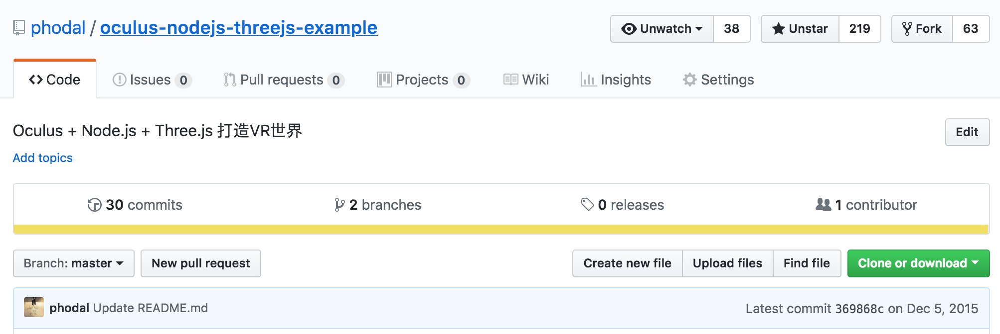
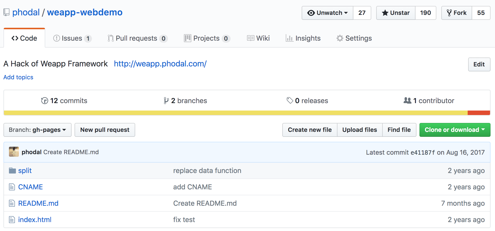
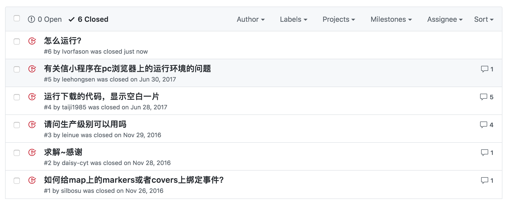
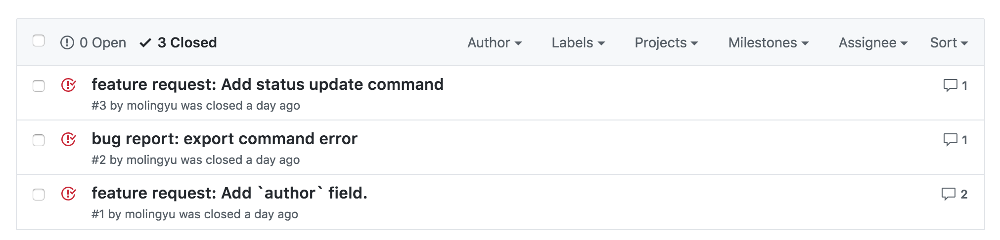
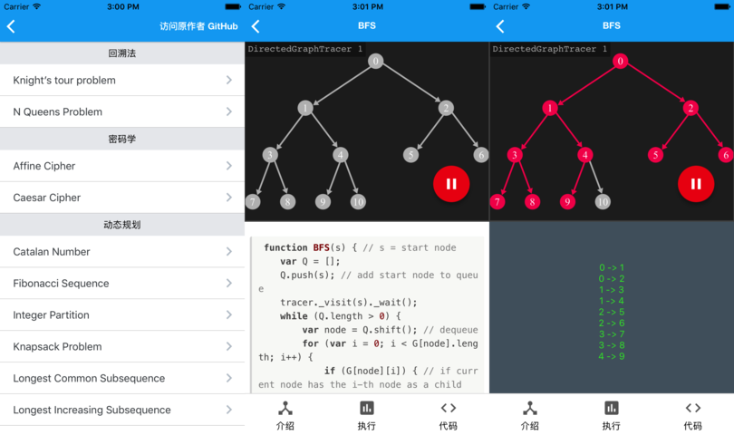
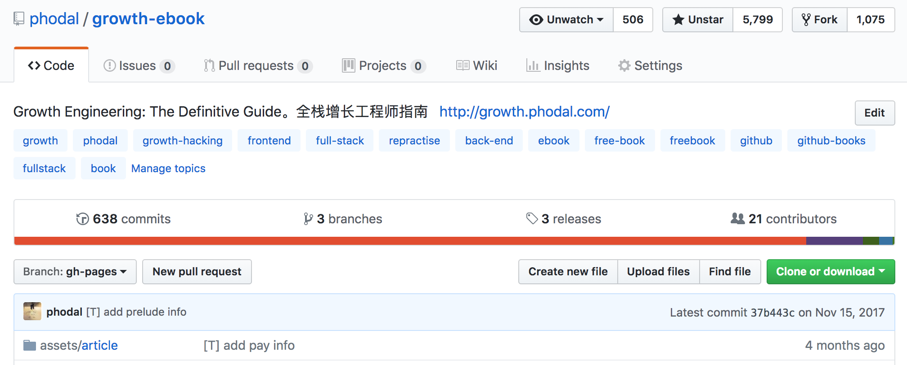

反哺社区：分享知识
---

如果我们从网上可以获取到知识，那么我们也应该将一些知识反哺到社区中。如，三年前，我在使用浏览器玩 VR（Oculus） + Node.js + Three.js 的时候，躺了一些坑。

一来，国内没有合适的中文资源；二来，总觉得应该留下点什么。所以我就建了一个项目来做这样的事情：

而作为一个 md + 源码的项目，README 里就写明了要怎么去做这样的工作。从 star 数就可以看出，有相当多的人看过这篇文章。

当然，我写的 markdown 电子书就更多了。

分享想法：寻找志同道合的人
---

很多时候，我有一些奇怪的 idea，比如说：两年前，想在 Chrome 浏览器上运行微信小程序，便做了一个 [weapp-webdemo](https://github.com/phodal/weapp-webdemo)：

它的 issue 表明了，有一群人拥有同样的想法：

于是，如果我们愿意，那么我们就可以一起去做这样的事情。

可以验证 Idea 是不是可行
---

又比如说：使用 DSL 来生成领域模型图。于是，我写了这么一个开源软件叫 [stepping](https://github.com/phodal/stepping)，它符合我对领域模型的理解。但是。它并不代表我的理论是正确的。我只是凭着我的猜想，做了这么一个 “DEMO” 级别的软件，没有应用到 “生产”用途。所以，我也不知道，它是不是可行的。因为没有多少用户，这个项目就没有然后了。

如我去年底写的架构决策记录工具 [adr](https://github.com/phodal/adr)，也是一个 IDEA。我觉得开发者需要一个支持 Windows, GNU/Linux, Mac OS 的轻量级架构决策记录工具，而不是只支持 shell 的 adr-tools。但是，大多数时候只有我在用这个工具，直接最近有用户提了 issue。

我便快速修复了这些 Issue，毕竟用户觉得这个 IDEA 是可以的。

学习如何去构建一个产品
---

[Growth](https://github.com/phodal/growth) 项目是我的产品领域的最大尝试，面向 Web 工程师的知识图谱学习软件。

> Growth是一款专注于Web开发者成长的应用，涵盖Web开发的流程及技术栈，Web开发的学习路线、成长衡量等各方面。

只有开源的软件，才适合程序员去使用。

我从 2015 年底开始写这个开源软件，经历了 Ionic 1.x -> Ionic 2.x -> React Native 的三次技术栈升级。学会了：

 - 如何在 App Store 和 Android 应用商店发布应用
 - 如何记录用户行为，并分析用户的喜好
 - 如何去营造一个社区
 - 如何去设计一个适合用户的产品
 - 如何去做一些运营推广
 - 。。。

认同感
---

看着每天的 GitHub 首页涨了很多 star，就觉得很开心。有这么多人认同了我做的事，这让我觉得它是有意义的。

赚钱
---

开源只意味着，我开放的是源码。它并不意味着：我要免费为这个软件提供服务。我可以通过提供软件相关的技术支持，来赚取费用。但是，我没有这种机会。

我通过 GitHub 赚钱恐怖就只有：间接出版开源在 GitHub 的电子书了：

star 数让我觉得这本书适合出版，可惜在知乎被骂得很惨。

所以，我已经放弃了这个路子了。

现在的想法，便是好好写几个可以日常用的开源软件就好了。

如我的微信公号编辑器：[md](https://github.com/phodal/md)

我的 GitHub Pages 主题：[mifa](https://github.com/phodal/mifa)

以及其它。。

更容易换一份工作
---

虽然，我一直在 ThoughtWorks 工作着，但是每个月总会收到几封面试邀约邮件。绝大多数都是从 GitHub 上找过来的。

名
---

对，因为我写了很多 Markdown + 开源项目，所以我被称为网红。

虽然，网红是用来 “骂人” 的，可是我真的写了很多开源软件，而不只是文章。

