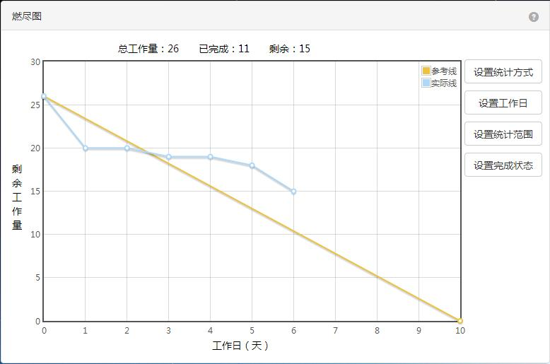

一种提高编程效率的『简单方式』
===

提高编程的效率目的就是：早点下班回家抱女朋友。

最近，我觉得好像老了——事情一多、一杂，再加点别人的干扰，就有点记不住。于是乎，当遇到一系列的问题时，我开始写在便利贴上。然而，我却发现了，它可以让我更专注。

编程的效率
---

为了提高编程的效率，我们想尽了一切办法，戴上个耳机、寻觅个安静的地方、等到一个安静的片刻，可说到底就是：让自己能专注的完成目标。

身为一名程序员，每天我们都在为争取编程的时间而努力着：

 - 减少参加各种『不重要』的会议
 - 戴个耳机，尝试与世隔绝
 - 为了使用上 Google 和 StackOverflow 想尽办法
 - 尽量不参加微信群、微博、知乎上的撕逼

而往往多数的时候，我们会发现，我们没有办法避免别人的干扰。作为一个团队，我们总需要去响应别人的请求。而如果时间一长，则当我们安静下来的时候，我们已经没有思路了。

我们甚至已经不了解，我们究竟在做些什么。

便利贴与 Tasking
---

通常来说，我采用 Tasking 来切分某一个功能、业务的时候，并将它记在纸上的时候，就意味着这个功能、业务有一定的复杂度。

在完成某一个具体功能的时候，我总会习惯地将其划为一步、两步、三步，第一步做什么，第二步做什么。而这些东西，都是记在心里。当我们是一个人工作、或者是新手程序员的时候，要做到这一点很容易。

而这也只限于任务相对简单的情况下，当一个问题变得复杂的时候，如果没有记录下来，我们就会变成一个混乱的状态：

 - 我们要先考虑如何解决这个跨域请求？
 - 我们是不是应该解决一下这个参数的异常处理？
 - 我们是不要看一下后端是不是正常工作的？
 - 我们要先处理这个表单没有验证的问题？
 - 我们还要处理这个样式的问题

天呐，为什么我们有这么多的问题，而却只有一个大脑。如果这个时候，我们没有记下来，那么我们就会陷入焦虑中，我们要解决的问题太多了。但是，到现在我们一个也没有解决。

当我又一次，发现这种情况的时候，我才想起来把它记在便利贴上：

每当我们完成一小步的时候，就愉快地划上一笔，直到我们完成这个任务。

这时的我们就好像在心流上的这种状态。

即使是被打扰，我们也会发现我们正在一步步的逼进任务。

唯一的问题是，你需要在最初的时候，按照优先级，先把重要的任务完成了。

那么你呢，为了提高编程的效率，你是怎么做的？

---------------------

不对，女朋友还在加班中。

不对，你有女朋友吗？

那么，我为什么要这么早回来呢？

