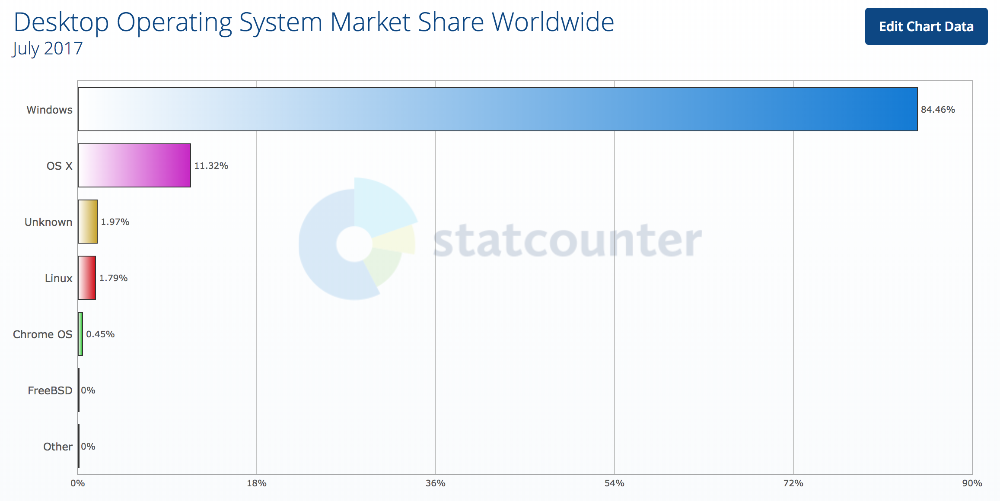
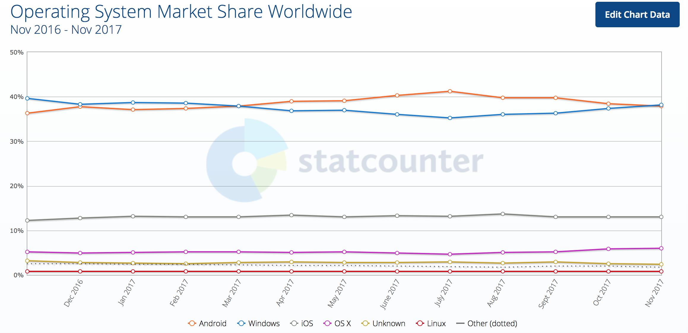
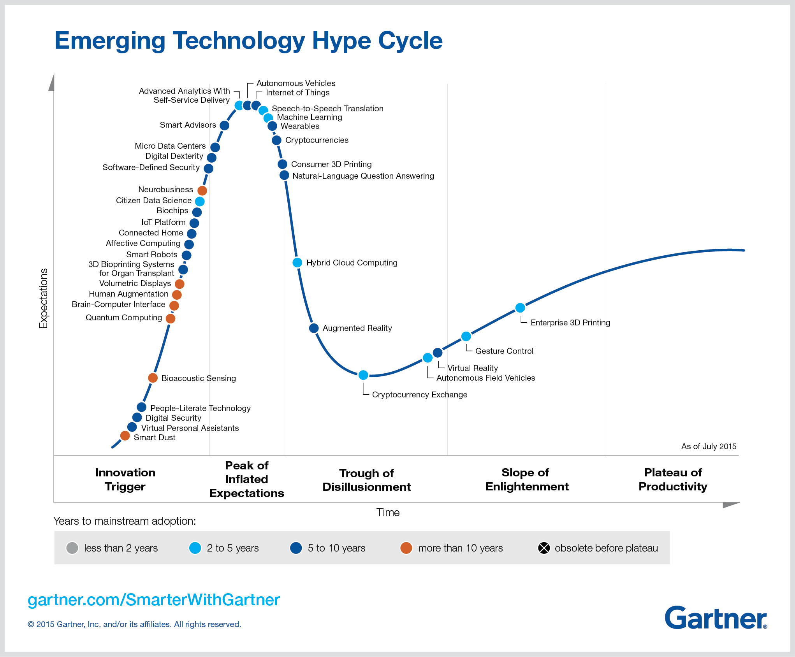
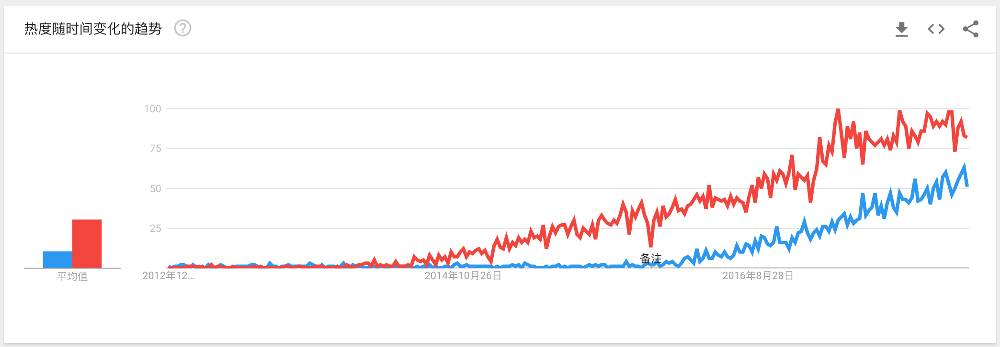

2017 年，我的技术投资学习策略：超越前端、物联网、事件驱动
====

软件开发不是一份稳定的工作：每年都会涌现一个又一个新的技术，每隔几年都会出现一些革命性的技术。尽管从代码、表现及差异上来看，新技术和旧的技术有一些概念上的相似，但是在使用的过程中，仍然是需要花费时间去学习的。

除了，加深自己对现有一些语言、技术、软件工程的领域深度。为了保持一定的技术洞见，每年我们都会学习一些新的技术，使用一些新的技术栈。因此，这篇文章就是介绍一些我对于新技术的感受，以及在这一年学习中的一些经验。

本文主要包含以下内容：

 - 回顾前端：超越交互
 - 回顾移动开发
 - 技术投资策略
 - 物联网与去中心化
 - AI 与技术成熟度
 - Serverless 与事件驱动
 - 区块链评估

（PS：本文的阅读时间大概 10 分钟）

回顾前端：超越交互
---

年初，我在写电子书《我的职业是前端工程师》的时候，已经 “钦定” 了 React、Angular（没有.js）、Vue 作为未来前端开发的主流趋势。在国内来说，还是以 Vue 为主，Vue 好上手，但是不都是所有的用户都是小白 ：） 。但是作为一个前端开发人员，你把时间投资在 React 和 Angular 上，在未来你会有更大的赢面。

Facebook 一系的 React，还有 React Native 和 React VR，未来可能还会有 React Game。Angular 受**奥斯本效应**的影响，采用程度受到一定的影响。在目前来看，对于开发人员的主要成长得益于 TypeScript，对于项目的优势主要静态类型使得代码更加强壮。

可是这一年 AI 的火热，让我开发思考 AI 带来的一些交互上的变化。现在，我们所指的前端多数是一些 Web、移动端相关的 UI 开发，其本质就是与用户交互。诸如前几年火热的虚拟现实、智能音箱，都是一个交互的新入口。

可视化仍然是人类最好的**获取数据**的方式。可当用户大量的日常工作，被 AI 自动化之后，有些工作就变得有些多余。如你出门前要看的天气，以决定穿什么衣服，它都可以由计算机算出来。带不带雨伞，都可以由雨伞提醒你。如 Amazon 设计的 Dash Button，可以让你不需要任何的 UI 就可以购买日常用品。

回顾移动开发
---

今年，我在工作上主要做的都是移动开发相关的工作，从基于 Ionic 与 Cordova 的混合应用，到嵌入 WebView 到 React Native，再到年底的 Android 原生应用，中间写了一些 Cordova 和 React Native 的 Android、iOS 插件。也算是见证了移动应用的不同技术选型，成为了 3/4 个移动应用开发，对整个移动端的技术有所了解。

在最近几年里，原生移动应用开发没有像过去那么火热。一来是，受到混合应用和 React Native 的影响；二来是，移动端的开发技术已经趋于成熟；

尽管在年初，看到越来越多的原生应用开发人员正在转向 React Native。过去，我们认为的操作系统市场份额是这样的：

但是实际上，在讨论市场份额的时候已经是这样了：

以 VR、AR 和 AI 的技术趋势来看，移动平台才是未来的重点——除非有更好的平台出现。触手可及的技术，拥有更多的可能性，也拥有更多的数据及美好的未来。

技术投资策略
---

（PS：在这里，所谓的技术投资是指，在一定时期内向一定的新领域投放时间来学习新技术。）

新的技术每天都在不断地涌现，很多就是黑天鹅一样看不出。并且，一来我们已经习惯了新的轮子的产生，二来我们也**没有那么多的精力**去关心每一个新技术。可是当有一些技术在不断被**提及被应用**的时候，你就差不多应该关注、学习、采用了。

如我在年初看到那一本《灰犀牛》：**灰犀牛体型笨重、反应迟缓，你能看见它在远处，却毫不在意，一旦它向你狂奔而来，定会让你猝不及防，直接被扑倒在地**。你明明看得见，新的趋势在那里，却固执的不肯去了解。那么，未来你就轻松地进入了中午危机。

在 Gartner 的技术曲线上，定义了五个阶段：科技诞生的促动期、过高期望的峰值、泡沫化的底谷期、稳步爬升的光明期、实质生产的高峰期。对于个人来说，这个技术曲线就没有那么复杂。

### 成为早期投入者

对于一个技术人员来说，这个流程就比较简单了。通常来说，作为一个初入这个行业几年的 “新人” 来说，我们是没有经验、能力去开扩一个新的领域。这时成为早期投资者，可能就是最早期的选择了。

在新技术的早期就采用它，**是一件相当有风险的事，也可能会有相当大的收益**。新技术在早期充满了不确认性，如果你押错了，那么你在这段时间的时间可能就白费了。因此，一般是到一个新的技术、概念出现一段时间后，去填这些相关的坑。

如我在这一年进入 Serverless 的坑一样，虽然有一些晚，但是好在国内的云服务产商的服务还不怎么行。通过使用感受、社区及 Google Trends 来看，来看看是否押错地方。

### 在光明期前采用

通常意味着，这个新技术栈还有很多坑。但是，大家都认可它是一个有前途的技术。如在今年被大规模采用（淘宝、QQ 等，有一些因为版权已经换坑了）的 React Native 就是一个很好的例子。

一般来说，经历了一些大公司的踩坑，以及网上的一些踩坑经验，那么就意味着采用它已经没有多少问题了——前提是你已经做好了技术储备。这个时候你就可以为了今年的 KPI，去说服你的领导了。我们应该这么做，xx 公司都已经上线了，而且这些 blabla 的优势很明显。

### 跟随项目使用

当一个新技术的采用，已经在市场上达成共识。那么，也不要再采用旧的技术了。

到了今天，前端的**单页面应用**已经是 React、Angular、Vue 的天下了。这时要开发一个**复杂的前端应用**，那么你应该从这些主流的框架中去选择，而不是采用早期、过期（已经不维护）的技术了。除非，你们是一家大公司，有自己的轮子。

当然，只在该用某技术的时候，才在项目上使用新技术。对于一些简单的页面，jQuery + Bootstrap 还是万能的。为了使用新技术，而在项目上使用，有时候容易造成问题。

物联网与去中心化
---

在这一年里，为 InfoQ 编写《物联网周报》的时候，我花费了大量的时间在索引互联网上的 IoT 相关内容。随之也翻译了一系列的文章，也有了 “[玩点什么](https://www.wandianshenme.com)” 网站 、APP和小程序，其目的主要用于储备技术。通过翻译一些物联网及前沿的技术实践——**持续关注某一领域，可以通过翻译相关的文章来投资**。将一些国内没有的，又可能在未来用到的技术翻译成了中文，再增加一些提升 SEO 提名的文章。（PS：因为在我的[技术博客](https://www.phodal.com)）上，650+ 的博客大部分都是原创的技术笔记，所以不打算放在我的博客上——同时，也可以避免版权带来的问题。）

除了，我大学学的电子信息工程；还有一点，硬件是虚拟世界与现实世界的接口，而物联网则可以让我们真实的、从远程访问世界的各个角落。于是，在年中的时候，我花费时间去研究各式各样的智能家居系统，也有了我的 [smart-home](https://github.com/phodal/smart-home) 项目。

**当自己擅长的技术，有一些新的突破，那么就应该去学习它。**

2017 年里，IoT 领域的技术趋势，已经在不断地结合各种时髦的技术，如：

 - [Serverless Framework 与 AWS IoT 构建 Serverless 的花园监控系统](https://www.wandianshenme.com/play/serverless-framework-aws-build-serverless-garden-monitoring-system/)
 - [Raspberry Pi 教程：在 Docker 上使用 Go 点亮 LED](https://www.wandianshenme.com/play/use-golang-docker-build-go-application-on-raspberry-pi/)
 - [Raspberry Pi 与 OpenFaaS 构建 Serverless Kubernetes 集群](https://www.wandianshenme.com/play/raspberry-pi-build-home-lab-serverless-kubernetes/)
 - [Raspberry Pi 自动驾驶：使用 Keras 与 Tensorflow 构建车道跟踪自动汽车](https://www.wandianshenme.com/play/tensorflow-keras-build-lane-following-auto-car/)

他们解决了一些嵌入式设备的自身缺陷，不过在一年里，**安全仍然是这方面的主流考虑**。

> 当一个流行的技术能在 PC 上运行，它也终将在智能手机、Raspberry Pi 这一类小型计算设备上运行。

在数字化浪潮不断扩张的今天，物联网作为一个底层的技术合集，越来越受关注。但是，这不意味着它会马上火爆起来，只是我们可以看到它在不断地被**应用**。

在这上面花时间，不一定有收益，但是总觉得**自己改变了什么**。

AI 与技术成熟度
---

AI 火热的这一年，在为玩点什么做应用的过程中，便想结合一些机器学习的技术。所以我又复习了一下机器学习，顺便打算 GET 一下深度学习的技能。也就有了玩点什么的[推荐系统](https://www.phodal.com/blog/how-to-design-a-recommend-system-part-1-statistics-rating-up/) ，也应用上了 jieba 分词，加上之前对于朴素贝叶斯、聚类等的研究。发现一般的机器学习，对于我这种已经远离高等数学的人来说，还不算太难，概念上基本能理解得差不多——主要是这些算法，都能应用到一些真实的场景。

于是，我打算试水一下深度学习。然后，我发现我 TM 的数据都没有，下载个数据都要半天。再看看书上的理论，我发现我抽不到足够的空余时间来学习——我的意思是，**足够集中的学习时间**。还有一个问题是，没有**数据**——尽管网上已经有大量的公开数据，但是这些公开数据多数是英语的。这些基于英语语言的数据，会导致出现的算法以英语为主，导致算法本身难以采用，这一类问题最常见于 NLP（自然语言学习）。

假使我将一个周末的两天 + 每天三个小时的晚上时间都投在上面，那么从短期来看收益太少——我可以花这些时间，强化我在其它领域的知识。

好在深度学习的 API，也很容易上手。这一点与我之间在试水智能音箱有点类似，实现一个简单的智能音箱本身并不需要太多的新算法——利用一些现有的公开 API、公开算法，我们可以轻松也用深度学习做一个音箱。但是我们缺乏足够的音频数据，它将会导致我们无法进入下一步。

这就是为什么 Mozilla 会推出 Common Voice Project 项目的原因，没有足够的财力就不会有足够的数据；同理于，今年阿里在双 11 送的大量 99 元的天猫精灵一样，只有大量的数据才能造出 AI。**只能有足够的数据或者财富，才能拥有与之匹配的人工智能**。

Serverless 与事件驱动
---

在第四个季度里，我花费了大量的时间在学习 Serverless 系统，编写大量的 Serverless 应用。有兴趣的同学可以了解 [花了 1000G，我终于弄清楚了 Serverless 是什么](https://www.phodal.com/blog/serverless-architecture-what-is-serverless-architecture/)，以及基于 Serverless 架构的 [简单日志系统 molog](https://github.com/phodal/molog)、[表单系统 moform](https://github.com/phodal/moform)，这些 Serverless 应用都可以在一天内开发、上线。

Serverless 事件驱动的特性，使得它适合物联网、人工智能、数据分析等场景。其按需付费，又能让我愉快地（毕竟穷）各种 Serverless 应用。

如上所示，Serverless 将是一种新的技术架构趋势。而 Serverless 本身算不上一个新的技术，只是 FaaS 结合一堆现有的技术组成的技术架构。因此我将学习 Serverless 的行为，定义为**一种 “短平快” 的学习投资**。

由于国内的内容匮乏，我采用的策略是：边写 DEMO，边写文章、编写自己的 Serverless 应用、写一系列的总结文章、整理成电子书。这样一来在 2018 年，我的博客可能就会受长尾效应的影响，带来额外的更多流量。

区块链评估
---

我对区块链采用的是评估，也就是还没有进入我的采用、Demo 期——主要是因为区块链技术采用的领域有限。早期我在思考在边缘计算、物联网领域引入，但是场景有限。不过，在未来我应该会尝试引入这个技术的。

**常规的物联网系统都是中心化的**，采集数据、加工数据、存储数据、可视化数据、预测数据，它也不需要担心中间的数据修改。如果以一个传感器采集点，作为一个节点，采用区块链的存储成本过高。如果以一个区域作为结点，它也不需要担心其它结点的数据的修改问题。

**只当每一个节点自身需要记录变更**的时候，那么这个物联网应用才适合采用区块链技术，如物流场景等等。

又或者是，在你的智能家居系统的每一个控制节点上，都记录每一次控制的变化。如你使用手机控制了台灯的开和关，这个数据就会同步到你的手机上。问题是，控制个灯都需要记录一下的场景，这可能是监狱吧？

或许，我还需要一个区块链的 markdown 同步工具，而不是使用 GitHub 或者各种云笔记。这样我的 [markdown-improve](https://github.com/phodal/markdown-improve) 计划，又多了一个新的成员了。

结论
---

从上述的学习经历来看，学习技术的期限主要是：

 - 短期学习未来将采用的技术
 - 中期了解一些新的技术知识
 - 长期接触自己喜欢的技术

不过，简单的来说，这一年的经验就是：

 - **持续关注某一领域，可以通过翻译相关的文章来投资**
 - **当自己擅长的技术，有一些新的突破，那么就应该去学习它。**
 - **如果一个与自己工作相关的技术是未来的趋势，那么请拥抱它。**
 - **如果有一个新的技术可以影响到你的生活，不妨去学学它。**
