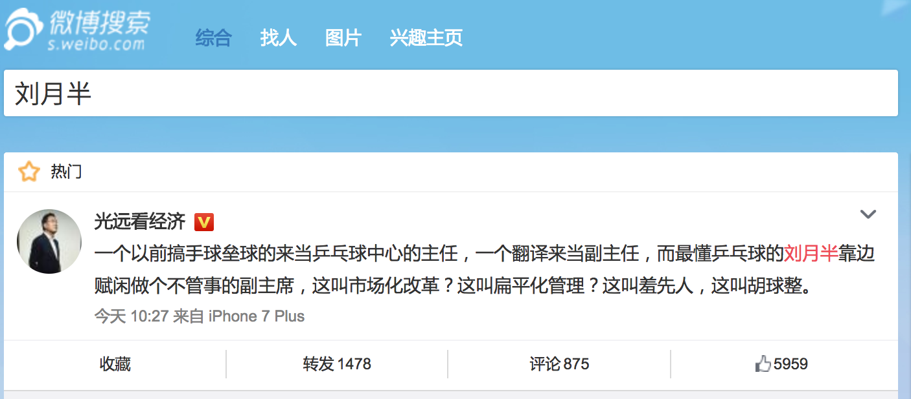
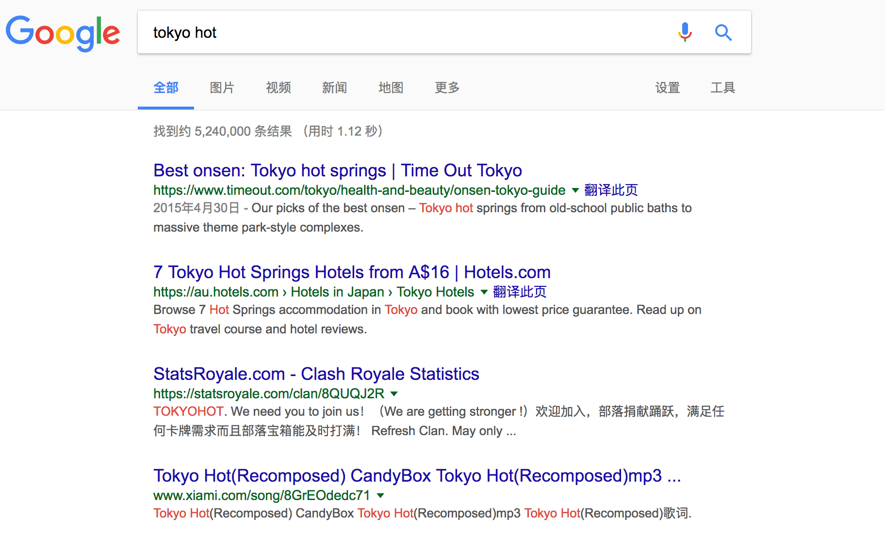
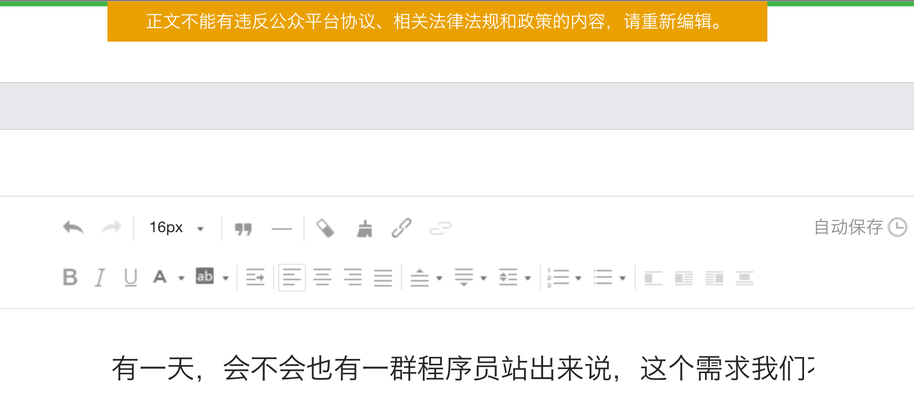
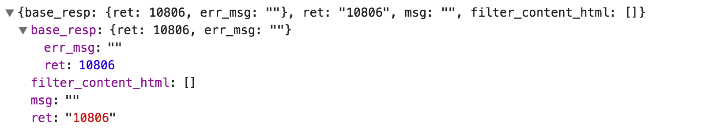
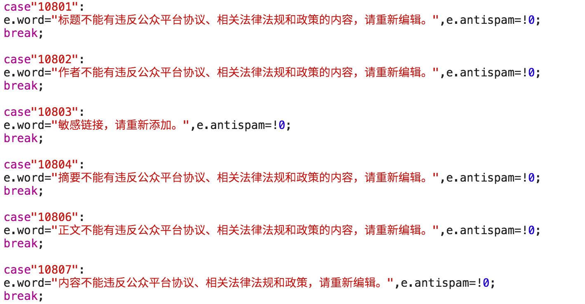

有一天，会不会也有一群程序员站出来说，这个需求我们不做?
===

> 运动员都是有血性的，那么程序员呢？

每当我写下一篇非技术文章的时候，总得仔仔细细的检察一遍又一遍，生怕写错了一个字，多或者是说了不该说的。

可有的时候，我总也想吐槽一下，便得找找看这个词是不是不能出现。要么删去了这个词，又或者是想个办法，换个大家都能听懂的。

一不小心吧，就出个乱子，说不定就在哪里写不了文章了。可这样，一来读起来就没有那种感觉，二来文章写文章的时间变长了。慢慢的也就发现了：

有的网站，差一点，文章一发去吧，自己是能看到自己的文章的，可不一定读者要能看到我的文章。这个时候，总是有些做些忧伤。

以前吧，Google 总会友善地提醒你：找不到和您的查询"xx" 相符的内容或信息。 建议：请尝试其他的查询词. 这还是印象中的那个Google吗？ 现在倒是更友好了，要是开启了『安全搜索』就变成了这样：

有的网站，好一点，你还没按下发布的时候，就提醒你文章是不能发布的。又得重新再审视一遍，然后终于你发现哪里有问题了。要是这个时候，有一个插件，能明明白白告诉你哪里有问题，那或者还是相当不错的。

说罢，便想去 GitHub 创建一个项目，叫上一个 pre-check 的名字。可想了想，觉得不对啊，这些关键词可都是放在系统的后台。就像是微信公众号，预览之前，可是要发一个请求到后台。要是文章有点问题，便会返回一个 10806 码：

然后前端便告诉你：

于是，我就好像是，**学会了一堆深度学习屠龙术，却没有一丁点的数据**。上面的这些倒只是一些小事，毕竟大家都得生存。而它总会让我联想起进击的巨人与城墙的故事：

也总在想，这些程序员在写这些代码的时候，是整样的一种感觉。也是有人把刀架在脖子上吗？虽说，这件事你不做，别人也可能会去做，我在想这是不一样的。

这一点便是和国内互联网公司的加班现状蛮像的。22 年前的 1995 年，通过了**职工每日工作8小时、每周工作40小时。**与此同时，超过工作日法定劳动小时的，按照双倍的小时工资支付加班报酬；节假日加班的，按照三倍的小时工资支付加班报酬。

给的工资一高吧，人们就会去做这样的事，往复的这样循环几次，结果便是整个行业都被带坏了。可毕竟这又不是刀架在脖子上的事，你可以和我一样，找一个不加班的工作。

有一天，你会不会考虑到，那么你会怎么去对待你孩子、后人？

有一天，会不会也有一群程序员站出来说，这个需求我们不做?

请文明回复~~。
