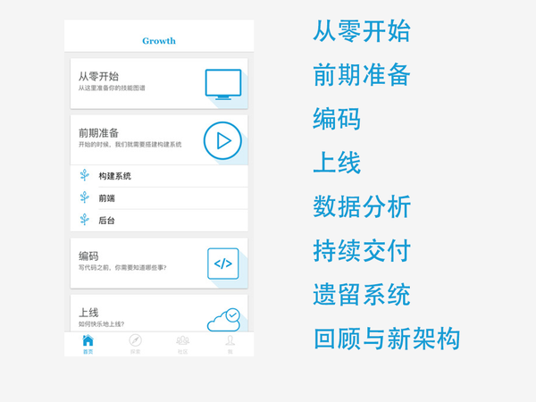
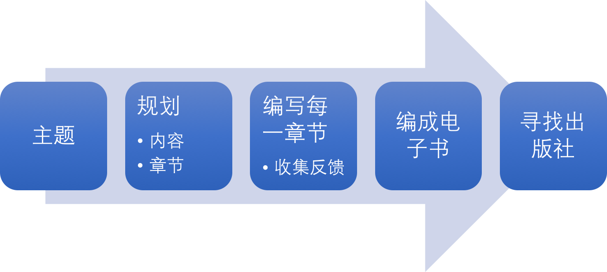

为什么你不应该加入 Phodal 的小密圈
===

> 两星期前，看几个“大 V ”们开通了收费的小密圈，我也开了一个。慢慢的，也陆陆续续地也来了一些人。意外地发现：他们都很安静，没有问题，没有交流。结局就是：小密圈没有帮助你们，但是拯救了我——最喜欢你们这些有钱人了~~。

当我开通小密圈的时候，只是发了个二维码到 Growth 群里，什么也没说。结果有一个小伙伴，掏了 99 块就进去了——这一瞬间我就蒙逼了，我应该做点什么。第二天早上，我想的是：**主要回答圈子里小伙伴的问题，偶尔分享一些知识到圈里**。

当你把这个东西弄成付费的时候，日子就没有那么好过了。平时，要是你向我提个问题，我只在心情好了就回答一下，心情不好、忙着就容易忘了。可要是你在圈里提出一个问题，不好好回答吧，就有一些愧疚，毕竟你是付过钱的那个人。

可是吧，如果你是那个付了 99 块钱的，但是却不提问、不看分享。那么，**你就不应该加入这个小圈子**。免得以后哪一天呐，你说没有从我这学到一些东西，那我可对不住你了。

所以呢，你是那个要提问的人，因为我往往不知道你需要的是什么？

知识盲点：我不知道你不知道什么
---

提问是一种艺术，首先你要总结出你的问题。然后我要确认一下，你是不是问的这个问题。最后，我才能针对这个问题，整理出我所知道的知识。要不然，大家都是在对牛弹琴了。于是，问题分为了两种，一种是好的问题，一种是不好的问题。

（PS：曾经我在一次分享上过这样一个回答技巧，当别人问你一个问题的时候：你应该先把对方的问题重述一遍，然后叫加上一句："这是一个好问题"，再去好好回答这个问题。）

来了个好的问题，好好分析，真的能写个不错的文章。这个模式就变成了，如果你提了一个好的问题，你就可以在公众号上看到一篇相应的文章，如之前的：《[如何以正确的姿势学习前端知识](http://mp.weixin.qq.com/s?__biz=MjM5Mjg4NDMwMA==&mid=2652974651&idx=1&sn=9a14f8c185d34850c53bf0a45e1122a4&chksm=bd4afd188a3d740ea4d3471e65342aceedb4ea56278ad68338b0c48ef1312267b6421ea5ec47#rd)》、《[如何以正确的姿势参与开源项目](http://mp.weixin.qq.com/s?__biz=MjM5Mjg4NDMwMA==&mid=2652974658&idx=1&sn=d847abc6f5e217d149c4955742ee27f0&chksm=bd4afd618a3d7477dd18fb665c1e77cb9707cf3636c32c86ddeb45e21fcf2ba34ce3c9e3cdf9#rd)》。

这样一来，作为一个提问的人，你好像就亏了——别人也可以看到这个问题的答案。要是大家都如此，怕到了后来，就没有人提问，也就看不到想要的内容了。我也就不了解，大部分读者到底需要什么内容了。如果我能知道大部分人真正需要的知识，那么我就是一个畅销书作家了。我也就能边开着咖啡馆，边写着畅销书了。

几年前，我知道大部分 Web 程序员都需要有一份索引，于是我创建了 Growth 应用。虽然没有非常火，但是已经相当的不错了。

这个应用为大部分的人提供了一个大的方向，每个用户都可以轻轻松松地知道，自己下一步需要什么。而这个应用终究只是提供了一个大方向，深入到细节的知识时，又需要一些额外的功能。对于这些基础的内容，已经有足够多的书籍了，我也没有那么多的精力去补充它们。

这种时候，我知道别人缺少的是什么东西，就可以做出一些真正需要的东西。

而当你工作了，你遇到的问题就和我的不一样，你让我去分享吧。我就疑惑了，因为：**我不知道，你究竟不知道什么？**

Phodal 的套路：如何让知识传播得更远
---

对于现在的我而言，写文章时、分享知识都以特定的套路来运作着——一个关于平衡技术与收入的套路。

作为一个刚毕业不久的、山沟里出来的孩子，我一直都有着相对比较大的经济压力——某仲马要在城里买房，家里之前把钱把供我上学了，现在是时候盖个房子。于是，我一直在爱好与收入之间做平衡。即不能将全部时间投入到兴趣中，又得去额外地获取一些收入。有些时候，倒是蛮羡慕别人~。

后来，慢慢地便探索到了，一条适合自己的路线：技术写作。即可以深化我对某一技术的理解，还能提高我 PWD （program、write、design）中的写作能力，多多少少还能换点收入。有些时候还能出本书。而这个过程所示：

即：

- 寻找一个大的主题，如：物联网设计、全栈工程师、成为前端工程师 等等
- 以写书为目的，整理这个大主题相关的话题
- 在自己的博客、公号、专栏上发这些文章
- 收取反馈，并不断的调整方向
- 整理内容成电子书发布
- 询问出版社是否有相关的出版意愿
- 再去出版纸质书籍

即使最后一步失败了，也能在 GitHub 上攒下好多个 Star~~。于是乎， Chief Markdown Officer 就是这么来的。而，你总能找到你需要的内容：
 
  - [Design IoT](https://github.com/phodal/designiot)， 讲的是基于 RESTful 协议的物联网
  - [Ideabook](https://github.com/phodal/ideabook) 是练手项目
  - [GitHub Roam](https://github.com/phodal/github-roam) 是参与开源相关的内容
  - [RePractise](https://github.com/phodal/repractise) 讲述的是练习的艺术
  - [Growth Ebook](https://github.com/phodal/growth-ebook) 讲的是全功能工程师所需要的技能
  - [Grwoth In Action](https://github.com/phodal/growth-in-action) 则是关于如何成为全功能工程师
  - [FE](http://github.com/phodal/fe) 则是成长为一个优秀的前端工程师
  - [Growth Engineer](https://github.com/phodal/growth-engineer) 则是关于如何成为一个卓越的程序员

也因此，你并不能总是看到想要的内容，但是很多知识都是连贯的。

对于我而言，尽管很多的知识本身是没有回报的，如一篇好的文章没有人赞赏~~。但是当我们发现，这些知识可以帮助很多人时，就足够了。

补充一点：提问的艺术
---

而如果你已经这个圈子里了，那么你在提问的时候，试着去思考一下以下的问题：

问题一：如何成为前端工程师？

问题二：我是一个在校生，如何成为一个前端工程师？

问题三：我是一个在校生，学过 Java 用过 JSP，如何成为一个前端工程师？

问题四：我是一个在校生，学过 Java 用过 JSP，想要开发一个单页面应用，如何成为一个前端工程师？

哪个问题对于我来说，更加友好呢？

或许，我并不是那个会经营社区的程序员~。
