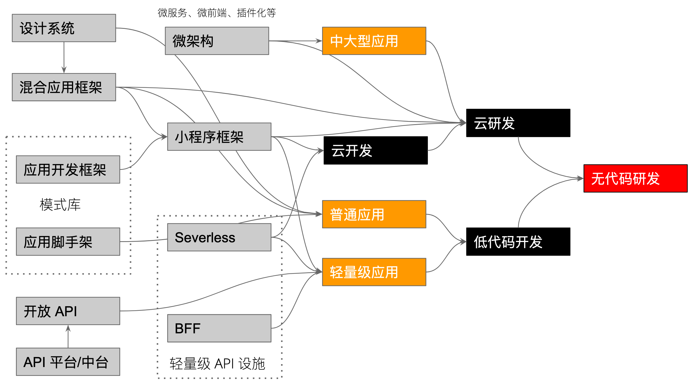

# 万物归代码：从微架构到低代码、云开发、云研发的设计

PS：过去的几个月里，我陆陆续续和不同公司的人一起讨论了开发、研发的未来。光是发我写过的几篇文章的链接，已经不能很好地解决问题。所以我决定写一篇长长的文章，来帮助更多地人理解：研发的未来在哪里？

> 一个逻辑学家可从一滴水推断出大西洋和尼亚加拉瀑布的存在，而不必听说或着见到它们。 —— 《福尔摩斯》

我也是从我的所做、所见、所听中，构建了整个的模型，并非从未来穿越到现在，所以其中的一些设想，可能并非如此准确。

## 前言

开发了一个又一个项目，撸了一个接一个的轮子，已然习惯了各式各样的软件开发流程。每一种模式自有自己的优缺点，也各自有自己的适用场景。而随着历史车轮的缓缓前进，开发流程都在不断地演进，以致于诸多的人都在想：未来的开发是怎样的？

我亦是如此。（PS：为了让大家更好地理解此文，我先说一下我相关的一些上下文）

2017 年，为了解决微服务和 BFF 的最后一公里问题，我开始研究 Serverless，并写下了国内第一本 Serverless 相关的电子书《Serverless 应用开发指南》。过程中，有幸进入了一个 APP 插件化的项目，顺带学会了移动端的 “微服务” 相关的思想。随在 2018 年，便思考着在前端如何去做微服务，写下了国内最早的微前端电子书《微前端的那些事儿》，后来出版《前端架构：从入门到微前端》。自此，大抵说得上是掌握了应对大型应用和轻量级应用的架构设计方案。

2019 年初，我开始思考开发流程的各种自动化，便基于自身的经验和开源社区的项目，构思了低代码/无代码系统架构的设计，也就有了国内最早的低代码架构设计的文章《无代码编程》。随后，我不断去探索尝试一些更好的解决方案，其中一个方案便是《云研发：研发即代码》。（PS：不好意思走得太快了）

装逼到此结束。

---------------

## 云研发路线图

有了上述的各种蛛丝马迹，我想很多人已经有了一个大体上也能有点印象：

这个图略微复杂一点（有些线也没划上），它展示的是组织内前后端能力复用的过程。而云开发、低代码之所以能在某些组织内落地，很大一部分原因也来自于：持续性的能力复用。有了这张图，我们可以很容易推层出其中的实施过程。

按照这个路线图，我把整个过程划分为四部分：

1. 云开发。即软件的开发流程都可以在云端完成，所有相关人员只需要一浏览器就能完成工作。
2. 低代码。需求的变更，可以影响到代码的生成。
3. 万物代码化。由低代码到无代码、云研发的关键技术。
4. 云研发。某个需求的变更，能直接完成部署。如需求对数值的更改，能直接映射到代码的修改，并上线。

如果你还没有放弃此文的话，让我们继续往下走。

### 实施过程

总体来说，我把实施过程划分为了四步：

1. 构建能力复用平台
2. 精心设计胶水式框架及能力
3. 完成生命周期闭环：定制胶水语言
4. 建立双向反馈，以持续优化：同构

事实上，如果你熟悉 DevOps 的实施流程的话，它与这个实施过程还是相似：

1. 闭环
2. 建立反馈
3. 持续优化

稍有有点不同的是，云研发的建立过程要更为精细化许多。

#### 1. 构建能力复用平台

继续从上图中的左下角的方块讲起。近几年，中台十分火热，不断有新概念，也不被地被置疑。我并非一个中台专家，从个人的角度来看待，中台更像是一个垃圾回收站。而受部门墙的影响，大型组织下的部门的核心业务，到底不会交由中台来管理？便是另外一个问题。

但是不论中台的结果怎样，它做了一件有了不起的事情，**引发了管理者对于服务复用的思考**。提升复用率，意味着提升组织的整体效能，减少了一定的内部浪费。

同样的，这种复用的机制，也出现在组织内的前端基础建设、APP 基础设施建设等等。它们出现的本质就是为了提升组织级的开发效率，减少创造重复的轮子。

所以，落地组织级别的云研发有一个很大的前提是，能实现组织内的技术能力复用。这里的组织是相对的，因为大公司的某一部部门本身类似于中型公司的开发能，以此类推。所以，在公司这一级别上，他们可能会有各种重复的轮子，其主要受限于各自的场景及未来的假设之间的差异。

#### 2. 精心设计胶水式框架及能力

技术能力复用，意味着：我们可以把上述的每个技术能力视为一个个的乐高。在构建应用的时候，我们只需要学会如何去组装它们即可。而为了组装它们，我们需要：

1. 编制它们之间的粘合规则。
2. 设计粘合适配层，用于防腐和适配未来的新架构。
3. 制造各种粘合剂，以便于连接系统的各个部分。

因此，我们还需要一些支持快速粘合的技术作为支撑：

 - 后端接口快速适配。从过程中有，微服务 -> BFF -> Serverless -> Serverless Components，直到把基础设施弱化
 - 前端组件快速复用。这一点上便有：组件 -> 微前端架构 -> Web Components 
 - APP 快速接入。从技术上来说有：小程序、APP 插件化、H5 等

一旦完成了这些技术能力，就可以关注于如何完善胶水层。

#### 3. 完成生命周期闭环：定制胶水语言

只凭上述的两步，我们大可以完成一个简易的云研发系统。但是而为了系统的未来演进，还需要一些更先进的能力，以便于我们解耦各个开发过程。这样一来，我们可以轻松更换其中的组件，而不至于因为组件的替换，引起系统架构的巨大变化。

譬如，我们已经有了 Web 部分的快速开发，现在要支撑起 APP 的快速开发。我们不需要一起改动上下游的代码，只需根据定义好我们的接口，各自的改动都是独立的不受影响的。哪怕我们是通过采购的供应商，也可以轻松地替换供应商，避免供应商锁定。这样的接口包含了结构和数据，所以我倾向于 DSL（领域特定语言）来完成。

 - 通过在线 IDE 隐藏胶水细节。
 - 创建 DSL（领域特定语言）连接生命周期的两两节点。（PS：节点间的 DSL 是不同的）
 - 建立起系统的闭环。如通过运营数据节点里，可以直接创建用户故事，来优化系统

尽管这些胶水语言会在前期增加系统的复杂度，但是它无往而不利。

#### 4. 建立反向反馈，以持续优化：同构

> 在抽象代数中，同构指的是一个保持结构的双射。在更一般的范畴论语言中，同构指的是一个态射，且存在另一个态射，使得两者的复合是一个恒等态射。 

有过使用 DreamWeaver、WinForm 等拖拽式开发经验的开发人员，都对这种形式的低代码开发有点反感。其中的主要因由有，当我修改完代码之后，无法反馈到设计上。也因此造成了一个问题，拖拽只适用于设计阶段。当后期代码发生变更时，便无法进行演进。

解决这个问题的办法，除了更新代码生成机制，还有一种方式是通过 DSL （领域特定语言）来建立反向反馈。如设计专用的工具，来将代码的修改同步设计上，同时改变架构设计的 DSL 代码。换句话来说，通过 DSL 来建立起步骤之间的桥梁。

 - 架构同构。即已完成的代码进行解析，其生成的架构设计与模型设计是一致的。
 - 设计同构。对已设计的前端组件进行解析，其与 UI 设计图生成的模型是一致的。
 - 需求同构。对已编写的测试用例筛选解析，其与原始的需求是一致的。
 - ……

简单地来说，我们要保证系统的各个节点的一致性。最终所呈现的结果是：如果节点间不一致的话，那么只能是原始需求有问题。为此，开发人员进行的代码修改，应当是通过 DSL 的形式一步步回溯，直至自动修改了需求，或者映射到需求的问题上。

所以，需要把生命周期的每一个过程都代码化。

### 三个要素

在那篇《[云研发：研发即代码](https://github.com/phodal/cloud-dev)》 中，我们介绍了云研发的三要素，在这里仍然是我么有和的。

1. 微架构：胶水。微架构，即以模块化的组合方式协同构建大型应用（前端、后端、APP等）的架构方式。每个微应用都可以独立开发、独立部署、独立运行，对应的替换的方式有模块化、子模块的方式，微服务、APP 插件化（独立构建、独立运行）、微前端等。
2. 代码化：胶水标准化。代码化，即通过创建领域特定语言来描述某一特定的事物或流程，以用于描述它在数字世界的孪生。
3. 协作设计：文化。从诸多组织实施 DevOps 的过程，我们就可以看到：要打破部门墙并不是一件容易的事。这事实上，这才是云研发的成功关键，要让打通生命周期，意味着要打通一个个的部门墙。让各方达到目的一致，怕是得由各种绩效来保证。

有了这些理论与要素之后，剩下的就是一步步的往上堆砌代码了。

## 云开发

随着持续部署、DevOps 在各个企业的推进，越来越多的企业已经有完善的基础设施，软件开发团队只需要一个在线的 IDE，就可以完成开发工作，这就进入了云开发时代。

### 什么是云开发？

> 云开发，是一种将开发过程完全迁移至云端的云原生开发模式，开发者可以在浏览器端、客户端完成一切的软件开发活动，如代码修改、调度、本地构建、代码提交、部署等等活动。其展示形式往往是通过在线 IDE 的形式完成。

在过去的一二年里，有越来越多的云厂商，选择了云开发的模式。值得注意的是，我们在这里定义的云开发和国内云厂商定义的云开发略有不同。国内云厂商所针对的是轻量级的应用开发，这里我们所针对的是所有场景下的云开发模式。换句话来说，支持轻量级应用开发是一个必由之路（MVP）。

对于一个云开发产品来说，它具备了这么一些关键要素：

1. 云 IDE。
2. 分钟级部署的基础设施
3. 生命周期打通

依旧，最难的仍然是生命周期打通。

### 1. 云 IDE

在这里，我们所讨论的是云 IDE 集成开发环境。它意味着，我们需要将其作为入口，封装各种细节。也因此，它并不仅仅是一个编辑器能完成的。

只是呢，我们可以基于成熟的开源的云编辑器来完成基础部分：

 - VSCode Online（业内：腾讯云 Coding）
 - Eclipse Theia （兼容 VS Code，业内：华为 DevCloud）
 - Monaco Editor（VS Code 基于 Monaco）

随后，通过插件来扩展我们所需要的各种能力，打通一个个的环节。

### 2. 分钟级部署的基础设施

在云开发的模式下，我们需要多种模式的快速部署：

 - 轻量级场景。如 BFF / Serverless + 小程序
 - 开发态容器化（可选）。即在浏览器修改代码时，有一台类本地的环境在后台运行，并实现快速预览。
 - 常规部署。

这些模式都已经具备一定的成熟度，只是需要基础设施来配套上开发者的手速。

### 3. 生命周期打通

在我们解决了代码问题之后，我们还需要做各种集成，以保证：

1. IDE 支持与需求的相关联。
2. 代码与版本控制系统的关联。
3. 临时的流水线与部署环境。
4. ……

当然了，各个地方有了 API 之后，就不是问题了，唯一要考虑的可能是服务器成本。而这个成本呢，可以从开发机器上补回来。

### 如何验证云开发是成熟的？

如何验证一个云开发平台是成熟的？

关于这一点非常的简单：自举 —— 它用于云开发的代码使用云开发环境完成的。

## 低代码

云开发和低代码并没有太多的联系，既然我们不在云环境开发，依旧可以选择低代码技术。唯一有意思的是，它们所需求的基础设施是相似的。既然如此，那么为什么我们在选择架构的时候，不多走一步呢？

### 什么是低代码？

> 无代码/低代码是一种创建应用的方法，它可以让开发人员使用最少的编码知识，来快速开发应用程序。它可以在图形界面中，使用可视化建模的方式，也可以通过领域特定语言，来组装和配置应用程序。开发者可以直接跳过所有的基础架构，只关注于使用代码来实现业务逻辑。

PS：关于『[无代码编程](https://github.com/phodal/lowcode)』 的更多内容可以在我的 GitHub 上查看如何设计：https://github.com/phodal/lowcode 。

这里我们只是介绍它的几个关键因素：

1. 生命周期自动化
2. 流程代码化、数据化
3. 持续完善的基础设施

过程同样不复杂，但是它的场景比较有限，远不如云开发来得实在一点。不过，对于这些有限的场景来说，低代码有非常大的优势 —— 特定的场景，模式是特定的，能大大节省成本。

### 1. 生命周期自动化

低代码最吸引人的一点是，拖拉拽就可以快速预览和上线。这意味着，在这种模式之下，融合了软件开发生命周期几个步骤，需求、设计、编码、构建、部署、运营（+运维），并实现了部分的自动化。

为此在这个要素上，它同理于云开发模式，只是要求的范围更大。所以，我们需要打通更多地环节，才能实现更多的自动化。

### 2. 流程代码化、数据化

在低代码的流转过程中，系统需要存储中间态的结构化数据，或者是领域特定语言编写的数据，以解耦不同环节。

对于一个组织而言，如果计划购买一个低/无代码编程平台，那么需要一个中间态的语言或者数据。我们已经在先前解释了其目的，这里就不重复介绍了。

### 3. 持续完善的基础设施

在实施低代码时，它需要大量的基础设施，如：

 - 大量快速可用的后端 API
 - 分钟级部署后端 API
 - UI 组件集丰富
 - ……

除此，过程中还会有各种的新需求接入，因此还需要不断地完善：

 - 方便与第三方服务集成。
 - 灵活性。支持多语言等。
 - 对应基础设施接入机制。

### 低代码的复杂度

> 复杂度同力一样不会消失，也不会凭空产生，它总是从一个物体转移到另一个物体或一种形式转为另一种形式。

我们尝试降低一部分开发者得难度的同时，也意味着我们需要将这部分复杂度拉由自身来不来解决。

## 万物代码化

> 代码化，即通过创建领域特定语言来描述某一特定的事物或流程，以用于描述它在数字世界的孪生。

代码化是我们实现从低代码到无代码的一个过程，关于如何实践其的代码化，可以关注我后续的文章。在那一篇《[云研发：研发即代码](https://github.com/phodal/cloud-dev)》中，我们把其划为了六步：

1. 需求代码化。使用 DSL 描述需求，并能转换为设计 DSL。
2. 设计代码化。完善设计 DSL，并成架构模型和 UI 设计。同时，实现设计结果到需求的反馈。
3. 代码代码化。创建通用语言，以生成不同语言的代码。同时，代码来反馈到设计。
4. 构建构建化。代码提交自动创建构建，构建自动销毁。
5. 部署代码化。代码描述部署方式，并实现各个环境的自动化、自部署。
6. 运营代码化。所有运营、运维操作都可以通过 DSL 来描述；根据线上反馈结果，能自动创建需求优化。
 
 为了配合它，还需要其它的代码化模式：
 
  - 文档代码化。
  - 合规代码化。
  - ……

嗯，这就是人生的乐趣。所以，是时候准备招一些能造飞机的程序员了。从毕业生中培养，或许是一个更好的主意。

## 云研发

最后，让我再稍微总结一下这篇文章。

### 什么是云研发

>  云研发，是一种生于云上的闭环 + 代码化的软件开发方式。它可以让业务人员、开发人员、运营人员等在同一个云端共同协作、透明化地完成整个软件的生命周期（需求、设计、编码、构建、部署、运营），而非相互隔离，又或者是借助于多个软件才能完成工作。

它需要我们在这篇文章里提到的一系列要素，并整合起来：

1. 代码化。
2. 全生命周期打通。
3. 协作式设计。

所以，整体的实施过程便是：

1. 具备基本的远程编程能力及自动化部署。即代码无需在本地
2. 在云端能完成软件开发的完整生命周期。能在云端完成所有的软件开发的工作，并且配套
3. 云研发平台上的云研发平台。（自举）
4. 借助于代码化的方式，将软件开发的每一个步骤都变成代
5. 实现开发全流程的自动优化。如自动化的蓝绿部署，自动化选择方案，自动化优化。
6. 无人编程。Human Over

## 无代码

真正的无代码，可以使得碳基生物已经不需要存在了。

## 其它

就这么多，凑点字数到 5000。

示例代码：

 - https://github.com/phodal/story
 - https://github.com/phodal/design
 - https://github.com/phodal/code
 - https://github.com/phodal/code

相关文章：

 - https://github.com/phodal/ascode.ink
 - https://github.com/phodal/lowcode
 - https://github.com/phodal/cloud-dev

