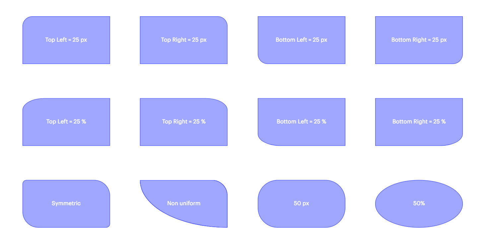
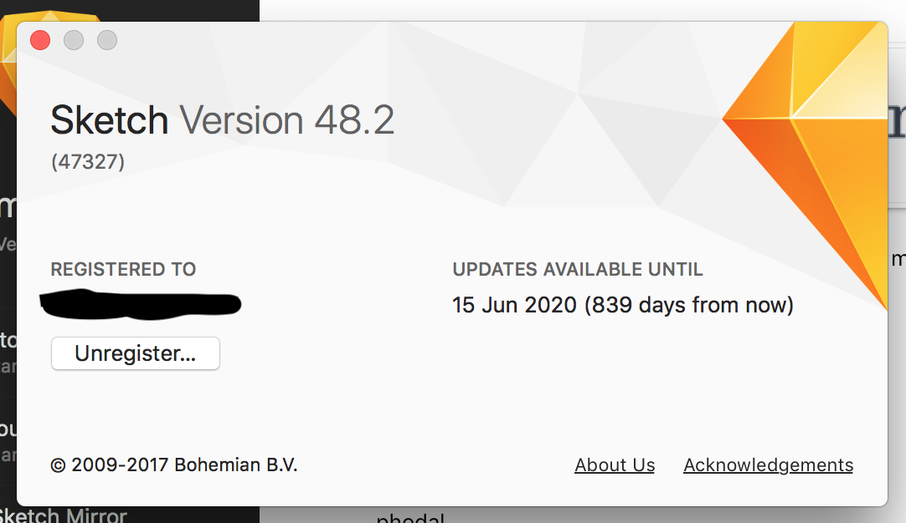
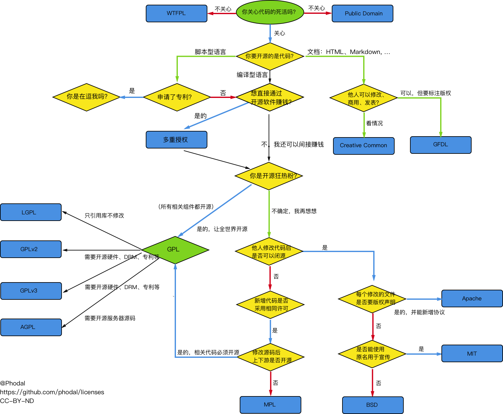
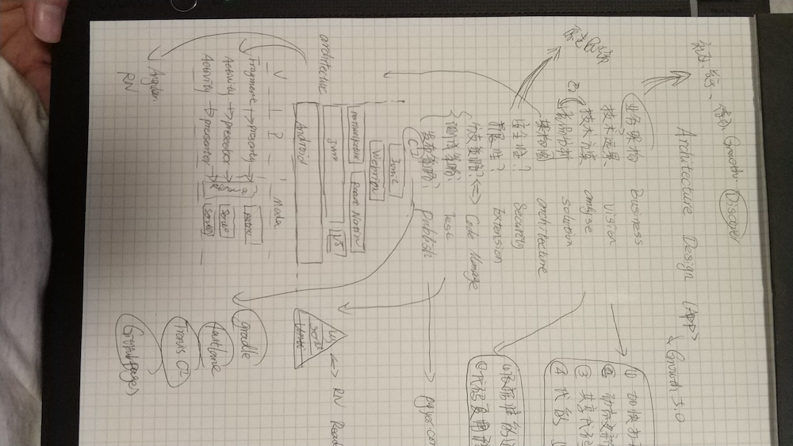
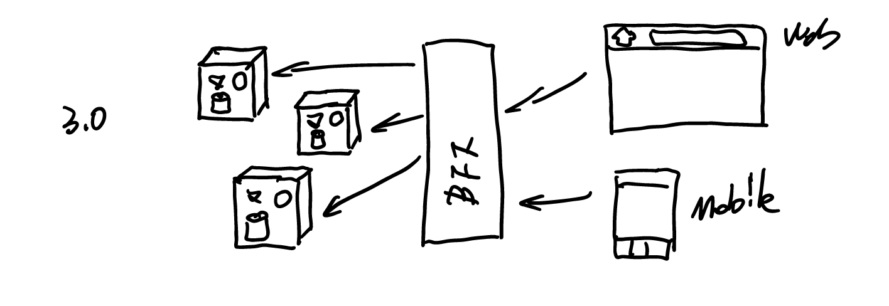
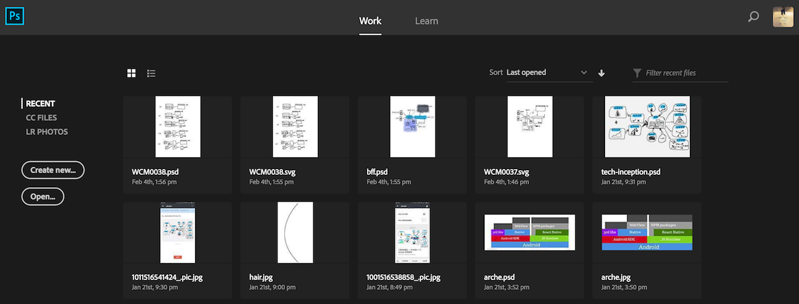
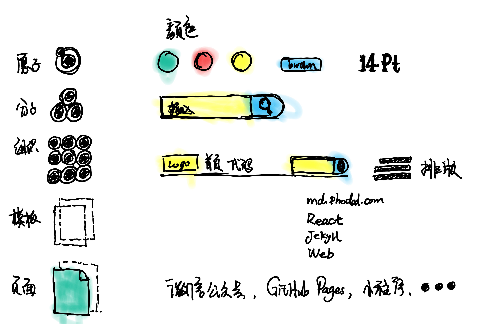
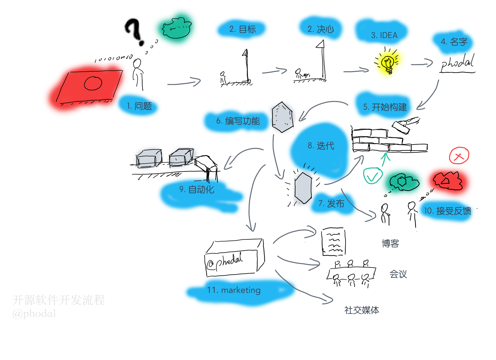

我是如何手绘文章中的流程图？
===

> 我们常说，「文不如表，表不如图」。而要做出一张适合文章的图，也不是一件容易的事。

图比表和文章更容易理解，但是其所花费的时间也更长。在构建得差不多的时候，写一篇文章只需要一两个小时，而画一张图要花去四五个小时。于是，画一张图变成了一张痛苦的事。

我的流程图演进史
---

### Graphviz

早期我最喜欢的流程图工具是 Graphviz，它真的是“程序员友好了”，只需要这样：

```
"《JavaScript高级程序设计》" -> "《编写可维护的JavaScript》"
"《编写可维护的JavaScript》" -> "《JavaScript设计模式》"
"《EffectiveJavaScript:编写高质量JavaScript代码的68个有效方法》" -> "《JavaScript设计模式》"
```

**只需要三分钟**，就能有这样的一张图：


就觉得有点不对劲，这里能不能往上再移一点点，这里是不是改成黄色。


简直是一场灾难。

### D3.js

在后来的一段时间里，在使用 D3.js 完成了 2.0 版本的技能树之后：


我开始使用 D3.js 来画这一类图片：


总体的感觉还是很不错的。可是，我不可能为了画这样的一张图，都去写一份代码。这就成了一个悲伤的故事：


### Word

在我翻译第一本书的时候，我成了 Office 365 的用户，于是我就有了 Word。早期的 Mac OS 版的 Word 即使比屎还难用，后来巨（微）硬（软）的一体化战略，使得 macOS 上有了更好用的 Word。它可以协助我们画出各种规规矩矩的图，如：


对只要是规规矩矩的图，你用 Smart Art 就能画出来


只是，我想要这里是圆角，这里是直角的时候：



我们就只能：


### 在线绘图

随后的一段时间里，我使用的是在线的绘图工具，如 processon.com。它可以完成大部分的图表功能：


在网络条件好的情况下，它可以满足正常的图表需求。但是偶尔也会遇到网不好的情况，直到有一天我觉得我和别人合伙买了一个 Sketch。



可是用 Sketch 画这样的一张图：



也是蛮累的：


### 手绘

而等等，每次我要画一张图的时候，总要在纸上打草稿：



随后，我会在电脑上画出这张流程图。于是，我便想着能不能直接画出这张图。理想的方式有：Surface Studio + Surface Dial 或者 iPad Pro + Apple Pencil，可是它们都太贵了。

这条路不行的话，那么就在纸上画出来。就找到了一个更便宜的工具 Wacom Bamboo Folio，它可以直接同步纸上画的内容到手机、电脑上：



我们就可以在再愉快地打开 PhotoShop：



然后，上色：


对，这些图都是这么来的。




