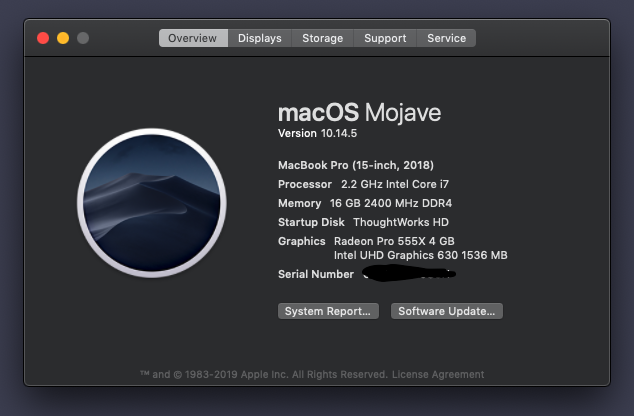
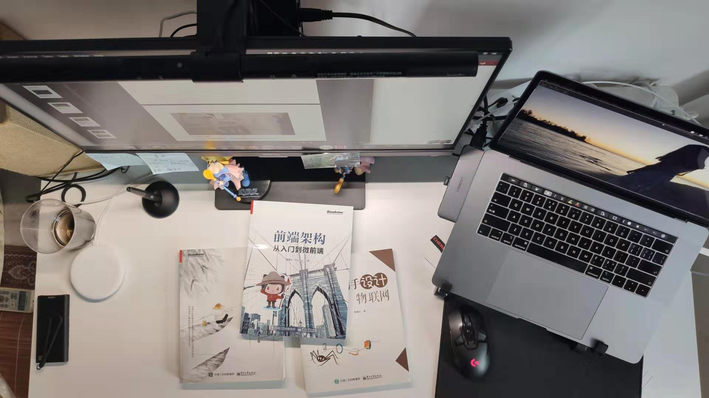
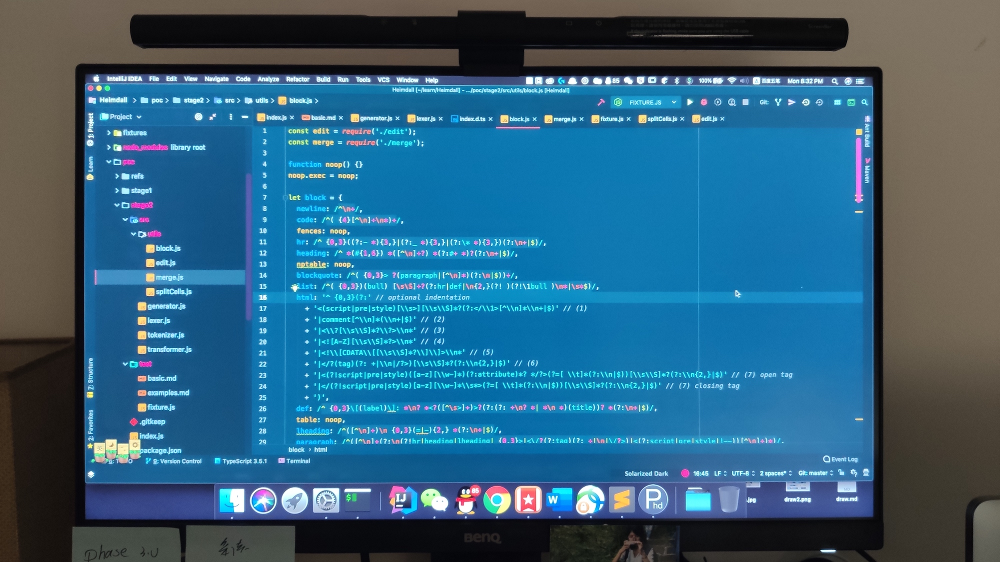
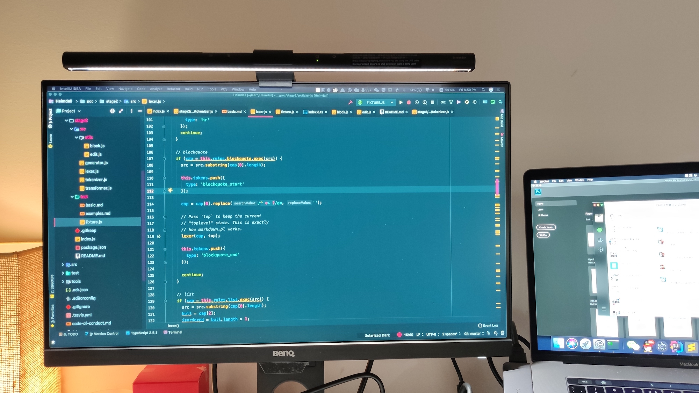
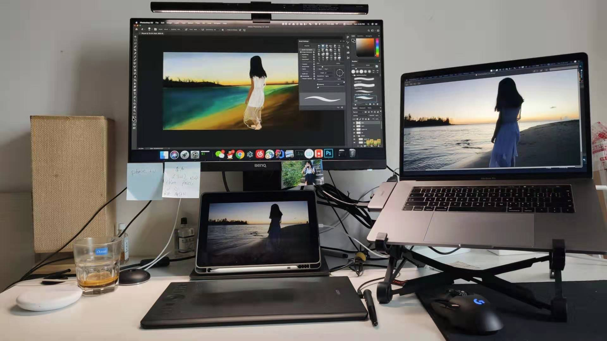

# 程序员的我，在家的工作台是这样滴

前阵子网上有句流行语：上班 996，下班 ICU，而作为程序员，在这个话题里必须拥有姓名了，不仅在公司“超长待机”，回家加班也是常事，肩颈酸痛、眼睛疲劳是最普遍的健康问题。工作那么累，下班回家后，怎样才能舒适学习和写代码呢？除了贤惠的程序员鼓励师@花仲马，舒适的生产工具也是必要的。

过去，我在家的工作台是单一的编程、阅读模式。现在我在家的工作台变成编程、绘图、阅读模式。随着职责的变多，我也需要更多的设备来支持它们。今天就来期轻松点的主题，让我来介绍一些提升 “家” 班舒适度的神器。

## 工具

### 电脑

上一个公司配的电脑到期（三年一换）了，买了，卖了，赚了。我使用的电脑仍然是公司配的 MBP，数字上由 2015 Mid 变成了 2018，CPU 主频降低了，多了一个 Radeon Pro 555X 的独立显卡，除此似乎也就没有别的变化了。

### 键鼠

在日常写代码时，我已经比较少用机械键盘了。微软的 Surface Ergo 人体工程学键盘目前是我的主力，因为它可双肩展开，相对比较舒适。周末在写文章的时候，还会使用一下机械键盘——如果 @花仲马 不在的时候。因为我买的是一个茶轴的键盘，手感是好，但是真的不是一般的吵。之前的鼠标被 @花仲马拿走了，日常就用了我的游戏鼠标。

上面有三个程序员鼓励师，笑 ~ 。

### 台灯

我之前的台灯，也已经转交给花仲马使用了。现在，使用的是明基的 WiT ScreenBar，它特别适合于看书学习，并且比之前的大台灯方便得多——不会占用我桌上宝贵的空间——挂在屏幕上就可以了。它还能感知周围的光强度，自动调节亮度——和手机的原理类似。

它适合用于读书，或者是做笔记。（PS：我的书镇楼）

### 显示器

除了键盘、鼠标之外，显示器也是一个需要好好考虑的电子产品。对于我来说，我关注的因素有：

 - **护眼**。日常在工作的时候，显示器一看久了，就会疲劳。并且，一到下午四五点就不在状态了，好在我们用 Code Diff 这一良好的传统。不过，要是周末在家的时候，我通常会小憩一会儿。
 - **人体工程学**。作为一个长期打算在这个行业混下去的程序员，我还考虑显示器的人体工程学。用书来把显示器垫高，这并不是一个好的主意——书都是要拿来看的。所以，我需要一个能方便调节高度，以降低脊椎负担的显示器。

 起先我考虑的是和公司一样的型号：DELL U2417H，但是这个显示器吧，有一个问题就是刺眼。调低亮度的话，看上去又有点累。于是，我开始尝试了明基的  BL2480T，它是一款定位护眼的 IPS 高清显示器——主要是性价比高。某东上的 Dell 的 2417H 要 1479 元，而带护眼模式的 [BL2480T](https://detail.tmall.com/item.htm?spm=a220m.1000858.1000725.1.a8609de6L8fPPf&id=573592059027&skuId=3907492642254&user_id=672165860&cat_id=2&is_b=1&rn=4c392fa4eb5bf3c450a49f0ff9b16802) 只要 1199 元。

这个显示器，拥有智慧调光和 4 种智慧蓝光、红绿色弱模式随时切换。当你需要在夜深人静的时候写代码，这个智慧调光功能，就是一个不错的选择。周围光线发生变化的时候，它的亮度也能跟着自动发生变化，以让眼睛处于一个比较舒适的状态——对，和上面的台灯一样。这个功能除了自动调光，还有个人性化的地方，就是即使屏幕亮度调暗了，也不会看不清画面细节，因为它还有内部算法会自动优化画面。

至于人体工程学，这个显示器除了常规的 140mm 升降，±45° 左右旋转，俯仰 25° 调节，它还可以支持 90° 竖屏。当我们有阅读 paper 的需要时，就非常适合旋转一下。可惜我穷，要不应该多买个显示器放在一起：

应对久坐的习惯，可以用少倒点水。应对眼疲劳，就只能靠显示器了。

## 工作台模式切换

虽然说，编程领域喜欢单一职责，但是当你穷的时候，需要的永远都是多用。

### 编程模式

嗯，日常我写代码的时候，大概就是这样的：

不得不提一下的是，我用的显示器在拍照模式下，代码也看得相当的清楚——这就是减少频闪带来的效果。普通的显示器，在我们拍照的时候，或多或少会看到一些波纹。当你需要发朋友圈给老板看的时候，这个显示器就特别好用——领导可以清晰地看到这代码是项目的代码。这款BL2480T就是采用 DC 调光技术，减少频闪，可以将对眼睛的伤害大幅降低。

### 绘图模式

我从 2019 年初，开始练习画画，为此我买了个 iPad + Apple pencil。后来，换成了 Wacom Intuos Pro，然后使用 iPad 来看图——等 iPad OS 出来了，就不需要使用 iCloud 来同步参考图片了。过程中，发现使用 MBP 画图的话，有一个问题：**眼睛离屏幕太远了**。我和屏幕的距离 = MBP 键盘 + MBP 触摸板 + 手绘板，旁边还要放一个 iPad。

显示器，配合上我的手绘板和 iPad，就是这样的效果：

虽然明基的 BL2480T 只是一台 1080P 的显示器，使用下来感觉画质不错，能满足我一个绘画爱好者的需求。不过呢，在画画的时候，还需要关闭护眼模式，要不色彩上会出现一些偏差。

### 游戏模式

周末的时候，我偶尔也会拿拿 Switch 玩玩游戏：

为了平时携带方便，我买了一个第三方的 Switch 底座——它有一个弊端，需要外接音箱，不兼容我家的电视。不过，好在明基的 BL2480T 自带一对内置音响—— 1 W 音箱 * 2。不过，它也就听个响吧——反正游戏音质，就凑合一下，毕竟一个耳机都比这个显示器贵。

### 你呢？

选择这些搭配的主要原因是：我穷——买不起房，还要上班。笑：

 - **编码效率**。多一个显示器，加快 Copy / Paste 的效率。
 - **桌面太小**。物尽其用，却又不占用过多的桌面空间
 - **健康因素**。人体工学键盘、护眼显示器、护眼灯，你懂的。

那么，你的桌面是怎样的？

