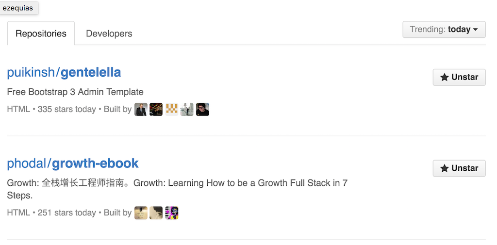
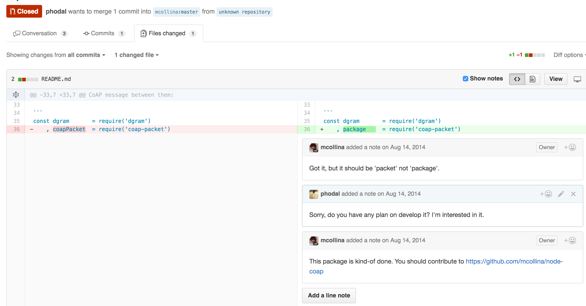
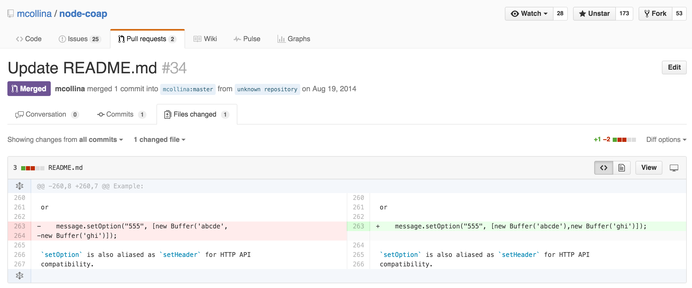
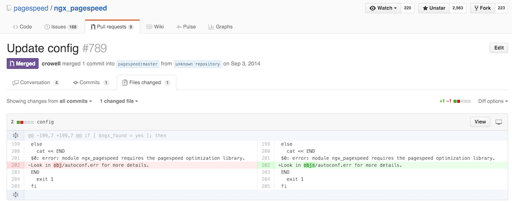
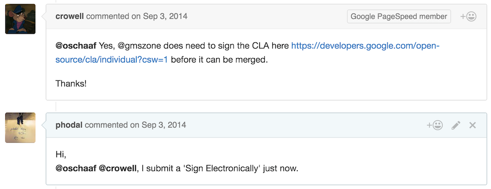
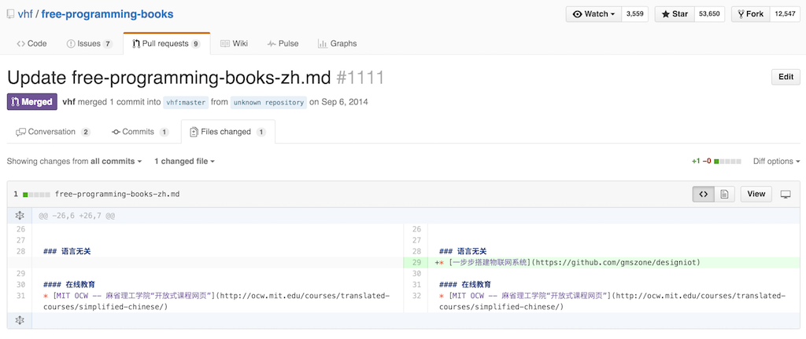

我的GitHub PR的那些故事，以及我向往的开源
===

最近在GitHub上发生了太多的事就不多说了，有好有坏。趁着Growth排在GitHub Trending上，我还是写一篇文章好了:

##我向往的开源

我想我是一个理想主义者。在我工作一段时候后，我就开始在设想使用开源软件来度过未来的编程生涯。当然这样的公司已经有很多了，并且有很多是营利的。

他们的营利方式有多种多样的，如：

1. 多种产品线 。
2. 技术服务型 。
3. 附属品。
4. Donate

这三个是我所想去探索的方向。第一个和第二个需要依赖于开源框架，在过去我试过做了这样的事。也差点有了一些收入，但是因为经验不够就没有去做这样的事。而第三个则是特别容易做的，对于我来说，就是将开源项目变成书籍。如之前的IoT项目变成了电子书，然后走到了出版流程里了。第四个是随着Growth的出现开始有了一些Donate。

说起来，我最大的感悟就是先提升影响力，后面做什么都容易了。

再回到标题里，我们再来说说和GitHub的那些故事。

##我的那些PR

开源软件已经改变了这个世界的软件开发方式，软件从大教堂变成了集市。我们开发软件的时候越来越多的依赖于外部的开源软件库。因此，在实践的时候我们就会按照对方的README一步步往走。而如果README出错了，问题就很严重了。

在我刚工作的时候，我试图在写一个物联网的框架，使用到了一个名为node-coap的第三方库。这个库依赖于另外一个库，结果这个库的README出错了，然后我就来了一个PR。

虽然这是一个失败的PR，但是很快又有一个更新README了。。

刚开始接触的时候，就觉得好有成就感。不久之后，我开始使用Google的Pagespeed来优化网站的性能。然后，我在编译的过程中出错了，但是错误提示我并没有找到这个文件。后来，我发现目录错了，于是我来了个PR，如：

当然这次是最激动人心的，因为还要签署什么CLA——签署后才能merge代码。对于我这种没见过世面的毕业生来说，感觉好高端。

后来发现很多大的公司都需要，如后来我尝试给Eclipse的PR，就是因为CLA不知何故签署失败就没有继续。

过了几天，又看到一个Repo，又来了个PR——这次是打广告去的~~~：

接下来当然还有一些PR，不过大部分也是使用过程中出错才有的。**现在因为README看少了，都只看测试用例了，PR也就少了。**

说了那么多，大家看Growth的时候，多给点PR吧~~~。

