全栈工程师的百宝箱：图形工具篇
===

在上一篇《[全栈工程师的百宝箱：黑魔法之文档篇](http://mp.weixin.qq.com/s?__biz=MjM5Mjg4NDMwMA==&mid=2652973386&idx=1&sn=c775725513879f52b1d40219b7d457a4#rd)》我们介绍了一些文档工具，今天让我来分享一下，我常用的一些图形工具，主要有两类：

  - 流程图
  - 数据可视化

##流程图：Graphviz

说到流程图还是再次提及一下，我们之前说到的**Graphviz ** 。

> Graphviz （英文：Graph Visualization Software的缩写）是一个由AT&T实验室启动的开源工具包，用于绘制DOT语言脚本描述的图形。它也提供了供其它软件使用的库。

它的主要特点是代码生成图像，并且足够的简单。

在我的那个“Web Developer 成长路线图”(GitHub: [https://github.com/phodal/developer](https://github.com/phodal/developer))里，就是用这个工具生成下面这个复杂的图形。

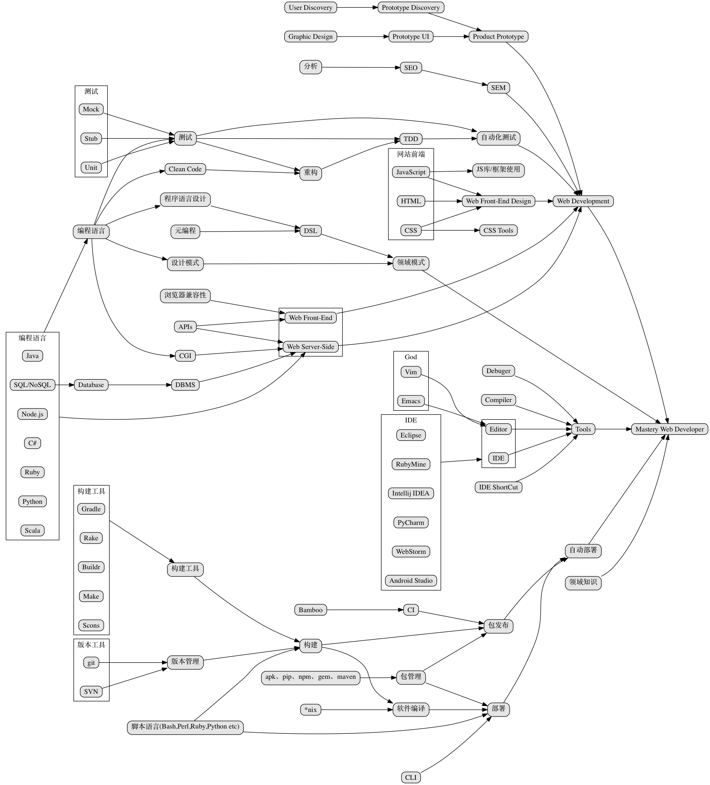

而其代码特别简单——和我们平时表达的手法是一样的，即：

```
"包管理" -> "包发布" -> "自动部署"
"CLI" -> "部署"
"脚本语言(Bash,Perl,Ruby,Python etc)" -> "部署"
"脚本语言(Bash,Perl,Ruby,Python etc)" -> "构建"
"*nix" -> "软件编译" -> "部署"
"构建" -> "软件编译"
```

 Graphviz有一个大的优点和弱点是：自动生成，导致画线的时候很出现出问题。接着，我们就来看看手动画线的例子。

##流程图： Visio vs Dia vs OmnIGraffle

在Windows世界里，在这一类的工具里面最常见的算是Visio:

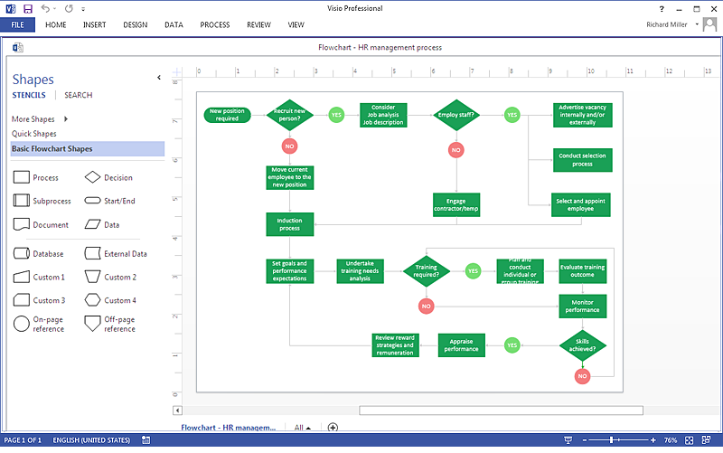

遗憾的是，它并不支持在Mac OS上使用。而且，它并不在我购买的Office 365套装里。

在Mac世界里，最好的工具算是OmniGraffle，就是很贵——我们平时使用的是公司的Mac电脑，使用盗版软件是有法律风险的。

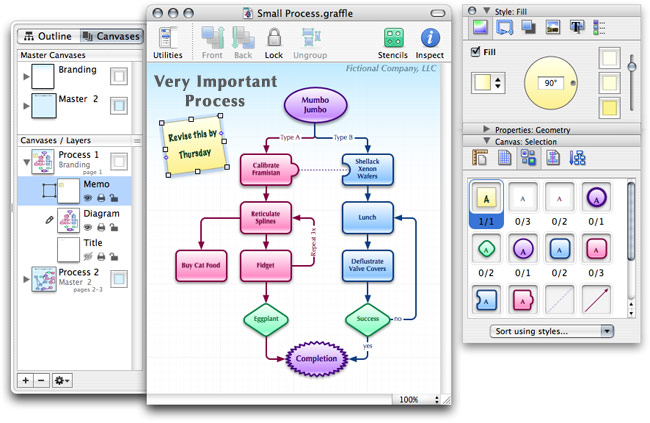

在GNU/Linux世界里，我们使用Dia。

> Dia 是开放源代码的流程图软件，是GNU计划的一部分，程序创立者是Alexander Larsson。Dia使用单一文件界面模式，类似于GIMP与Inkscape。 Dia将多种需求以模块化来设计，如流程图、网络图、电路图等。各模块之间的符号仍是可以通用的，并没有限制。

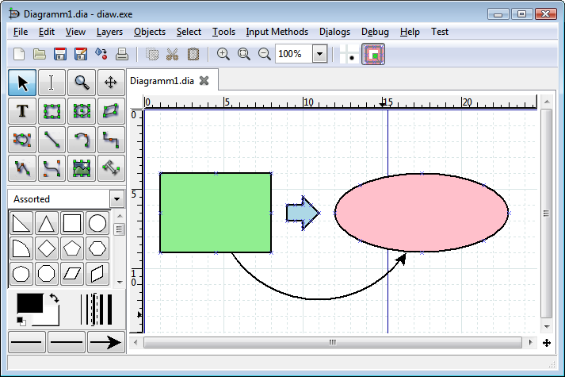

顺便安利一下，我最喜欢的操作系统OpenSuSE——简洁、尾长、绿色。

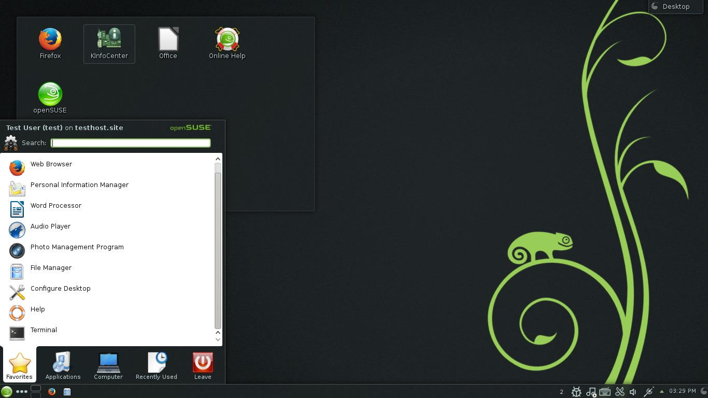

OpenSuSE在KDE桌面下效果最赞了——因为KDE和OpenSuSE都是德国制造。总的来说，会比Debian系的Debian和Ubunt，及RetHat系的CentOS及Fedora稳定、漂亮。

令人遗憾的是这三个工具，我都用不了。Mac对X Windows的支持不是一般的差，于是我就需要别的替代工具。

##在线流程图：Processon

这个工具还是相当好用，至少是在GxFxW内比较快——我之前使用过Creately、draw.io、Gliffy等等的一些工具，只是随着版图的扩展，很多地区都已经“xx”了。

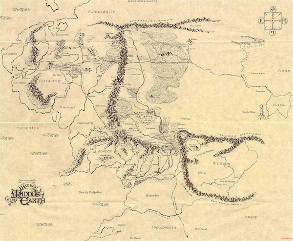

不过遗憾的是：他们没有给我广告费。

> ProcessOn是一个在线协作绘图平台，为用户提供最强大、易用的作图工具！支持在线创作流程图、BPMN、UML图、UI界面原型设计、iOS界面原型设计等。

同样的，在我的那个“Developer进阶书单”（GitHub: [https://github.com/phodal/booktree](https://github.com/phodal/booktree))中，就是用这个工具画出规规矩矩的线。

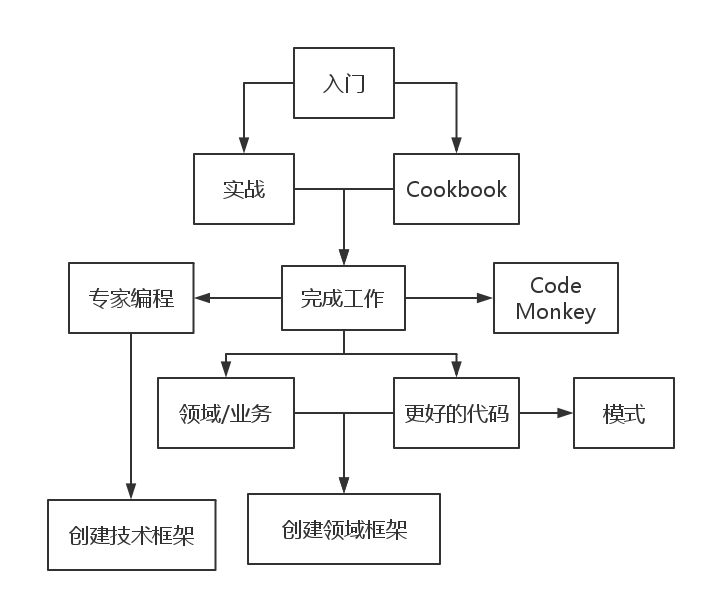

并且，它还是跨平台的。

##各种图： Word和Excel

由于翻译和写书的需要，我成了一个Office 365订阅用户。于是发现在Word等一系列的Office工具中，自带了一个SmartArt的工具：

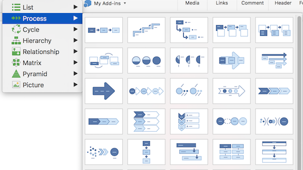

可以画出很多很有意思的图形，比如：


又或者是：

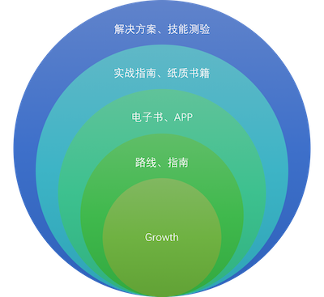

分分钟就能画一个的节奏。

##脑图： XMind

我想这个一般人都是知道的。

> XMind思维导图软件被著名互联网媒体Lifehacker评选为“最佳头脑风暴和思维导图工具”及”最受欢迎的思维导图软件”。

它有一个很大的优点是使用了全球最先进的Eclipse RCP 软件架构，支持跨平台使用。它有一个很大的缺点是使用了全球最先进的Eclipse RCP 软件架构，导致了有点卡。

相比于流程图什么的，它只适合做脑图。

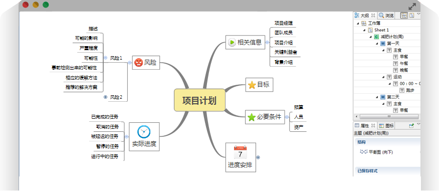

如果你还在使用Eclipse，那么你应该试试Intellij IDEA了。

##各种图：D3.js

> D3.js（D3或Data-Driven Documents）是一个用动态图形显示数据的JavaScript库，一个数据可视化的工具。

与上面的工具相比，这个工具可能没有那么方便。但是，作为一个数据可视化工具，它不仅仅可以做出各种炫酷的图形：

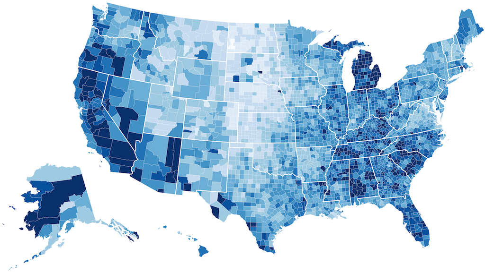

还可以做出一个技能树：

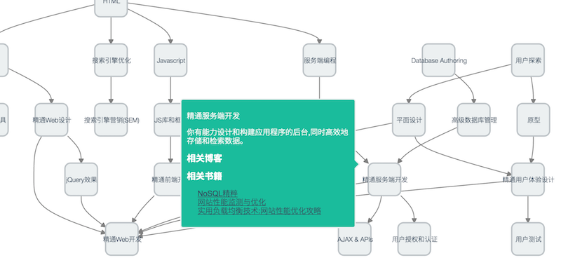

这个项目的GitHub见：[https://github.com/phodal/sherlock](https://github.com/phodal/sherlock)

##地图：Leaflet

> Leaflet 是一个为建设移动设备友好的互动地图，而开发的现代的、开源的JavaScript 库。

虽然它与上面的图形没有啥关系，但是它带了一个图字啊。与Google Map原生的API，或者OpenStreet相比，它最大的优点是对移动设备支持好。

并且，它也是一个可以根据数据（GEOJSON，地理数据）生成图形的工具。

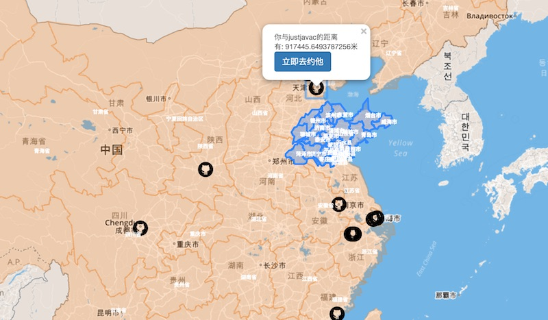
