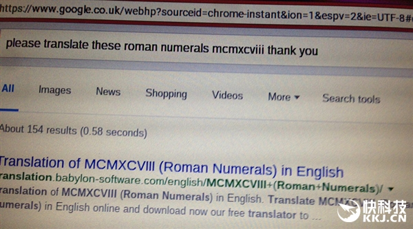
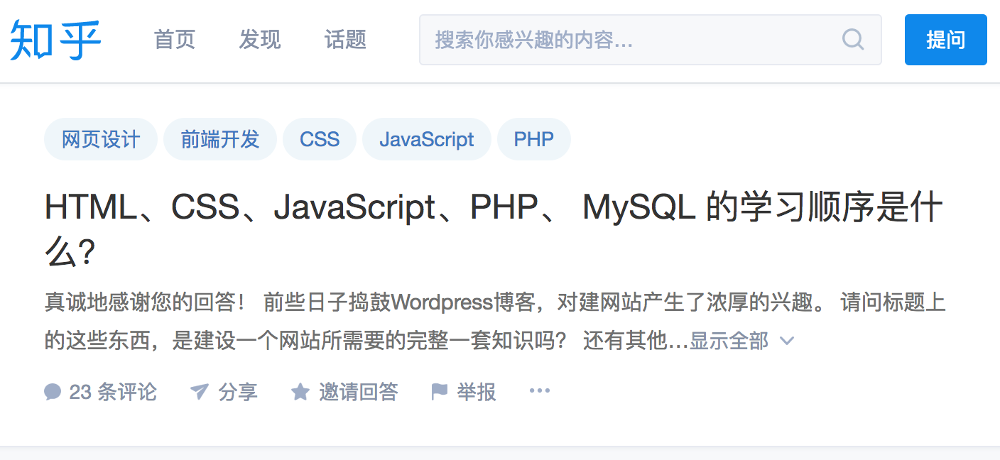
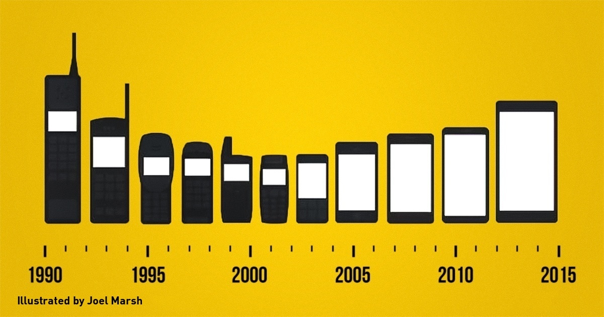

2017 年，你应该这样学习 Web 开发 - 内置索引 + 外置搜索引擎
===

>  如果你不会使用 Google 去搜索，那么你是一个新手。而如果你只学会如何使用 Google，但是不知道搜索什么，那么你也仍是一个新手。

最初我对这个问题的思考，来自于一年前的一篇相关的文章《程序员的内置索引与外置的Google》。当时，文章的主要对比点是，门户网站与 Google。两者有一些明显的区别：

 - 门户网站更适合那些什么都不知道，从头开始探索互联网的人。
 - 搜索引擎更适合你知道相似的东西，但是忘记具体的细节。

类比之下，便是：

 - 当你是一个新手程序员的时候，你需要一本书、一份指南、一个教程来作为索引，并学习上面的一个个内容。
 - 当你是一个有经验的程序员时，你只需要一个搜索引擎，因为你的脑子里已经有了整个世界。

当你不会使用 Google 时，你可能会这样去搜索资料（参见：英国老人坚持用敬语谷歌搜索 成网红被怒赞）：please translate these roman numerals mcmxcviii, thank you。

这种感觉就好像是，你在使用机器人“娇娇”，背后有一个人一样：

可惜，机器人都是晚期直男癌，喜欢单刀直入。

-------------

当你只会使用 Google 时，那么你只能去知乎、SegmentFault 或者 StackOverflow 提个问题：

因为，你根本不知道你需要学习什么？

-----------

也因此，这实际上是两个问题：学什么和怎么学？

从学什么到怎么学
---

从哇哇坠地在医院，到初高中毕业，学习的大部分知识都是别人觉得重要的。你并不需要知道自己需要去什么，你像游戏中的国王一样，按别人的规划一步步地往前走。

知识本身具有**连贯性**，这就是技术发展的本质。你把一个现代的智能手机，交给 20 年前的用户，他都不知道怎么用。

如果你是经历过手机 20 年的更新换代，那么你就很容易地就可以上手各种手机。与些同时，你并需要从 20 年前的大哥大开始用起。

这也是大部分开发者的学习过程，但是并意味着你需要从头学起。你仍然可以忽略过很多东西，然后学习最新技术。

从技能树到知识图谱
---

Human -> Crawler ->  

FKS -> EKS -> Awesome Growth

Awesome-xx

Index 索引

Skilltree Skill-Map 图谱

Awesome-Growth

Update Index
---

Book、教程、官方文档