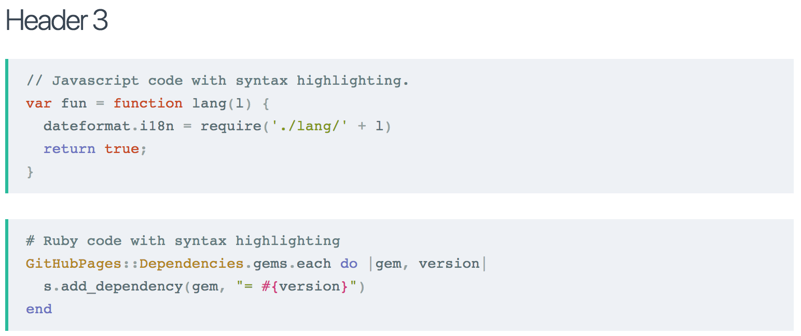
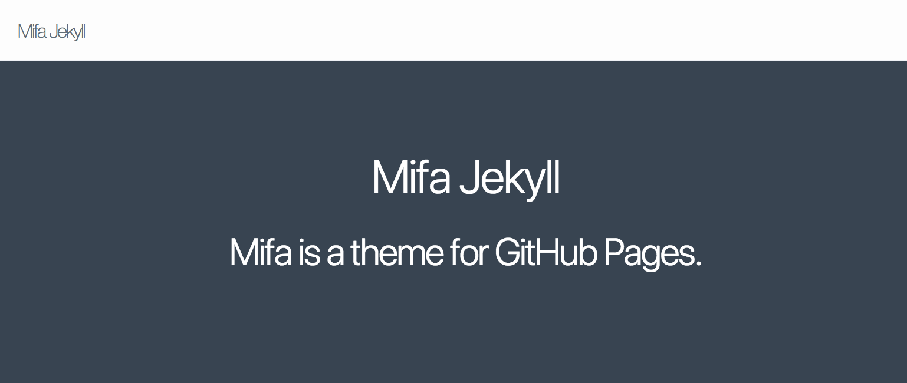

Mifa Design：一个服务于 Markdown 的设计体系
===

嗯，UI 框架，这已经不是一个很好的时代了。可对于 Design Systems 来说，**这还是个不错的开始**。

Material Design 是 Google 推出的专为设计适用于多个平台和设备的视觉、运动与互动效果而制定的综合指南。它不仅让 Web 应用与 Android 原生应用、Chrome OS 应用等等有了一致的外观效果，它还能提高一个一致的视觉体验。

Ant Design 是一个服务于企业级产品的设计体系。基于『确定』和『自然』的设计价值观，通过模块化的解决方案，让设计者专注于更好的用户体验。

那么 Mifa Design 呢？

> Mifa Design 是一个服务于个人的设计体系。基于『易读性』 和『一致化』 的设计价值观，让 Markdown 作者能专注于写作。

我已经编不下去了，就三个字母


Mifa 之所以称为 Mifa Design，只是因为它的缩写是 MD。并不是为了和 Ant Design 齐名，只是用于为我的网站、博客、APP、小程序等等，提供一个一致化的 UI 及阅读体验。


（PS：Logo 有待改进进进进进进进进进进进进进进进）

缘由
---

过去，在讨论程序员影响力的时候，我们讨论了 Avatar、ID 一致性带来的影响。今天，一致性不仅仅只体现在 ID 和头像上，还有 UI 设计上。

在这几年里，在业余时间创作了一系列的作品——文章、开源软件、开源应用、电子书等等。按统计来看，每天累计大概会有两千多用户，会接触到我的博客（~500），Growth 系列应用（~200），玩点什么网站、小程序、APP（~200），开源电子书（~800），还有 GitHub 上的一系列开源应用的文档。而这没有算上在 微信公众号、GitHub、知乎、SegmentFault、CSDN 等等的访问量，还有在今日头条、微博、搜狐、百家号会自动转载文章。

考虑到这么大的访问量里，如果一致化设计风格，那么将会提升我的设计能力。于是，我制作了几个简单的计划，罗列了一下可以修改 UI 的地方：

 - GitHub Pages 主题（完成）
 - 微信公众号编辑器（完成）
 - 在线电子书（TBC）
 - 我的博客 phodal.com（TBC）
 - 玩点什么网站、小程序、APP（TBC）

因为这些地方多数都是 Markdown 编写的，并且共同组成了一个设计体系。因此，名称就由 Mifa Framework 变成了 Mifa Design。Design 出自于之前项目上 UX 分享的 Design System 的 session：


因为，他们解决的是同一个问题，一致性。Design System 要解决的是一定规模公司中的 UI 设计问题，Mifa Design 则是为了提供一致化的阅读体验。


考虑到原子设计是一个不错的处理流程，接下来的内容就以原子设计来展开。

原子：Mifa CSS Framework
---

基于迷你的 CSS 框架 ``milligram``

在这个框架里标题、引用、段落、列表、表格、代码高亮、链接，外加不需要在 Markdown 使用的网格、按钮、表单、工具

 - 颜色
 - 字体大小
 - 文本风格

对于颜色的敏感问题，采用玩点什么、Phodal.com 以及 Growth 的色彩。

分子
---




组织：组件
---




模板：Mifa Jekyll 主题及 Markdown 编辑器
---

```

```

页面
---

So，本文自豪地采用 Mifa Design 0.1.0 排版。
