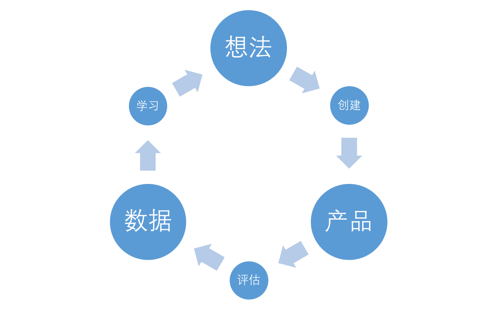
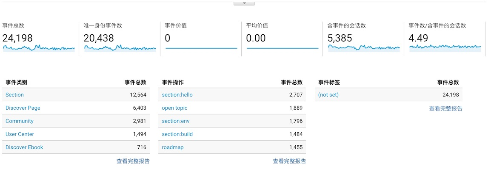
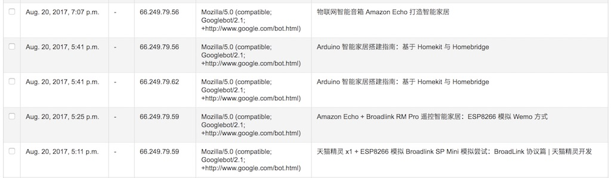
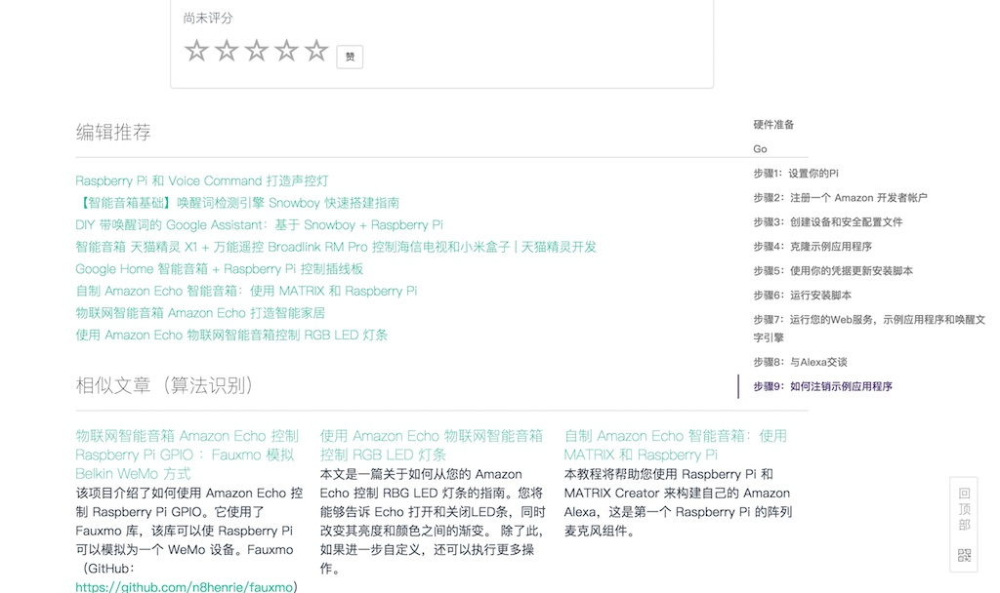
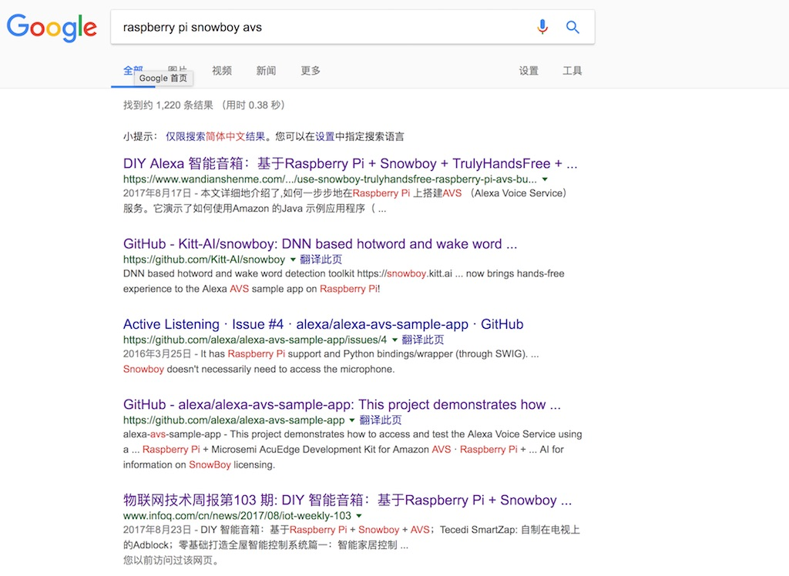

我是如何为技术博客设计一个推荐系统
===

过去的两周里，我一直忙于为 『[玩点什么](https://www.wandianshenme.com/)』 设计一个推荐系统（即，recommend system）。在这个过程中，参考了之前的 几本书籍，查找了一系列的资料。想着这些资料上，大部分都是大同小异的，实现了几个简单的推荐功能，改进了标签推荐算法，便想着写篇文章记录一下。

『[玩点什么](https://www.wandianshenme.com/)』，是一个基于 Django、Python 的 CMS 系统（Mezzanine）。是的，和我的博客使用的是同一个 CMS 系统。由于使用的是 Python 语言，因此对于机器学习具有天生的优势。

推荐系统
---

> 推荐系统是一种信息过滤系统，用于预测用户对物品的“评分”或“偏好”。

对于推荐系统系统来说，目前采用的主要方式是：

 - 基于内容推荐：内容之间的相似度，如文章的标签、电影的属性、书籍的分类。
 - 协同过滤（待实现）：用户之间的相似度，如喜欢看科幻片的 A、B 用户、并且都看过 a 电影，A 喜欢看的 c 电影，B 也可能喜欢 c 电影。

要实现这两种方式有一个前提是，用户数据。特别是协同过滤，需要有**大量的用户行为数据**。对于一些大的社交应用、有大量的用户，如微信来说，还会有：

 - 基于社区推荐，如，你的好友喜欢什么，就会为你推荐王者荣耀。
 - 基于人口统计学，即我们网上看到的各种区域性人的偏好，各种地域黑~。

上面主要是依赖于大量的用户数量，当我们没有大量的用户数据时。我们可以先采用其它的方式：

 - 基于统计学推荐，诸如文章的阅读量、分享量，又或者文章的评分数。
 - 基于标签推荐，对于专业领域的文章来说，作者提交的标签往往比机器生成更加可靠。

除此，按我的理解，对于专业领域来说，还会有一种方式是：

 - 基于知识图谱推荐，如我之前做的技能树和 Growth，便是其中的一种方式。

这种成知识体系的文章，往往对于用户来说，更具备价值。

收集用户数据（一）：统计
---

那么，现在先让我们从收集用户数据谈起。

因为不论是哪一种推荐方式，其都依赖于应用服务提供者所拥有的**数据**、**数据**、**数据**。没有数据，你所谈的算法都是在耍流氓，你所学的机器学习、深度学习算法也是在而流氓，只谈算法不谈收集数据都是在耍流氓。他们的学习成本都很低，几星期几个月，差不多能学好七八十。可是要是没有 ImageNet 的图片数据、CNN 的上亿条新闻数据，这一些算法都没有价值。

而如我在《全栈应用开发：精益实践》所写，数据分析应该在我们上线了第一个 DEMO 之后，或第一个正式版就必须上线的功能，以实现产品的精益化。



它只是数据分析的第一步，引入一些数据分析的工具——只需要引入 Google Analytics、又或者 Piwik 这样的工具，就可以轻松地帮我们做数据统计。这些功夫，基本上只需要半天就做完了。这时，当我们谈及收集用户数据的时候：

 - 对于技术人员来说，无非就是用户的地域、浏览器、操作系统等等，这些相关的信息会影响到用户的体验、技术决策等等。
 - 对于业务人员来说，他们可以了解某个产品的浏览量、受欢迎程度、爱欢迎的区域等等。

只是这些数据，并不能帮我们做出一个优秀的推荐系统。这时，我们是基于统计学，只能统计出哪些产品受用户欢迎：



但是，这已经可以实现我们的第一个推荐系统。

（PS：另外一部分用户数据收集，见下文）

基于统计学与评分
===


基于统计学：访问量及评论数推荐
---

我过去一直觉得，依据统计博客、文章的访问量来推荐是不可靠的。

 - 一篇文章可能因为观点受争议，如 『PHP 不再是最好的语言』，而着有极高的访问量。可这个时候，用户往往是通过标题和摘要来理解作者的观点，往往就会轻易地下定论。又有一些用户，比如我则喜欢看热闹，去下面回复一个『JavaScript 是最流行的语言』。
 - 一篇文章可能因为大 V 的流量效应，而导致 他/她/也 的每一篇文章都有极高的访问量
 - 。。。

并且使用流量统计也容易被攻击，只需要一些诸如『流量精灵』这样的软件，就可以提高文章的访问——虚假的繁荣。

一般来说，大部分的社区都会将流量大的内容、话题等，放在首页显眼的位置。从这个推荐的位置，我们就可以知道这个社区的『水平』。衡量一个社区的『水平』，无非就是最受欢迎文章的类型，如简书的鸡汤，知乎的故事。但是，这些并不代表着这些社区的真实水平，却反应了这些社区的主要受众。


好在简书是编辑推荐制，但章的质量还是『有一定』保证的，但是文章的性质改不了鸡汤。

考虑到我过去曾经刷过访问量，以及流量统计对于数据库性能的影响，我决定改进一下统计代码，即将统计代码放在 JavaScript 中，通过 Ajax 请求实现。而我在这个过程中，犯了一个严重的错误就是，忘了在前端屏蔽中的爬虫。我虽然在 Nginx 里，直接过滤了一部分的爬虫，但是诸如 Google、百度、Bing 都是允许的，而 Google bot 则会在页面上执行 JavaScript，因此每篇博客都被刷了好多阅读量。



于是，只好在前端做一些相关的处理。

```
var botPattern = "(googlebot\/|Googlebot-Mobile|Googlebot-Image|Google favicon|Mediapartners-Google|bingbot...";
var botRe = new RegExp(botPattern, 'i');
var userAgent = navigator.userAgent;
if (!botRe.test(userAgent)) {

}
```

而除了，上面说到的鸡汤问题。它也有一些额外的好处，如：

 - **长尾效应**。这种高流量的文章、商品，往往能带来长尾效应，就像亚马逊上的畅销书，畅销书本身是不赚钱的。但是网站可以通过相关的文章、产品，来获得更多的阅读及利润。而这取决于，**我们为用户推荐的相关产品，是不是真正是用户需要的**。

考虑到上面的鸡汤流量问题，它可以吸引大量的人气，但是会导致劣币驱除良币的产生——大量产生优秀内容的作者，写不出受大众欢迎的文章。举个例子，技术写作来说，面向新手的文章，往往会有比较高的阅读量；而面向中高端用户的文章，则阅读量低。可要是首页都是新手文章，流量和受众就会越来越多，但是高端用户就会离开这个社区。

因此，我们还可以采用用户评分，来增加一个新的榜单，如 Medium 和 『[玩点什么](https://www.wandianshenme.com/)』的第二种推荐方式。


它可以在保证流量的同时，也不降低网站的质量。

基于统计学：评分及 IMDB 加权算法推荐
---

软件开发，本身是以演进的形式进行的。不论，我们是开发基于内容的推荐系统，还是协同过滤的系统，它都依赖于我们拥有一个评分系统。与此同时，如果我们没有足够的用户，我们也进行不了内容推荐和协同过滤，因此设计一个稍微完善一点的评价排名，便显得很有必要。

下图是『[玩点什么](https://www.wandianshenme.com/)』的评分，用户不需要登录就可以评分：


尽管没有登录是一个风险问题，然而对于一个内容网站来说，刷评价的意义并不大。

在真实应用的过程中，遇到了一个问题：

 - A 文章只有 5 个评分，且都是 5 分；
 - B 文章则有 100 个评分，平均值则是 4.8 分；

如下表示：

id  | xx | keywords | votes | rating_sum | rating_average | published | title
----|----|----------|-------|------------|----------------|-----------|-------
"323 " | "0 " | "tech tools " | "45 " | "165 " | "3.66666666666667 " | "1 " | "每个程序员必知之:程序员差别的本质"
"63 " | "0 " | "programmer resume latex " | "24 " | "66 " | "2.75 " | "1 " | "程序员该如何去写自己的简历(草稿）"
"207 " | "0 " | "beageek geek anywherehtml " | "20 " | "79 " | "3.95 " | "1 " | "be a geek 1:无处不在的html"
"38 " | "0 " | "iot osiot laravel ajax RESTful " | "19 " | "84 " | "4.42105263157895 " | "1 " | "一个最小的物联网系统设计方案及源码"
"361 " | "0 " | "write type writer programmer " | "17 " | "65 " | "3.82352941176471 " | "1 " | "编程同写作，写代码只是在码字"
"259 " | "0 " | "gitbook " | "12 " | "51 " | "4.25 " | "1 " | "gitbook 制作书籍"
"37 " | "0 " | "iot ajax laravel RESTful serial " | "11 " | "40 " | "3.63636363636364 " | "1 " | "最小物联网系统（一）——系统组成"
"391 " | "0 " | "javascript anonymous encapsulation " | "11 " | "50 " | "4.54545454545455 " | "1 " | "Javascript 匿名函数与封装"
"512 " | "0 " | " " | "9 " | "36 " | "4.0 " | "1 " | "如何通过github提升自己"
"508 " | "0 " | "emacs vim github " | "8 " | "40 " | "5.0 " | "1 " | "努力只是因为想去做想做的事"
"548 " | "0 " | "full stack mustache django rework " | "8 " | "35 " | "4.375 " | "1 " | "全栈工程师的思考"


这个时候，我们很难判定 A 就比 B 好，于是在知乎上看到了一个相关的评分算法，即（更多信息可以阅读：[IMDB 给出的电影评分的计算方法是怎样的？](https://www.zhihu.com/question/19746144)），又可以称为 IMDB TOP 250 评分算法。

它是由贝叶斯统计的算法得出的加权分（Weighted Rank-WR），其公式如下：

```
(WR) = (v ÷ (v+m)) × R + (m ÷ (v+m)) × C
```

 - WR， 加权得分（weighted rating）。
 - R，  该电影的用户投票的平均得分（Rating）。
 - v，  该电影的投票人数（votes）。
 - m，  排名前 250 名的电影的最低投票数（现在为 3000）。
 - C，  所有电影的平均得分（现在为6.9）。

于是，我的算法代码就变成了这样：
 
```
def imdb_rank(average_rating, votes_number):
    minimum_votes = settings.MINIMUM_VOTES
    correctly_votes_rate = settings.CORRECTLY_VOTES_RATE

    return (votes_number / (votes_number + minimum_votes)) * average_rating + (minimum_votes / (
    votes_number + minimum_votes)) * correctly_votes_rate
```

然而，在计算排序的时候，我不是拿所有的文章排序，而是：

 1. 从所有文章中过滤出能达到最小评分数的文章
 2. 按评分值，对这些文章进行排序，取前 10
 3. 对前 10 中的这些文章，进行 imdb_rank 计算，取前 3

这样做的主要原因是，出于服务器性能考虑。

对于那些只有赞同和反对的网站来说，可以采用『威尔逊区间』算法，表示如下：

```
from math import sqrt

def confidence(ups, downs):
    n = ups + downs

    if n == 0:
        return 0

    z = 1.0 #1.44 = 85%, 1.96 = 95%
    phat = float(ups) / n
    return ((phat + z*z/(2*n) - z * sqrt((phat*(1-phat)+z*z/(4*n))/n))/(1+z*z/n))
```    

### 待改进

可是我给一个文章五分，并不代表我真的喜欢这篇文章。正如，我在某宝上不敢给差评一样，万一被骚扰了呢。但是我喜欢一个东西，我会给一个评论。因此，我会开心地留个言，又或者是在留言给个差评：**卖家真好，卖了个手机壳，送了个手机**。

因此，目前行业内有一些做法是，评分 + 评论分析，从评论中分析出用户的真实想法。

在 KOL （关键意见领袖（Key Opinion Leader）越具影响力的今天，一个 KOL 的文章链接发表在其社群里，也可以很轻松地获取大量的阅读量，哪怕只是一句：今天肚子不舒服。可这并不是所有用户想要的结果，而我们也没有理由去阻止这些文章的流行，只是需要做一些干预。

基于内容的推荐
===

与统计学相比，基于内容来向用户推荐相似的内容，往往更容易获得。对于推荐来说，则有两种方式：

 - 手动推荐
 - 自动推荐

（PS：我承认，这句话说了等于没说。）

如下图所示：



**手动推荐**。在技术领域，作者通常比大多数读者更专业，他们知道什么是读者需要的。比如，你看了一个 React 相关的文章，你可能会需要 Redux 相关的内容。

**自动推荐**。有一些前提条件，融合现有系统的数据信息，能获取一些用户的信息，再去获取数据库中相应的信息，最后返回给读者。

因而在这篇文章里，我们将介绍 ：

 1. 手动化的标签推荐
 2. 半自动的标签推荐
 3. 全自动的基于内容推荐

标签生成
---

使用标签来向用户推荐产品，有几种不同的类型：

这种标签生成方式有四种方式：

 - 手动标签
 - 机器生成推荐
 - 用户手动标记（UGC）
 - 混合学习式

**手动标签**

即，用作者手动添加相关标签，这种方式往往是最靠谱的。

对于文章来说，有 xxx

对于商品来说，也是相似的，在上架的时候，就拥有了相应的产品数据，如价格、类型、时间等等。

**机器生成推荐**

根据文章的内容、标题等信息，提取出

**用户手动标记（UGC）**

诸如豆瓣上的电影、图片等等，都是由用户手动标记的标签。

**混合学习式**

在手动标签的情况下，如果是 UGC 的内容，那么为了更多的访问量，用户可能会有意、无意地加上一些无关的标签。如 A 标签的关注用户比较多，相关的它的流量也会比较大，那么贴上 A 标签的文章，也会获得更多的关注。但是由于文章本身与 A 标签无关时，必然会导致用户的不满。而这个时候，如果普通的用户能判定该文章，是否是相关文章时，必然能某种程度上降低这种影响。

相似的，如上我们提到机器在生成标签的时候，也会出现一定的问题。

基于手动标签推荐：标签数量相关
---

由于我使用的基于 Django 的 CMS 里，已经包含了后台手动推荐相关文章的功能。因此，我的想法是，先基于某几个特定的标签的数量，来筛选中相关的文章。

在我的第一个原型里

1. 获取文章的所有标签
2. 对所有文章的标签进行统计，计数
3. 获取文章标签中计数最多的 tag，查找相同标签的博客
4. 在剩余的博客中，选择第二多 tag，再过滤剩余的博客

```
keywords_name = model.get_keywordsfield_name()
assigned = getattr(model, keywords_name).all()
all_keywords = Keyword.objects.filter(assignments__in=assigned)
keywords = all_keywords.annotate(item_count=Count("assignments")).order_by('-item_count')

# TODO: filter most popular tag
first_keyword = keywords.first()
if first_keyword:
    first_filtered_blogposts = BlogPost.objects.published().filter(keywords__keyword__title__contains=first_keyword.title)
    first_filtered_blogposts = first_filtered_blogposts.filter(~Q(id=post_id))
    second_keyword = keywords[1]

    if second_keyword:
        blog_posts = first_filtered_blogposts.filter(keywords__keyword__title__contains=second_keyword.title)
        return blog_posts[:3]
    else:
        return []
```                


这也就是上面算法中的问题，假如我们的文章中，出现一系列的 home assistant、raspberry pi 相关的文章，那么它对于网站来说，表明它是没有价值的。

并且如果同一系列的文章太多，如网上各类的 Vue 高仿站点，那么用户可能已经掌握了，或者没有价值。因此，它并不能在搜索结果上体现，

在站点内，它有重要的意义，标签数量多。但是它并不能真正地解决用户的问题？也不能真正地体现出网站的价值。

假如用户搜索了一篇 raspberry pi + homebridge 的文章，那么它确实可以阅读一些相关的文章，而诸如 raspberry pi alexa gpio 从上图来看似乎是一个用户更加喜欢的选择。

示例：http://localhost:8000/play/howto-install-home-assistant-in-raspberry-pi/

这个时候由编辑推荐出来的，反而比较准确。

 - 权重
 - 加权计算法


随后，对算法进行了改进


半自动标签推荐：基于 Google 搜索权重优化
---

单一的关键词，只对于网站本身是有价值的，对于用户来说，则不是如此。

在我使用 Google Analtyics 的时候，我突然想到可以通过 Google Search Console 来获取用户搜索的关键词。即：



如下表所示，会在 Google Search Console 写明其相应的位置、点击率、出现次数等等的信息：

Queries | Clicks | Impressions | CTR | Position
--------|--------|------------|------|------
homebridge-miio | 7 | 28 | 25% | 8.2
home assistant broadlink | 4 | 10 | 40% | 15
amazon echo raspberry pi | 3 | 10 | 30% | 5.0
raspberry pi homebridge | 2 | 6 | 33.33% | 7.7
raspberry pi alexa gpio | 2 | 4 | 50% | 10
nodemcu homekit | 2 | 3 | 66.67% | 13
arduino homekit | 1 | 3 | 33.33% | 9.7

### 相关性搜索

用户搜索 Raspberry Pi，那么它可能还会结合 Arduino ??


### 更新权重

于是便下载 CSV，创建新的 model，导入到数据库中。

同样的，简单做了一个权重算法：

第一个关键词 = 关键词次数 * 0.25 + 关键词查询次数 * 0.75

```
    for keyword in keywords:
        related_queries = Query.objects.filter(queries__contains=keyword.title)
        keywords[index].item_count *= 0.75

        if related_queries:
            for query in related_queries:
                keywords[index].item_count += query.clicks * 0.25

        if index > 1 and keywords[index].item_count > keywords[index - 1].item_count:
            top_rank_keyword = keywords[index].title

        index += 1
```

第二个关键词则按频率取词。

基于内容的推荐算法
---

1. Item Representation：为每个item抽取出一些特征（也就是item的content了）来表示此item；
2. Profile Learning：利用一个用户过去喜欢（及不喜欢）的item的特征数据，来学习出此用户的喜好特征（profile）；
3. Recommendation Generation：通过比较上一步得到的用户profile与候选item的特征，为此用户推荐一组相关性最大的item。

### 步骤一：文章的标签


### 特征提取

分词库：[jieba](https://github.com/fxsjy/jieba) 功能：

 - 基于前缀词典实现高效的词图扫描，生成句子中汉字所有可能成词情况所构成的有向无环图 (DAG)
 - 采用了动态规划查找最大概率路径, 找出基于词频的最大切分组合
 - 对于未登录词，采用了基于汉字成词能力的 HMM 模型，使用了 Viterbi 算法

分词功能

 - 基于 TF-IDF 算法的关键词抽取
 - 基于 TextRank 算法的关键词抽取

**TextRank**

> TextRank算法可以用来从文本中提取关键词和摘要（重要的句子）

 - 关键词提取
 - 关键短语提取
 - 摘要生成

中文库：[https://github.com/letiantian/TextRank4ZH](https://github.com/letiantian/TextRank4ZH)

Content Engine: https://github.com/groveco/content-engine

User Filtering: https://github.com/fcurella/django-recommends

**LDA**

> 隐含狄利克雷分布简称LDA(Latent Dirichlet allocation)，是一种主题模型，它可以将文档集中每篇文档的主题按照概率分布的形式给出。

### 用户喜好

**最近邻方法（k-Nearest Neighbor，简称kNN）**

**Rocchio算法**

**决策树算法（Decision Tree，简称DT）**

**线性分类算法（Linear Classifer，简称LC）**

**朴素贝叶斯算法（Naive Bayes，简称NB）**

### 步骤二：用户行为 

### 步骤三：分析用户可能性

### 生成推荐


http://blog.untrod.com/2016/06/simple-similar-products-recommendation-engine-in-python.html

协同过滤
===


### 技术实现原型

 - hitcounts
 - rating
 
 
django + celery + redis 调度/定期/afterpost ?

ajax 生成


小结
---

> 大多数情况下，对于我而言，又或者大多数程序员而言，我们只需要了解相关领域的算法（无论是机器学习、深度学习），有一个总体的认识：了解有哪些相似的算法、以及每个算法的用途、**能读懂原理**。除非自己去造轮子，要不仍然只是使用 API 而已。即便你熟悉某一个算法的原理，只要是不能深入理解，在未来也中会是使用 API。

参考内容：

 - 《驾驭文本》
 - 《推荐系统》
 - 《推荐系统：技术、评估及高效算法》
 - 《机器学习实战》

文章：[http://www.cnblogs.com/breezedeus/archive/2012/04/10/2440488.html](http://www.cnblogs.com/breezedeus/archive/2012/04/10/2440488.html)

