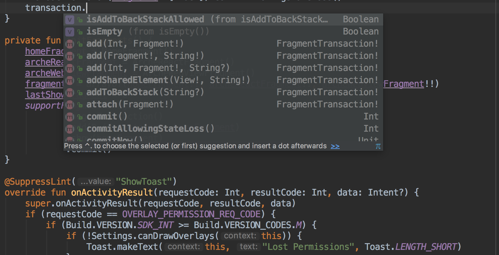

一个前端程序员的一个月原生 Android 开发体验
===

> 自从我写了 Android 应用后，上知乎的时间变得更长了。

自从我写了 Android 应用后，上知乎的时间变得更长了。哦，不对，你理解错了，我的意思是：编译代码、打包 APK、运行在设备上需要时间。可不像前端，一保存代码，就自动刷新页面。

是的，从上上周一开始，因为项目缺人的原因，作为一个有 Java 开发经验的大前端，我又又双叕进入了原生 Android 开发的世界。

这一个月下来，也算是有一些写 XML 的心得吧——不对，写 Java 代码，看 Kotlin 代码的心得。总的来说，Android 与前端的差异并不是非常大，在某些东西上，他们还是蛮相似的。怪不得像我这样的程序员，会将 Android 开发也归类到大前端上去。

如果你是一个前端程序员，想学习移动开发；又或者是一个移动开发，想接触前端开发；那么，本文可能就很适合你去了解两者间的差异。

本文包含了以下的内容：

 - MVP vs MV*：后天的 MV*
 - 静态语言 vs 动态语言
 - View 与 DOM
 - 调试
 - 兼容性
 - 编码效率

（PS：受限于我只有短暂的经验，所以有些用词可能没有那么准确。）

``注``：这里的**前端应用指的特指单页面应用**。


编码效率
---

从编码效率上来说，还是前端快，快得不止一点点。

 - 更快的预览速度。
 - 成熟的生态系统。
 - 大量可用的 UI 框架及组件。
 - 参考别家的实现。Web 前端是开放的世界，在今天来看，要实现的效果基本上已经被实现过了，所以我们可以直接参考

MVP vs MV*：后天的 MV*
---

> MVP，即 Model-View-Presenter，对应于视图层-数据层-展示层。

在 MVP 上来看，前端应用与 Android 都并非天生的 MVP 架构的。不过，两者在对业务逻辑上的处理，但是没有多少差异。唯一能体验差异的，可能就是 JavaScript 的异步，以及 Java 的同步带来的一些差别。

### V*

采用了框架的前端应用，则会因此而带上 MV* 的加成。一旦选用上了某个框架，那么你只能按照其特有的模式，如 Vue 提供的核心是 MVVM 中的 VM，React 则只是 MVC 中的 View 层，则 Angular 则可能是 MVW（Model-View-Whatever）。在这种情况下，要在框架的基本之上变更，那么灵活性上可能没有那么大。

而 Android 方面则是 MVP 架构，其主要依赖于**约定俗成**，其中一个参考的规范就是 Google 官方的 [android-architecture](https://github.com/googlesamples/android-architecture)，又或者是社区上推荐的 Clean Architecture。而无论是 Clean Architecture，还是 MVP，其都依赖于**约定**。一旦我们谈及参考的时候，便意味着灵活性——可遵循，可不遵循。

在这种时候，Android 的 MVP 需要我们自己去创建 MVPView，创建 Presenter。

```
public class MainActivity extends AppCompatActivity implements MainView {
	...
}
```

而整个 ``MainActivity`` 只是一个 View 层，真正的业务逻辑要交给 Presenter 来处理。简单来说，就是你需要手动地创建四五个类，才能完成一个 Activity 的 Hello, world。

### Model

与此同时，Android 默认是要对 Model 进行校验和转换的。因为取出 JSON 中的某个值，需要将 JSON 转换为对象——可以直接使用 Retrofit 库来转换数据，又或者用 GJSON 转换成某种对象。算是与前端的一个大的区别，在前端世界里，这种事情是轻而易举的，有万能的 ``JSON.parse``。

在使用 JavaScript 编写的时候，可以不对 Model 进行校验。不过，在 React 里会有  ``proptypes``，在 Angular 里可以用 TypeScript 来做相似的事。

与没有对象校验的前端相比，一旦出错，根本不容易察觉。这一点，或者也是一个优势所在——当你上架了新版本的 API 时，旧的应用不会 NullPointerException。与此同时，在开发的时候，后台 API 发生变化的时候，也会导致后续的一系列 bug。

静态语言 vs 动态语言
---

自从我写了 Android 应用后，上知乎的时间变得更长了。每次我想试着在手机上查看效果的时候，得构建、编译代码、安装，大概得等上个两三钟才能运行在虚拟机或者真机上。可事件往往不会这么顺利，动不动会遇上个 ``NullPointerException``，然后应用就 Crash 了。

与上面相类似的是，

怪不得 Android 的程序员喜欢上了 Kotlin：

```kotlin
override fun onCreateView(inflater: LayoutInflater?, container: ViewGroup?, savedInstanceState: Bundle?): View? {
    val view = inflater?.inflate(R.layout.fragment_home, container, false)
    val button: Button = view!!.findViewById(R.id.open_rn_button)
    button.setOnClickListener(this)
    return view
}
```

由于没有经验，我经常把 ``val`` 写成了 ``var``。

这就和那些习惯写 alloc init 的 iOS 程序员，一夜间突然喜欢上了写 ES6 一样：

```swift
let className = NSStringFromClass(MyClass)
 let classType = NSClassFromString(className) as? MyClass.Type
 if let type = classType {
   let my = type.init()
 }
```

哦，不对 他们写的是 Swift。

又回到设计模式的天下，

大量的代码，就意味着很容易出现重复。 

### IDE 支持 好



View 与 DOM
---

还有已经有写 React Native 布局的一些经验，在写起 Android 的布局，倒也还好——没有那么坑。

### 样式复用

前端使用 HTML + CSS 来编写样式，而安装则只使用 XML 来切图，这并不是一件容易的事。不像 CSS 可以通过 “继承”
 和 “覆写” 的形式来实现样式复用。

而在 Android 的布局上，这就不是一样容易的事。

### 双向绑定

从原生的角度来看，前端的 ``document.getElementById()`` 与 Android 的 ``findViewById`` 并没有多大的区别。

不过 Android 是自带了双向的 DataBinding，而原生的前端是没有的。只是前端有前端框架，在这一点也完全不是问题。

### 布局调试

而当前端有了前端框架之后，就不一样了。好在 Android 有 ButterKnife 这样的 View 注入框架。


Android 中也有类似于 JavaScript 生成 HTML 的方式，自定义模板。

过去，前端在 DOM 操作上存在天然的问题，即在我们使用 ``$("*")`` 的时候，全局。当然现今的框架，在这个问题上比较少，但是考虑到仍然可能会被误用，或者注入。

而 Android 则是局部页面的。

调试
---

记得我们在 Chrome 浏览器里可以打断点，随后在 Console 中做出一些计算。

得益于 Android Studio 背后的 JetBrain 的 Evaluating Expressions，可以实时计算表达式的值。

以我有限的 Objective-C 编程经验来说，XCode 也是可以做到的。

通过 stetho 也可以做与 Web 相关的调试工作：


又比如网络上的：


但是依赖上比较大，我还是更习惯 Charles。

HTML + CSS 在编写 UI 的时候，有各种奇技淫巧，比如说样式的优先级

每个 Activity（页面）都是

兼容性
---

前端要调试不同的浏览器

Android 则是面临碎片化的系统，不同的版本，及不同的屏幕大小，总的来说，要对前端复杂得多。

最后，又难免回到了 Android 系统的一些机制。这一点与我们讨论的各种浏览器特性是相似的

最典型的例子就是生命周期，在编写应用的过程中，得时时刻刻关注着生命周期上的变化。这一点和 React、Vue 都是蛮相似的。

