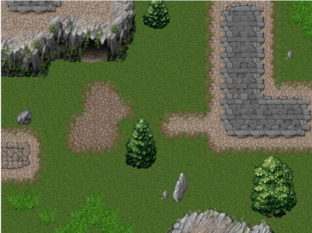
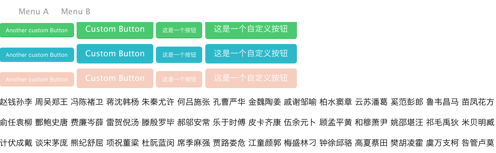
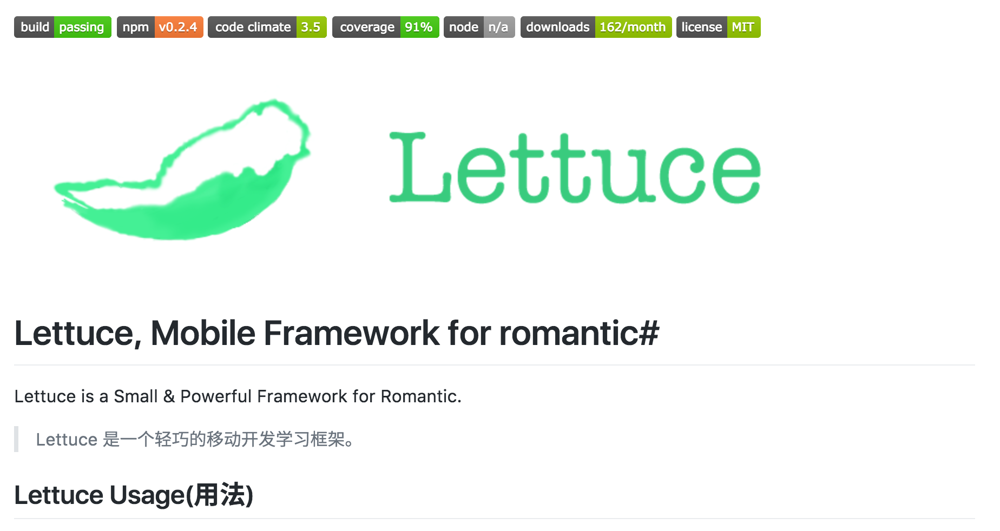
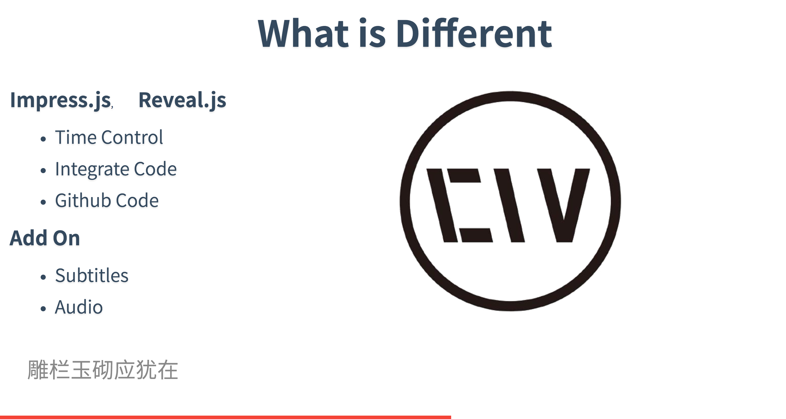
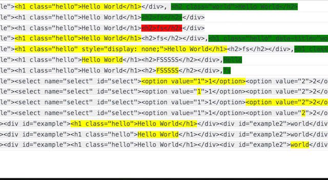

祭奠那些年，我弃坑的开源轮子
===

作为一个有理想、有追求的程序员，我造过许许多多的轮子。不幸的是，大部分轮子都死在沙滩上了，只有用 markdown 写的项目还活着。就这么着，我成为了``a famous MD programmer``.

> 谨以此篇纪念我那些已经弃坑的轮子。

我从 2010 年开始接触到 GitHub，不过真正活跃的时间是在 2014 年之后了。这些年来，陆陆续续也造了许许多多的轮子。造过的轮子很多，火起来的框架可是一个都没有，[物联网框架 Lan](https://github.com/phodal/lan) 倒可以算得上，不过只有 200+ 个 star。 当然 star 很多的应用倒也有几个，如[成长应用 Growth](](https://github.com/phodal/growth)) 也有 2k 个 star 了，然并卵。

不过，我倒还是造了很多『自用』的日常小工具，[markdown 微信排版工具 mdpub](https://github.com/phodal/mdpub)、[伪锁屏工具 ss](https://github.com/phodal/ss)，[定制 badge 的 brand](https://github.com/phodal/brand) 等等。

趁着清明这个节日，我把这些弃坑的轮子，再拿出来鞭尸一下。

[JavaScript 游戏引擎 Chinaware](https://github.com/phodal/chinaware)
---

这个名字听上去很霸气，中文翻译就是『瓷器』。弃坑的主要原因是，这个坑挖得太大了，我发现需要造的东西太多了，并且也已经有太多现成的方案了，如：

在对一个 jQuery 的 Tile Map 插件使用纯 JavaScript 重写之后，我就滚了~~。

还盗了别人的 Tile 图，2333

[Lumia.css](https://github.com/phodal-archive/lumia.css)
---

很早以前，我是一个诺基亚用户，先后用了 Lumia 920，Lumia 1020。

当时想造一个纯 CSS 的框架，可以用在自己的开源项目上。于是我开了个坑：

然后不知道什么原因，也就没有然后了。。。

[前端框架 Lettuce](https://github.com/phodal/lettuce)
---

在 Angular、React、Vue、Ember 还没有几分天下的时候，还是应该自己去造轮子。所以，我想自己想办法造了一个前端框架，还有一个对应的 Logo：

后来，这个框架只在我的几个小项目中出现过，这也算是值了。它让我有了造框架的快感~~。

[下一代技术Blog/Presentation 框架 EchoesWorks](https://github.com/phodal/echoesworks)
---

写这个轮子的时候，当时正值我需要做各种技术分享的时候。在今天看来，这个框架算是功能已经完成了，但是我都没有在正式的场合里用过。它是一个网页版的 PPT 工具，使用 Markdown 编写。并且支持一些『奇怪』的特性。

如：

 - 直接显示 Github 代码
 - 全屏背景图片
 - 左/右侧图片支持
 - 自动播放
 - 『字幕』
 - 分屏控制

这里的『字幕』我适配就比较奇特了~~，这个创意简直了。当你想分享一下视频的技术分享时，你只需要分享一下 PPT 和 录音，再搭上字幕，就相当于是一个高清版的视频。因为 EchoesWorks 可以支持：自动及定时播放 PPT、按时间显示字幕。

[基于Virtual DOM 的测试代码生成 Luffa](https://github.com/phodal/luffa)
---

这又是我当时想到的一个酷炫的 Idea。当我们编写功能测试的时候，我们需要监测页面 DOM 的变化。而有了 Virtual Dom 之后，我们可以轻松地 Diff 出修改的 DOM，并且还可以高亮这些修改的元素。

通过这个原因，我们就可以轻松地生成测试了。

哪知道：国内的大部分前端都是不会写测试的。

[微信小程序 兼容框架 WINV](https://github.com/phodal/winv)
---

这个故事就有点长了。在微信小程序出来的那段时间里，我发现小程序是一个封闭的世界。于是便想着做一个框架，来让大部分小程序可以运行在浏览器上。于是就做了一个框架来做这件事：

 - 兼容微信小程序的语法——它并没有多少复杂的语法。只是简单的Virtual DOM操作，以及事件绑定
 - 尽可能兼容大部分的微信API，兼容所有的微信API几乎是不可能的。
 - 提供一个Virtual DOM转换的混合应用插件。

 
你呢？

你造过哪些没人用的轮子了呢？ 

