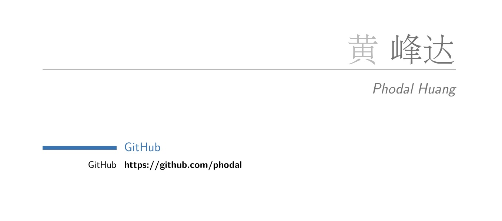
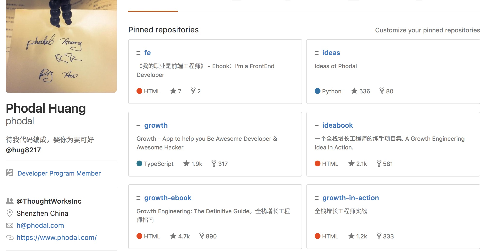
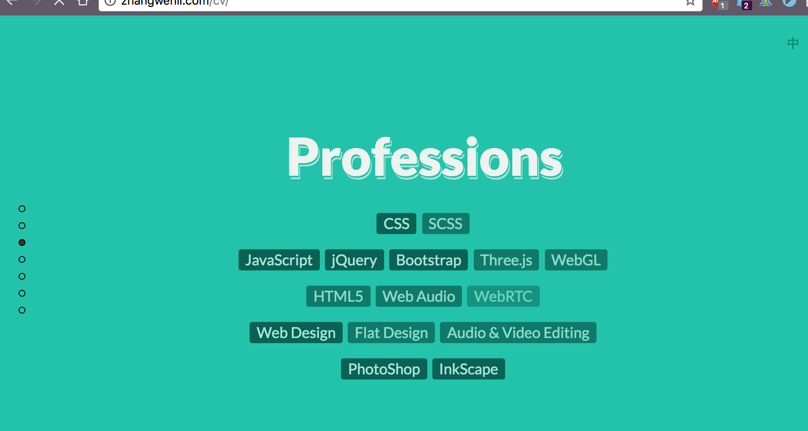
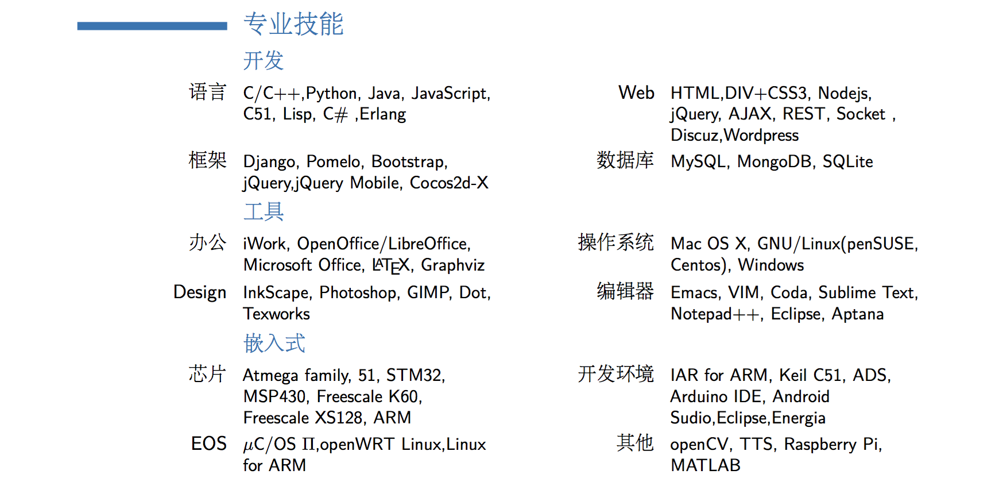
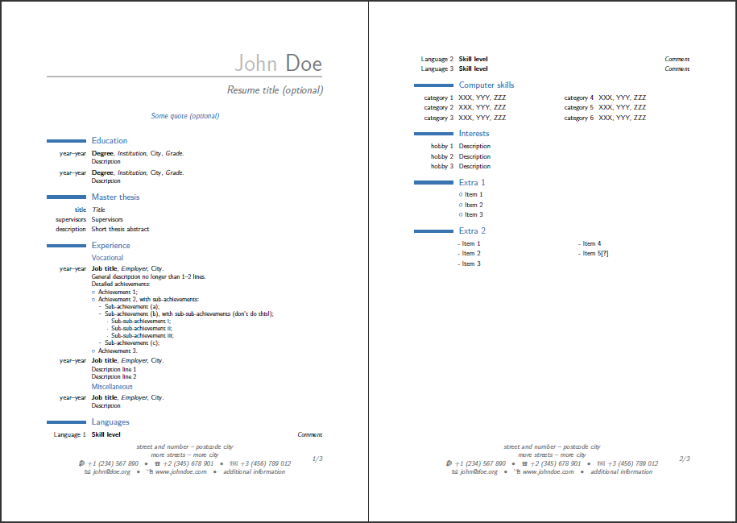
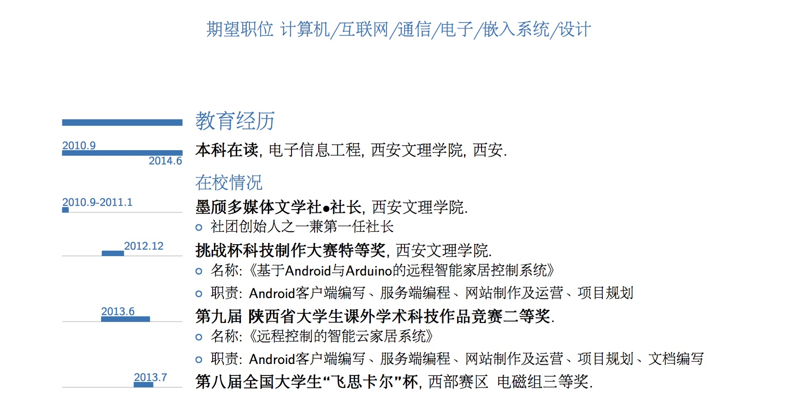
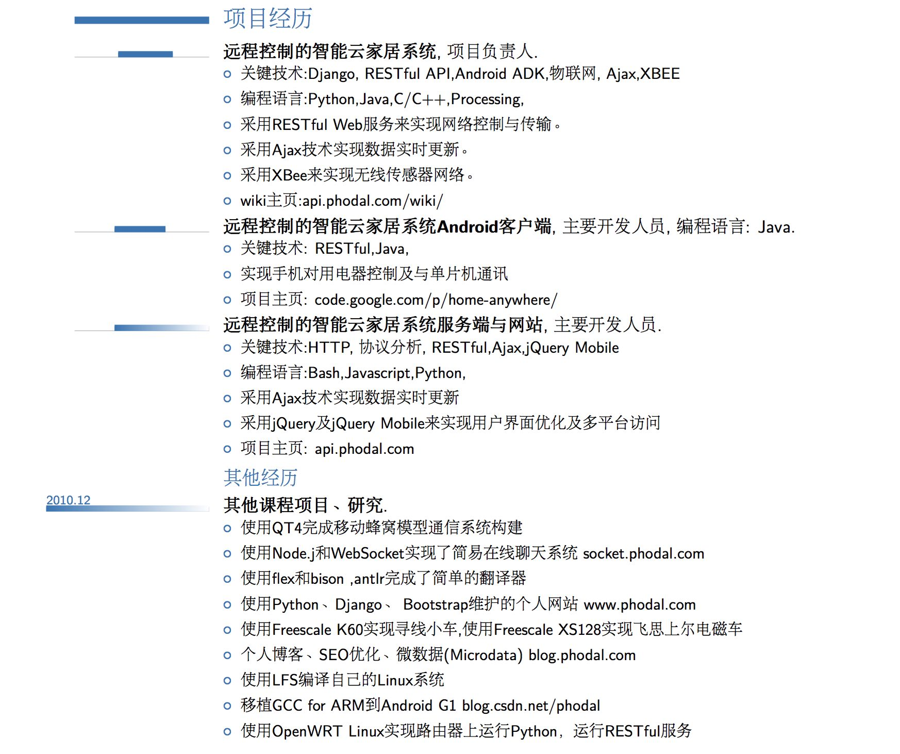

一份优秀的程序员简历是怎么样的？ | Phodal 来告诉你
===

> 最近收到了很多要来面试的简历，发现你们的简历怎么都是这样的呢？要是我是面试官，你们肯定进入不了下一轮。

马上就要到一年一度，最适合找工作的时间段：金三银四。另外一个时间段是：金九银十。**金三银四**的大意是：**最好的时间是三月，其次是四月**。同理于金九银十，**最好的时间是九月，其次是十月**。反正我也是在几年前，道听途说过来的。一过完年，一交流总会多些想法，就有了金三银四。金九银十则是，一些公司在年中的时候，发去年的年终奖。

今年的行情虽然没有去年火热，但是你仍应该拾掇拾掇一下你的简历，万一机会来了呢？

### 跳槽的 N 个原因

作为一个技术人员，如果你满足以下条件中的任意一个，你应该去看看更多的机会：

 - 钱少了
 - 技术空间增长太少
 - 没有发展空间
 - 心里委屈了

以及

 - 老板招你的时候，和你谈理想。现在，老板问你说：理想能赚钱吗？
 - 加班太多——都没有时间约会或者女朋友和别人跑了
 - 你的女朋友在北京，而你在上海
 - 这个技术公司已经没有大牛了

这不是马上就要到，传说中一年一度的**狗粮节**了么。回到正题，**一份优秀的前端开发工程师简历是怎么样的？**。

一份优秀的前端开发工程师简历是怎么样的？
---

这个嘛，我觉得应该是这样的：

然后呢，HR 只需要打开这个 PDF 中的 GitHub 链接即可：

这才叫优秀嘛，你说是不是？

好了，写完段子了，让我们来看正文。

简历的 N 种错误姿势
---

这些年来，我也多多少少了，看了一些简历。也稍微有一些经验，让我先罗列一下问题，再说说原因：

### 打开姿势

**简历造假**。任何造假的行为都是不能容忍的，这个问题容易出现在不自信的面试者身上。还容易出现在培训机构的学生上——我并没有任何歧视培训机构培训的学生，我只歧视培训机构及其行为。即使你能幸运的通过面试，在工作的时候，你也有可能被觉察出来。

**不适当的文件名**。当我收到一份简历，你可以是 xxx.pdf，可以是 xx公司_xx.pdf，但是不能是 all.pdf、resume.pdf 这样的文件名。我还需要帮你重新命名一下，然后存档么？在简历的文件名上，你要突出重点，谁，需要什么岗位，如：李小明_Android工程师_简历.pdf 

**使用 PDF 以外的格式**，如PPT、DOCX、HTML。PDF 是我目前看到兼容性最好的格式，要知道 Windows 上写的 TXT 在 Mac OS 上打开都会有编码问题。DOCX 就更不用说了，我司标配的 Office 是 LibreOffice，打开的文件 100% 出问题。PPT 我就不说了，虽然很帅，但是我很累——**要面试的人是你，不是我**。

呵呵~

### Be Professional

**语法问题**。在平时的时候，你可以将一些技术栈的单词拼错。但是在简历上，请认真一点~，最好可以找基友帮你过一遍。该大写的时候就应该大写，如 HTML 不应该写成 html 或者 Html，Java  8 不应该写在 JAVA 8 或者 java 8， 乃至 J8。

**排版问题**。像审美风格这样就算是其次的，该换行的时候就要换行，该对齐的时候就应该对齐。好在大家都是用模板来完成的，这个问题不大。

**没有项目经验或者无用的项目经验**。只是罗列技术栈，没有写你做了什么。这种感觉就好像，我在 BAT 里都干过，只不过是我是在里面扫地的。**作为一个美团外卖员工，天天进百度外卖大楼去送外卖——除了没被打死，你还有什么可以自豪的？。
**
**写了一些无关紧要的废话**。谁 TM 想知道你和你家大伯的女儿关系，以及你在中小学的时候去哪玩了。除此，你在大学的时候做的家教、兼职也不重要。你要来面试的是一份**技术工作**、**技术工作**、**技术工作**，不是销售，也不是大家老师。如果你是党员，你也不用突出你是有多爱党。毕竟，作为一个普通人，我们都拥挤党的领导的。

### 不作死

**罗列技术栈**。不要在简历上，写上太多的无关技术栈。**写到简历上的东西，都会成为你的呈堂证供。**如我毕业的时候，准备了三种不同类型的简历，嵌入式工程师的、Web 工程师的、包含两者的。然后在**专业技能**上，我列举了我玩过的各个东西。在现在看来，简单是。。。

简单是作死。当年，我写在简历上的每一个内容，**都被一一过问了一遍**。

程序员该如何去写自己的简历
---

简历就是**简单的介绍一下你自己有多 NB**。所以，你需要介绍以下的内容：

1. **我是谁**。
2. **我会什么**。
3. **做过什么**。
4. **结果如何**。

然后把这些内容放到一个模子里，就可以了。

### 选择一套模板

如果你并非设计师，或者想要相关的求职岗位，那么请不要在简历的样式上花时间。你应该将更多的时间花费在简历的内容上吧。作为一个技术岗位，面试官想看的是你能干什么，而不是漂亮不漂亮。你又不是要面试 鼓励师程序员 =  鼓励师 + 程序员。

然后推荐下我用的模板，LaTex 里的 **modercv** 模板。就是这样的效果：

这个简历的最大优点是，写废话的地方很少。你可以轻松地写上你的各种经历，并且排版出来的效果很不错。

### 首屏加载：在第一页尽可能突出自己

这里有一个突出自己的，最好例子：

> 本人学识渊博、经验丰富，代码风骚、效率恐怖，c/c++、java、php无不精通，熟练掌握各种框架，深山苦练20余年，一天只睡4小时，千里之外定位问题，瞬息之间修复上线。身体强壮、健步如飞，可连续编程100小时不休息，讨论技术方案5小时不喝水，上至带项目、出方案，下至盗账号、威胁pm，啥都能干。泡面矿泉水已备好，学校不支持编程已辍学，家人不支持编程已断绝关系，老婆不支持编程已离婚，小孩不支持编程已送孤儿院，备用电源万兆光纤永不断电断网，门口已埋雷无人打扰

因此，你要保证 **HR 可以轻松地打开你的简历**，并且可以看到他们想要看的内容。如果你使用 GitHub Pages 和网页的时候，就要注意这个问题。并不是所有的 HR 都会翻墙的，并不是所有公司访问外网都会很轻松的。

你刚毕业不久的时候，你应该突出你在学校的成果：

工作的时候，便是突出你的公司，和 NB 的项目。

### 毕业到工作：从看学校到看公司

校招的时候，你可以把你在学校玩过的各种东西都写在上面，如下：

就是要把你玩过的、觉得很 High 的东西都往上写。毕竟大部分人都是玩游戏过来的，然后你还玩过这么多东西，面试官对你的印象一定特定好。不过，还是那一点，**不要造假**——写到简历上的东西，都会成为你的呈堂证供。作为一个 Play for Fun 的程序员，谁的大家不是这么玩过来的。

除了这种玩可以为你加分之后，还有：

1. 211 985高校加分
2. 硕士学历加分
3. 大公司实习经验加分
4. GitHub、博客加分 
5. ACM 等比赛加分
6. 项目经验加分
7. 等等

而，等你工作多年后，教育经历就变成无关经历了。这时候加分的内容就变成：

1. BAT 等大公司加分
2. NB 的开源项目加分
3. 与本公司相关的项目经验加分
4. 行业大牛，自带光环
5. 技术栈完全匹配加分
6. GitHub、博客加分 
7. 认识 Phodal 加分 （笑~~）
8. 等等

这个世界就会从看学校到看公司。所以，如果你毕业的时候遇到这样一个选择：**大公司还是创业公司**。请考虑上这一点因素，如果这家创业公司倒了，那么你的下家就不好找了。反之，你从大公司要进入小公司，则是轻轻松松地一件事。

（PS：我的干货就到这里结束了，以下是广告时间。）

小结
---

当然了，简历再漂亮，能力不行的话，你也是进不了进一轮的。这时候，你一定需要新版的 Growth 2.5.0，我们将带你成为顶尖开发者：全新的技术树、全新的学习体验。下载链接（[http://a.app.qq.com/o/simple.jsp?pkgname=ren.growth](http://a.app.qq.com/o/simple.jsp?pkgname=ren.growth))。

