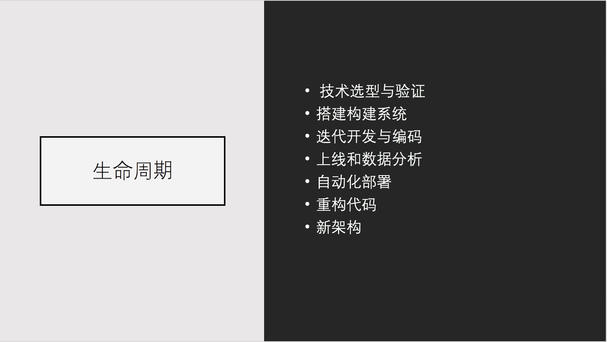

我是如何准备一个技术的分享？
===

> 在准备知乎 Live 内容的时候，我习惯性的准备了一个 PPT，又称为 Keynote。我才发现，自己已然习惯用 PowerPoint、Keynote 这些方便的工具，而不是酷炫的 Markdown。

从前，我喜欢用 Impress.js 来作 Keynote；后来，我都是直接使用 PowerPoint。鬼知道在这个过程里，我到底经历了些什么？

我的 Keynote 风格
---

工作以前，很少做 PPT，唯一记得的算是毕业设计，使用 PowerPoint 的模板做了一个 PPT 。

开始工作了，团队里的技术氛围好，经常做一些技术分享。记得有一次，要为客户讲述技术演进相关的内容，在一周里讲了四五次的 Session。

分享的次数多了，keynote 便也有了自己的风格。早先喜欢用 Impress.js、Bespoke.js，它们可以用代码生成酷炫的效果，甚至于我为自己写了一个名为 EchoesWorks 的 Slide 工具。

可后来，我便习惯使用 Keynote，又或者是 PowerPoint 这样的工具。

一是：**时间来不及**，二是：**做不出自己要的风格**。

那么什么是我的风格？

如下是我之前做的不同 PPT 的截图：

又如，这是使用公司的模板做出来的  PPT：

有时候会放上，这要视不同的受众来决定。。

于是乎：我的风格便是：

图！

图！

图！

**能用图的地方，坚决不用字**。

即使是长的概念性内容，我也会尝试性的做一些总结 。**我讨厌那些按着 PPT 来念的分享**，上面充满了各种废话。明明关键字就有一部分，只需要突出关键的地方：

如果我们向观众展示一个长的文字，那么这可能表明：**我们对复杂的概念没有理解清楚！**长的文字，可以进一步抽象成更易理解的内容。

**当我们准备充足的时候，我们只需要几张图就够了。**图，是在进一步对内容进行抽象，并且演讲者需要无比地熟悉这些内容。

那么，将主要的精力放在准备上，便算是一个不错的主意。

技术分享的 Keynote 准备
---

准备技术分享的 Keynote，无非便是：

 - 制定分享的主题
 - 明确分享的受众
 - 写出主题的大纲
 - 依照大纲，规划每一页的内容
 - 制作 Keynote

在这个准备过程里，除了产出一个 keynote，实际上我们已经在心里讲了好几遍 keynote 了。基本上我们的分享的内容，就八九不离十了。

### 主题与受众

当我们准备分享知识时，已然确定好主题，至少也是八九不离十的：

 - 介绍某个特定框架
 - 针对于某一个框架、技术的细节，进行详细
 - 详解某一特定业务系统的组成
 - 分享某一框架在某团队的实战
 - 等等

有的时候，可能只是一个大的主题，如前端、后台，在这个大的主题上，再去思考分享的内容。要是能抽个空，罗列一下自己的技能分布、最近做的事情，那么要进一步细分主题也很容易。

而针对于不同的受众，则会影响分享的深度、内容等等。技术人员喜欢听技术细节，业务人员想听它对业务带来的变化。同时，它也会影响我们制作的 PPT 的风格，如我们可以对 00 后，用喜洋洋的图，但是对 80 后，可能就是要魂斗罗了。

### 列出大纲 

在这个过程中，最难的便是写出分享的大纲了，大纲决定了整个分享的内容。这一点和我们在写书、写作，甚至是做任何大的项目都是相似的。

毕竟大纲，决定了整个分享、书本的内容，也决定了这次分享是否到位。因此，在我们没有经验的时候，可以和小伙伴们讨论一下大纲的内容。

而对于大纲来说，它几乎也是相似的简单，即 5W1H。
 
  - 对象 （What）——讲什么内容
  - 场所 （Where）——什么地点
  - 时间和程序 （When）——什么时候
  - 人员 （Who）——责任人
  - 为什么（Why）——原因
  - 方式 （How）——如何

再具体的根据这些内容，做一些简单的扩展即可。如我的知乎 Live 的大纲是：

 - 什么是全栈工程师
 - 全栈应用开发的知识体系
 - 我是如何成为全栈工程师的？
 - 等等

最近再细分一些内容，或者在制作 keynote 的过程中一点点细化即可。

### 制作 Keynote

制作 Keynote 的要点是：

 - 先在纸上打草稿，再输入到电脑上
 - 注意投影效果
 - 保证关键内容的出现
 - 尽量不要出现代码
 
**先在纸上打草稿**，**再输入到电脑上**。这样做的优点是，让我们优先关注于 keynote 的内容，而不是各种动画效果、图片的位置。

**注意投影效果**。

 - **考虑投影的比例**。投影的比例是 16：9，就意味着需要将 keynote 设置成 16：9，要不在显示上就会有一些问题。
 - **keynote 的色彩**。很多颜色在投影出来的时候，都是难以看清楚的，如黄色等等。如果没有这方面的经验，建议使用白底黑字，或者黑底白字。又或者，直接使用 PowerPoint、Keynote 自带的模板，他们已经考虑过这个问题了。
 - **适宜的字体大小**。任何难以阅读的小字，对于观众来说，都是不能接受的。

**保证关键内容的出现**。它并不意味着使用长的文字，任何长的文字，对于后排的观众来说，都是不友好的。而如果你还要去念 PPT 的话，那么就会被吐槽了。而是在关键的地方，对于关键点的展示。如我们想展示，使用 xx 性能提升了 50%，那么我们只用 50% 几个大字或许就够了。至于性能几个字，显然它没有那么重要，大家都知道你在讲性能。

**尽量不要出现代码**。代码本身具有难以看清的特性。而且简单的代码，说说大家就知道了，复杂的代码，要么用演示，要么就流程图。

除此，还有**尽可能地使用列表**等等的内容，大家在制作的时间可以体会一下。而最简单的方式，就是使用图了。

### 抽象内容 -> 图

如下是我最近完成的 Live 的 PPT，多以图为主：

找到合适的图不是一件容易的事，但合适的图可以增加阅读性。适当的时候，应该自己多做一些图，如流程图，它可以用来展示复杂的过程。

技术分享的过程
---

### 应对提问

按照公司内部的惯例，在分享的过程中，你可以**随时提问**。这就意味着，别人很容易打断你的分享。这个时候，即要回答好问题，又要记得分享到哪里了~。同时，如果遇到太复杂的问题，应该稍作解释，并说明可以在分享后讨论。

### 把握节奏与时间

对于我来说，超过一小时的技术分享，会变得不可接受。我觉得大部分的分享，应该控制时间在 30~40 分钟左右。
