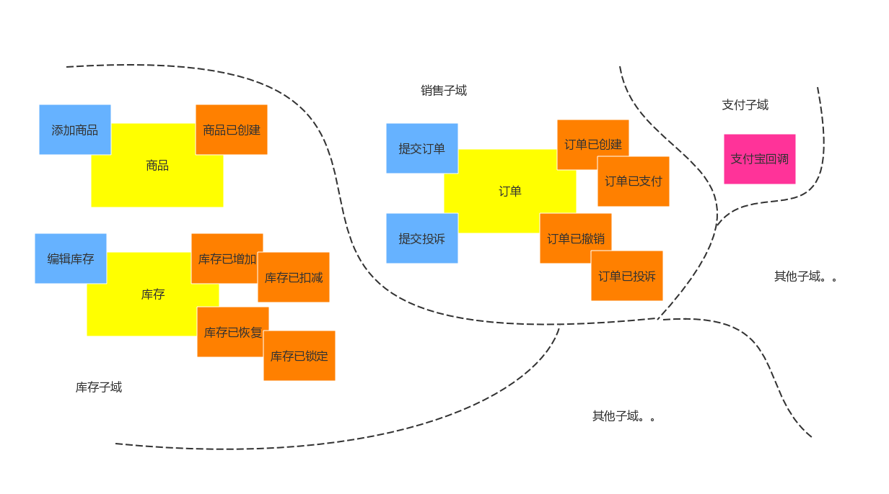
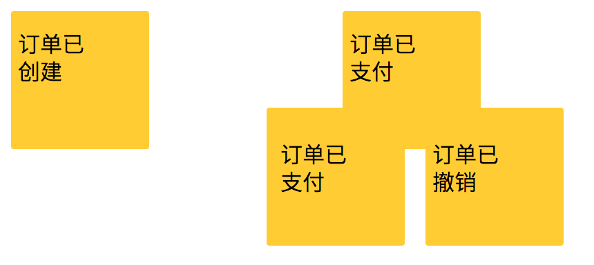
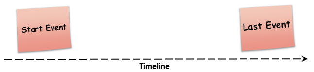
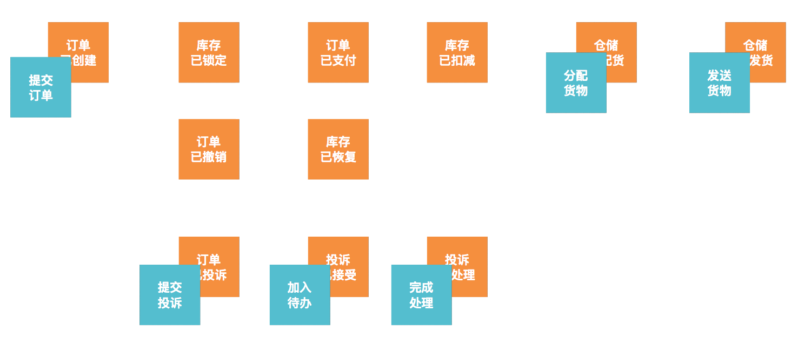

Stepping.js 让前后端分离四步走
===

一周前，参加了公司的一个架构设计与建模的工作坊——『事件风暴』。从某种意义上来说，这是一个关于架构设计与软件建模的工作坊。于是便闪现了一个灵感，便有了 Stepping.js。

当我们结束事件风暴（Event Stroming）的时候，我们需要拍照，又或者是其他手段来记录下相关的内容。因此，整理这些文档又不是一个的容易的事。而事实上，我们只需要一个 DSL（领域特定语言），我们就可以直接将这个文档转换为图片，还有文档等等的内容。

因此，我写了一个名为 Stepping 的工具，来简化这方面的工作。

Stepping
---


步骤一：安装 Stepping

为了使用 Stepping，我们需要先安装 Stepping，可以能过 ``yarn`` 或者 ``npm`` 来安装：``yarn global add stepping``。


步骤二：设计领域模型

除此，我们还需要设计好系统相关的领域模型，如：



步骤三：存储领域模型

再以 DSL 的形式来描述这个模型：

```
domain: 库存子域
  aggregate: 库存
    event: 库存已增加
    event: 库存已恢复
    event: 库存已扣减
    event: 库存已锁定
    command: 编辑库存

  aggregate: 商品
    event: 商品已创建
    command: 添加商品
```

步骤四：执行转换

保存这个文件为``phodal.ddd``，然后执行``stepping -i phodal.ddd``。就可以得到一个 ``stepping.svg`` 的文件，这个 SVG 文件便能得到上面的领域模型。

同时，如果你愿意的话，你还可以在这个 DDD 文件里写上相关的聚合的 Model：

```
aggregate-detail: 商品
  model: product
    field: 
      id: int
      name: string
      number: string
      manufacturers: string
```      

再执行下 ``stepping -i phodal.ddd``，就可以得到一份前后端分离的示例 API 接口，即：

```
{
    "count": 1,
    "next": null,
    "previous": null,
    "results": [
        {
            "id": 0,
            "name": "name",
            "number": 0,
            "manufacturers": "manufacturers"
        }
    ]
}
```

结合一下 moco 或者 pretender，就可以直接变成一个 Mock 服务器。

在未来，我们还将结合这个 Model 来与 Django 做集成——只需要写好设计稿的 DSL，就可以生成相关的文档。

末了，让我们了解一下什么是领域风暴。

事件风暴
---

> 事件风暴就是把所有的关键参与者都召集到一个很宽敞的屋子里来开会，并且使用便利贴来描述系统中发生的事情。

一张桔黄色的便利贴代表一个领域事件，在上面用一句过去时的话描述曾经发生过什么事情，格式一般是：xx 已 xx。于是，我们需要整理系统相关的所有**事件**，也因此需要业务与开发人员共同进行风暴。如针对一个订单，会有这么一些相关的事件：

 - 订单已创建
 - 订单已支付
 - 订单已投诉
 - 订单已撤销

 便会产生相关的便利贴：



再按事件发生的时间轴，来对这些事件发生的顺序进行排序：



紧接着，我们需要结合软件的用户的相关操作，写着与这些操作相关的**命令**。然后，结合这些**命令**与**事件**。如订单相关的命令就有：

 -    提交订单，可以触发事件『订单已创建』
 -    提交投诉，可以触发事件『订单已投诉』
 -    等等

 完成这个之后， 我们就有了系统相关的所有**事件与命令**：
 
 
 
 换句话来说，这些相关的**事件与命令**就是我们编写细节代码时，需要完成的功能。最后，完成相关的聚合，我们就可以得到一份完整的模型：
 
 
 
 依据这个模型，我们可以轻松地做出微服务设计。
 
 欢迎试用，并在 GitHub 上提出建议：https://github.com/phodal/stepping 
 
 