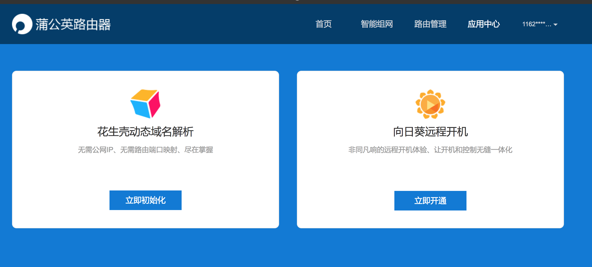
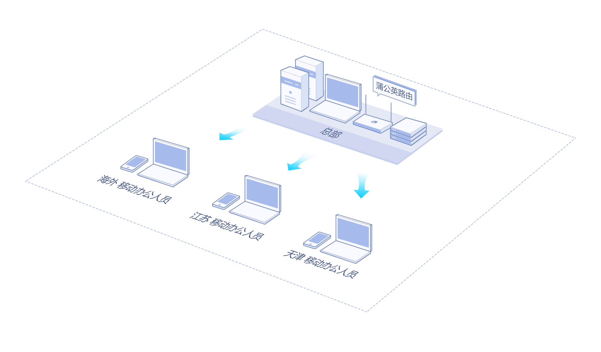
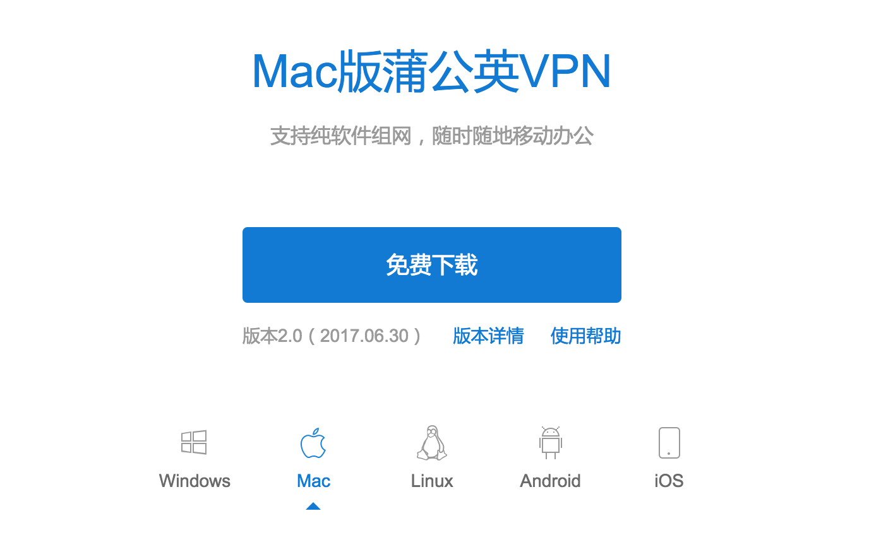
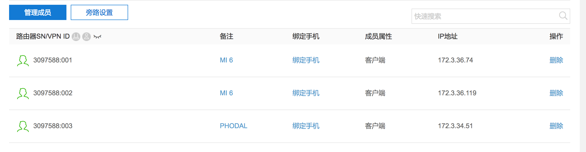
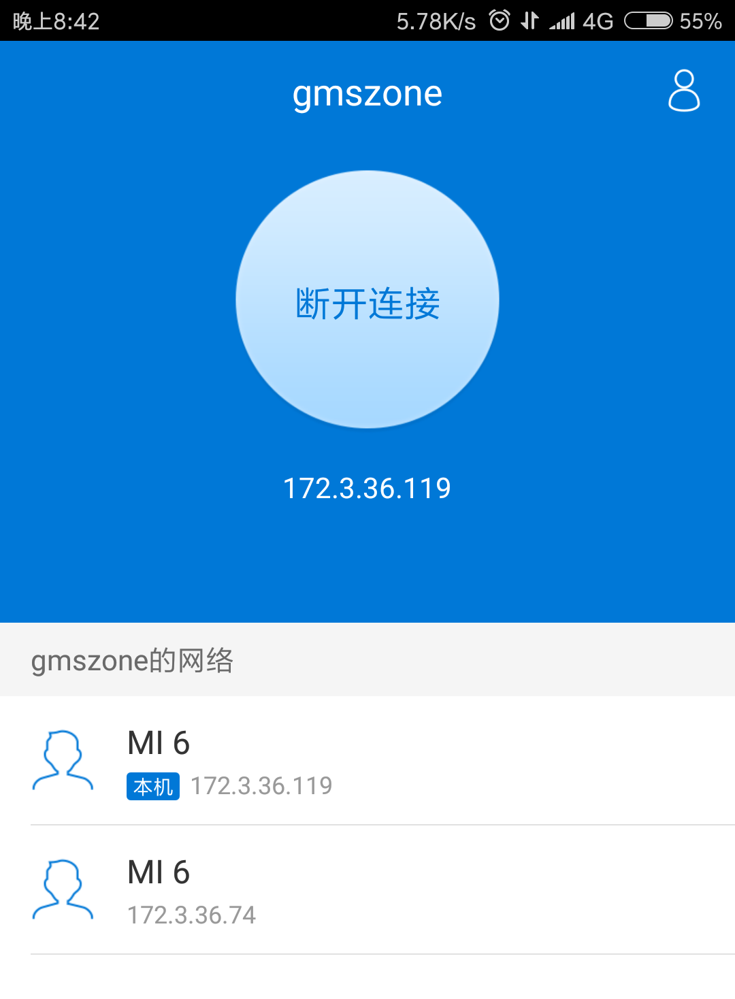

如何通过路由器快速组建 VPN 网络
===

在我搭建完我的智能家居系统之后，我一直在寻找一种方式从外网访问家里的一些服务，如 Home Assistant 服务、HomeBridge 服务。毕竟从外网 IP 直接访问的渠道，已经被服务提供商封杀了。而随着资料的膨胀——数据在不断的重复，我也在考虑入手一个 NAS 服务器。这些便意味着，我得想办法共享出这些服务。

如果只是 HTTP 服务的话，使用 ngrok 是一个不错的方案，可惜 ngrok.com 在国内已经处于不可用的状态。除了 ngrok，在国内还有一个非常不错的选择，就是很多 OpenWRT 路由器提供的『花生壳动态域名（DDNS）』功能，如我之前使用过的极路由、小米路由器就有这样的功能。

然而，在这种情况下，我们的服务就会暴露在外部，因此我们应该采用一种专用的 VPN 网络。而如果有一个专用的设备，如路由器，可以充当这样的设备，那自然是再好不过了。

蒲公英 X5 组网路由器
---

而正好出品花生壳的公司，也出品了一些相关专用的路由器，如我使用的 X5 路由器：


除了正常的路由器功能，它还可以支持局域网文件共享：USB3.0 的最大传输速度为 500MB/s，是普通 USB 2.0 传输速度的 8 倍
支持 3G/4G USB 适配器上网。

作为一个提供花生壳服务的产商，路由器自然提供了高大上的动态域名解析。



不过，这个东西不是我们的重点，因为会暴露服务整个互联网。

该路由器还提供了一个：VPN 组网的功能，即蒲公英 VPN。其采用全新自主研发的 Cloud VPN 技术替代传统 VPN，快速组建异地虚拟局域网，实现异地的电脑、手机、服务器等终端设备的互联互通。

简单的来说，就是我只需要在家里有这样一个路由器，也可以使用我的手机、电脑从 Anywhere 访问——~~要是我的路由器不在大陆，那就爽爆了~~。如下图所示：



除了提供强大的服务器群支持组网环境，还采用了非对称 RSA/AES 算法加密等特点。而，其最主要的特点就是**设置起来很简单**。

说了那么多，来看看我是怎么玩的吧。

实践 VPN 组网
---

首先，登录路由器，然后设置网络：


再注册、登录一个 ORay 的账户，我们就完成了路由器端的设置。

点击网页上的『智能组网』标签进入相关的 Tab，然后选择我要组网：


接着，就可以使用不同的客户端来进行组网。

### macOS

首先，从官网下载 Mac 版蒲公英 VPN



然后解压文件，接着到这个目录执行：

```
sudo ./PgyVistorForMac
```

在这个过程中，会要求输入我们的账号和密码：

```
=================== Best Oray ====================
	          PgyVPN(Mac OS)
		    Ver 2.0.0
==================================================
Please Enter Your Account:
xxx
Please Enter Your Password:

Auto Login ? [y/n]
y
Logining........
Login Successful
~~~~~~~~~~~~~~Please Enter a Command~~~~~~~~~~~~~~
1,getmbrs:	get group membership info
2,bypass:	check coustom routes
3,chgacnt:	change account
```

然后，我们就完成了 macOS 上的设置。在网页端，我们就可以看到我们的设备了：



上面的最后一个，IP 地址为 **172.3.34.51** 就是我的电脑分配的内部 IP。

### Android 安装

作为一个 “穷逼” 的 Android 用户，我下载了一个 Oray 客户端，然后登录上我的账号，就直接看到了我的网络：



为了测试外网访问，我使用的是手机流量。接着，我在我的 Mac 上运行起了一个 HTTP 服务：

```
python -m SimpleHTTPServer 8080
```

然后在手机上，访问 [172.3.34.51:8080](172.3.34.51:8080)，也就是上面的那个 IP：


这意味着，现在我可以随意访问，**在同一个 VPN 网络内的任何服务器**，而不需要的额外配置。而整个过程中，最麻烦的事，恐怕就是登录这个账号了。

### GNU/Linux 用户

这个步骤，对于 Linux 用户同样也很简单，只需要下载：

```
wget 'http://pgy.oray.com/download/dl?id=42&os=Ubuntu%20Linux' -O pgyer.deb
```

安装：

```
$sudo dpkg -i pgyer.deb
```

然后执行：

```
$PgyVistor
```

再输入我们的账号即可。

怎样，是不是很简单？

小结
---

除了，我们上述说到的远程移动办公，它还可以管理各大分支机构的OA系统、财务系统、ERP系统等，实现异地协同办公；各连锁门店的监控系统、收银系统等与总部实现交互数据，保证信息安全。

而要完成这些，只需要在不现的分支、机构上拥有各自的路由器即可。


